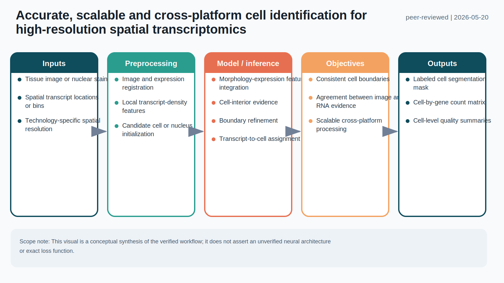
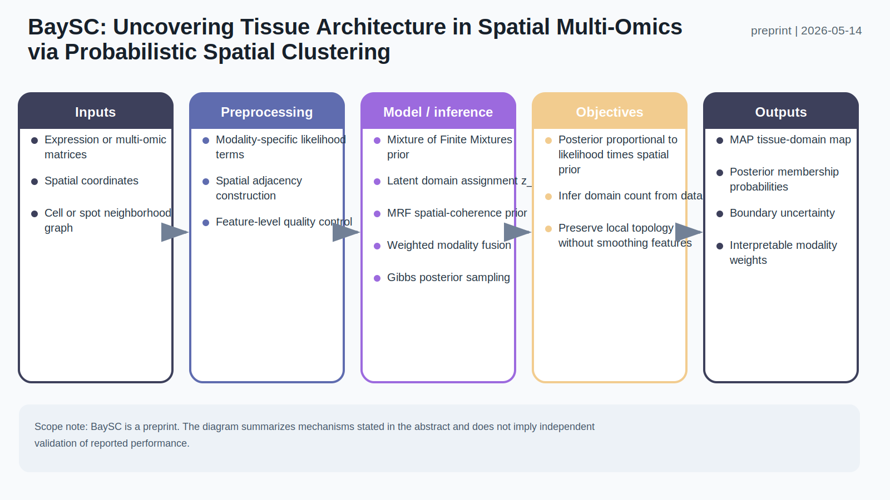
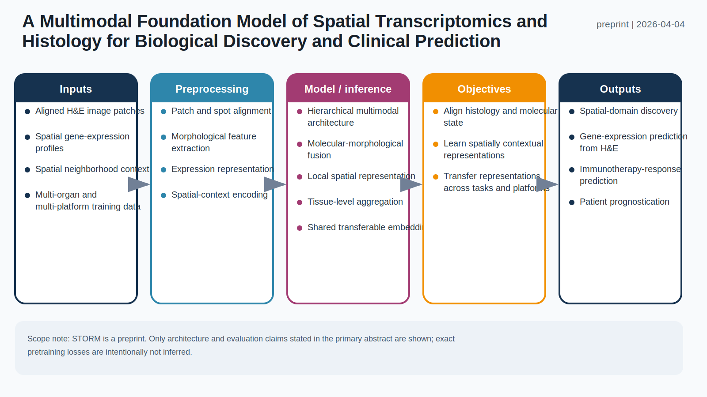

# Spatial Omics Modeling Brief

**June 5, 2026**

This sample highlights three modeling directions: multimodal cell segmentation, uncertainty-aware Bayesian tissue-domain inference, and large-scale histology-transcriptomics representation learning.

## 1. [Accurate, scalable and cross-platform cell identification for high-resolution spatial transcriptomics](https://www.nature.com/articles/s41588-026-02610-1)

**Peer reviewed | Nature Genetics | 2026-05-20**

Cellist is a computationally efficient cell-identification and segmentation method that combines imaging and expression evidence across sequencing-based and imaging-based high-resolution spatial transcriptomics technologies.

**Technical contribution:** The workflow incorporates morphology, spatial transcript density and boundary refinement to assign spatial measurements to cells, yielding segmentation masks and cell-level expression profiles in a cross-platform framework.

**Why it matters:** Cell segmentation is an upstream dependency for nearly every single-cell-resolution spatial analysis. A scalable method that transfers across technologies can reduce platform-specific processing choices and improve comparability.

**Verification:** Nature Genetics identifies Cellist as a computationally efficient method combining imaging and expression data across spatial transcriptomics technologies; the project documentation describes support for sequencing- and imaging-based platforms.

**Keywords:** `cell segmentation` `multimodal integration` `high resolution` `cross-platform`

## 2. [BaySC: Uncovering Tissue Architecture in Spatial Multi-Omics via Probabilistic Spatial Clustering](https://arxiv.org/abs/2605.15291)

**Preprint | arXiv | 2026-05-14**

BaySC is an integrative Bayesian clustering framework that jointly models molecular measurements and spatial topology while returning interpretable posterior assignments rather than only hard tissue-domain labels.

**Technical contribution:** A Mixture of Finite Mixtures prior learns the number of domains, a Markov random field encourages local spatial coherence, and weighted log-likelihood fusion integrates spatial multi-omics modalities through Gibbs sampling.

**Why it matters:** The posterior membership probabilities expose ambiguous boundaries and transitional regions. Learning the cluster count and modality weights also reduces two consequential user-specified choices.

**Verification:** The arXiv abstract explicitly describes the MFM prior, MRF on discrete assignments, weighted log-likelihood multimodal fusion, Gibbs sampling and probabilistic outputs.

**Keywords:** `Bayesian clustering` `Markov random field` `spatial multi-omics` `uncertainty`

## 3. [A Multimodal Foundation Model of Spatial Transcriptomics and Histology for Biological Discovery and Clinical Prediction](https://arxiv.org/abs/2604.03630)

**Preprint | arXiv | 2026-04-04**

STORM is a multimodal foundation model trained on matched histology and spatial transcriptomic profiles to learn molecular-morphological representations across organs, tumor types and spatial platforms.

**Technical contribution:** Its hierarchical architecture integrates morphological features, gene expression and spatial context. The learned representation supports spatial-domain discovery, gene-expression prediction from H&E and downstream clinical prediction.

**Why it matters:** The work tests whether expensive spatial molecular information can inform reusable representations and predictions from routine pathology images, while targeting generalization across Visium, Xenium, Visium HD and CosMx.

**Verification:** The arXiv abstract reports training on 1.2 million matched spatial profiles across 18 organs, hierarchical integration of morphology, expression and context, and evaluation across multiple spatial platforms and clinical cohorts.

**Keywords:** `foundation model` `histology` `virtual spatial transcriptomics` `clinical prediction`

## What to watch

- Probabilistic outputs are becoming first-class products rather than secondary diagnostics.
- Multimodal models increasingly treat histology, molecular profiles and spatial topology as coequal signals.
- Cross-platform transfer is emerging as a central test for spatial-omics foundation and segmentation models.

---

_Figures are original, structured visual summaries generated from verified paper descriptions. They are not reproduced publication figures. Technical elements that could not be verified are explicitly excluded or qualified._
