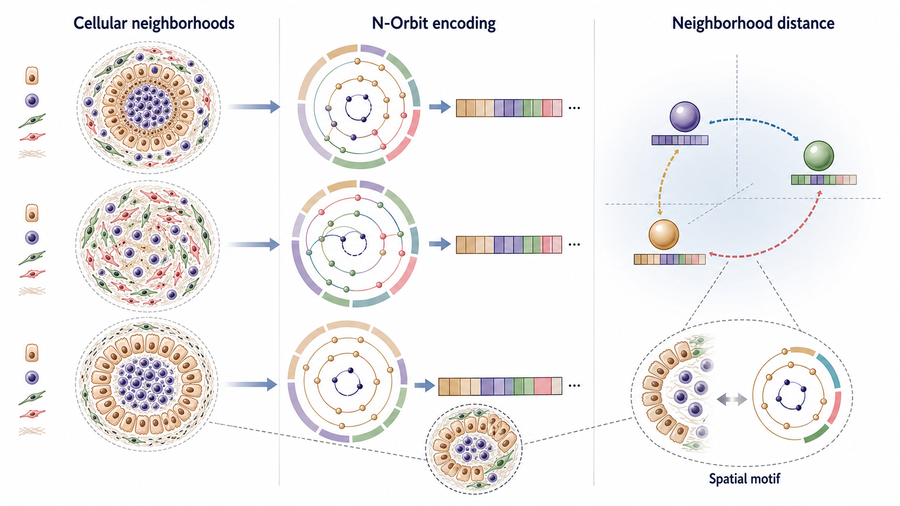
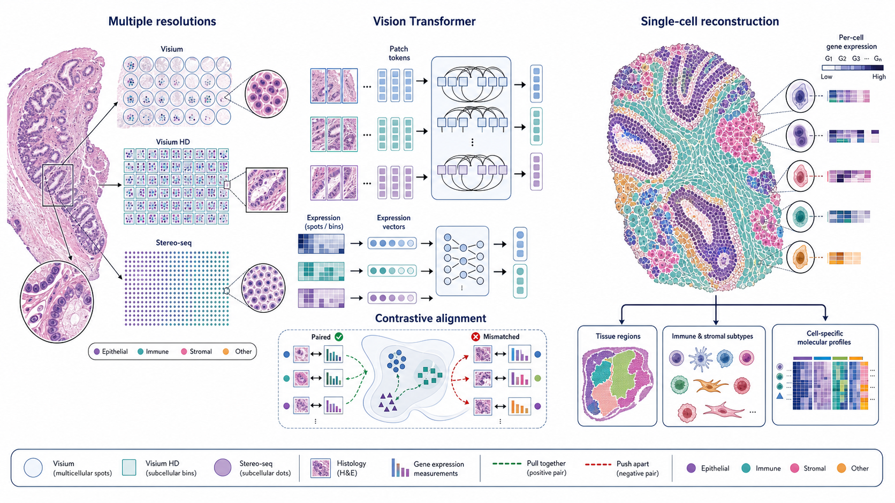
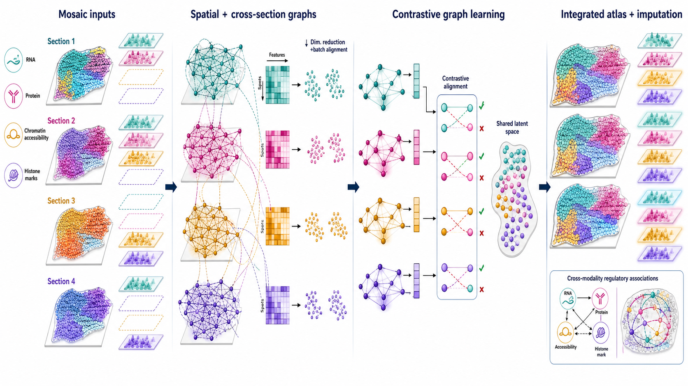

# Spatial Omics Modeling Brief

**June 6, 2026**

Today's update centers on representations that make spatial data comparable across neighborhoods, resolutions and incomplete modality panels.

## 1. [N-Orbit: towards a universal model and metric for comparing tissue microenvironments](https://www.nature.com/articles/s41467-026-73561-8)

**Peer reviewed | Nature Communications | 2026-05-22**

*Cellular arrangements are converted into N-Orbit fingerprints, compared in a shared distance space, and traced back to interpretable spatial motifs.*

N-Orbit is a mathematical representation for comparing cellular neighborhoods that encodes both cell-type composition and spatial relationships as vectors. It is designed to operate on neighborhoods found by other methods rather than to detect neighborhoods itself.

**Technical contribution:** The method maps each tissue neighborhood into an N-Orbit vector and defines an efficient distance between neighborhoods. The representation supports comparisons across samples and species while retaining links to enriched spatial motifs for interpretation.

**Why it matters:** Many spatial studies identify neighborhoods but lack a common geometry for comparing them. A reusable distance representation can support cohort-level association, clinical prediction and cross-species matching without reducing neighborhoods to cell-type enrichment alone.

**Verification:** The Nature Communications article, published May 22, 2026, states that N-Orbit jointly captures composition and spatial relationships, supports efficient vector distances, and traces neighborhoods back to enriched spatial motifs.

**Keywords:** `cellular neighborhoods` `tissue architecture` `distance metric` `spatial motifs`

## 2. [Decoding spatial transcriptomics across multicellular and subcellular resolutions](https://www.nature.com/articles/s41467-026-72872-0)

**Peer reviewed | Nature Communications | 2026-05-18**

*Histology and spatial measurements at several resolutions are aligned through transformer and contrastive representations to reconstruct cell-level expression.*

STARS reconstructs single-cell-level gene expression from spatial platforms whose native measurements range from multicellular spots to subcellular bins. It combines high-resolution histology with spot-level transcriptomics.

**Technical contribution:** The published description identifies a Vision Transformer and contrastive learning as the central modeling components. Together they integrate morphology and transcriptomic measurements to infer cell-level expression across Visium, Visium HD and Stereo-seq data.

**Why it matters:** A common cell-level output could make analyses more comparable across platforms with very different measurement resolutions. It also moves reconstruction beyond spot-level smoothing toward downstream tissue-, cell- and molecule-level analyses.

**Verification:** The Nature Communications article, published May 18, 2026, explicitly reports Vision Transformer modeling, contrastive learning, joint use of histology and spot-level expression, and evaluation across Visium, Visium HD and Stereo-seq.

**Keywords:** `cross-resolution` `Vision Transformer` `contrastive learning` `single-cell reconstruction`

## 3. [Mosaic integration of spatial multi-omics with SpaMosaic](https://www.nature.com/articles/s41588-026-02573-3)

**Peer reviewed | Nature Genetics | 2026-04-24**

*Incomplete modality panels are connected through within-section and cross-section graphs, aligned in a shared latent space, and completed by modality imputation.*

SpaMosaic integrates spatial datasets with partially overlapping modality panels, creating a modality-agnostic and batch-corrected latent space for joint atlas construction.

**Technical contribution:** After modality-wise dimension reduction and batch correction, SpaMosaic builds graphs encoding spatial neighbors within sections and expression-based mutual nearest neighbors across sections. Modality-specific weighted light graph convolutional networks produce embeddings that are aligned through contrastive learning.

**Why it matters:** Real spatial atlases frequently contain sections measured with different combinations of RNA, protein and epigenomic assays. Mosaic integration allows those incomplete panels to contribute jointly and supports principled imputation of unmeasured modalities.

**Verification:** The Nature Genetics article, published April 24, 2026, describes graph neural networks, contrastive learning, a modality-agnostic batch-corrected latent space, spatial-domain analysis, missing-modality imputation and scaling beyond 100 sections.

**Keywords:** `mosaic integration` `graph neural network` `contrastive learning` `modality imputation`

## What to watch

- Cross-platform analysis is shifting from ad hoc harmonization toward explicit shared representations.
- Spatial structure is increasingly encoded as reusable geometry: graph edges, motif vectors and neighborhood distances.
- Missing-modality prediction and resolution conversion are becoming core atlas-building tasks rather than optional post-processing.

---

_Figures are original, structured visual summaries generated from verified paper descriptions. They are not reproduced publication figures. Technical elements that could not be verified are explicitly excluded or qualified._
