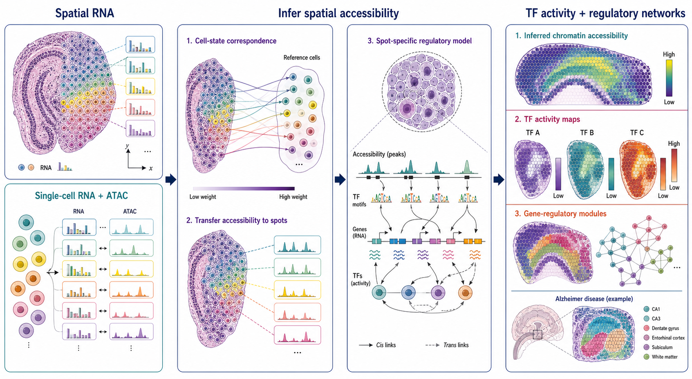

# Spatial Omics Modeling Brief

**June 7, 2026**

One qualifying unreported method was identified today. This focused update avoids padding the digest with older or lower-confidence work.

## 1. [ISON: Integrated Spatial Omics Network for reconstructing gene-regulatory landscapes](https://www.nature.com/articles/s41467-026-74298-0)

**Peer reviewed, unedited manuscript | Nature Communications | 2026-06-04**

*Spatial transcriptomes are matched to single-cell RNA+ATAC reference states, enabling spatial accessibility transfer and spot-specific inference of transcription-factor activity and regulatory networks.*

ISON integrates spatial transcriptomics with a single-cell multiome reference to infer chromatin accessibility, transcription-factor activity and spatial gene-regulatory networks. The current Nature Communications page is the peer-reviewed accepted manuscript before final copyediting and typesetting.

**Technical contribution:** ISON uses transcriptional correspondence between spatial observations and paired RNA+ATAC reference cells to reconstruct spatial chromatin-accessibility profiles. It then combines inferred accessibility, transcription-factor motifs and expression to estimate cis- and trans-regulatory relationships in a spatially resolved network.

**Why it matters:** Most spatial transcriptomics assays measure RNA but not chromatin state. Recovering regulatory information in tissue coordinates can expose region-specific transcription-factor programs and regulatory modules without requiring a spatial ATAC assay on the same specimen.

**Verification:** The Nature Communications abstract states that ISON integrates spatial transcriptomic data with single-cell multiome data, predicts spatial chromatin accessibility, infers transcription-factor activity and reconstructs spatial gene-regulatory networks. The article was published online June 4, 2026.

**Keywords:** `spatial epigenomics` `chromatin accessibility` `gene-regulatory network` `multiome integration`

## What to watch

- Regulatory-state reconstruction is extending spatial RNA measurements toward spatial epigenomic inference.
- Reference transfer methods need explicit calibration when tissue composition or disease state differs from the multiome reference.
- Distinguishing closely related transcription factors remains a useful stress test for motif-informed spatial models.

---

_The figure is an original conceptual summary based on the verified article abstract. It is not a reproduced publication figure and does not depict reported quantitative results._
