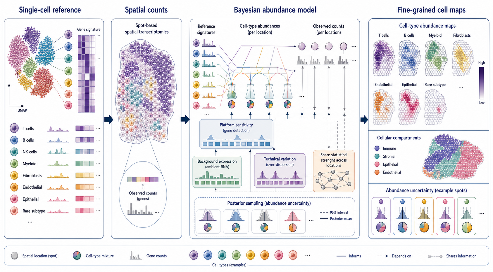
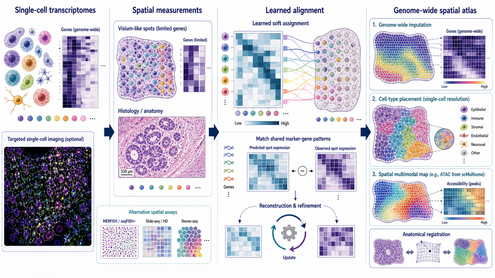
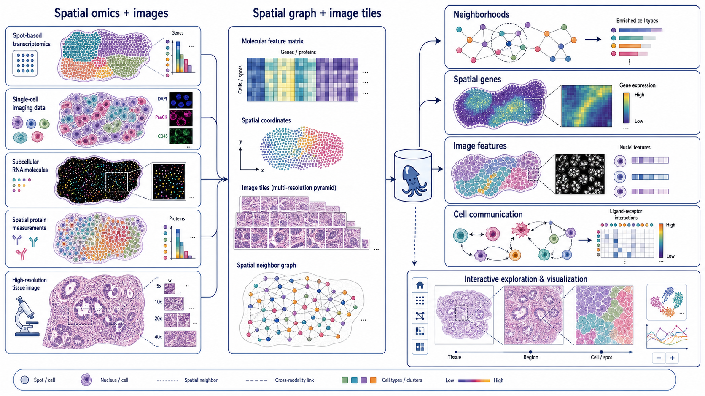

# Spatial Omics Modeling Brief

**June 7, 2026**

Today’s digest combines one newly published method with three established papers whose problem formulations remain central to current spatial foundation, multimodal and atlas-building work.

## New or updated

### 1. [ISON: Integrated Spatial Omics Network for reconstructing gene-regulatory landscapes](https://www.nature.com/articles/s41467-026-74298-0)

**Peer reviewed, unedited manuscript | Nature Communications | 2026-06-04**

*Spatial transcriptomes are matched to single-cell RNA+ATAC reference states, enabling spatial accessibility transfer and spot-specific inference of transcription-factor activity and regulatory networks.*

ISON integrates spatial transcriptomics with a single-cell multiome reference to infer chromatin accessibility, transcription-factor activity and spatial gene-regulatory networks. The current Nature Communications page is the peer-reviewed accepted manuscript before final copyediting and typesetting.

**Technical contribution:** ISON uses transcriptional correspondence between spatial observations and paired RNA+ATAC reference cells to reconstruct spatial chromatin-accessibility profiles. It then combines inferred accessibility, transcription-factor motifs and expression to estimate cis- and trans-regulatory relationships in a spatially resolved network.

**Why it matters:** Most spatial transcriptomics assays measure RNA but not chromatin state. Recovering regulatory information in tissue coordinates can expose region-specific transcription-factor programs and regulatory modules without requiring a spatial ATAC assay on the same specimen.

**Verification:** The Nature Communications abstract states that ISON integrates spatial transcriptomic data with single-cell multiome data, predicts spatial chromatin accessibility, infers transcription-factor activity and reconstructs spatial gene-regulatory networks. The article was published online June 4, 2026.

**Keywords:** `spatial epigenomics` `chromatin accessibility` `gene-regulatory network` `multiome integration`

## Important to revisit

### 2. [Cell2location maps fine-grained cell types in spatial transcriptomics](https://www.nature.com/articles/s41587-021-01139-4)

**Peer reviewed | Nature Biotechnology | 2022-01-13**

*Single-cell reference signatures and mixed spatial counts enter a hierarchical Bayesian abundance model that returns fine-grained cell-type maps and posterior uncertainty.*

Cell2location estimates the abundance of reference-defined cell types at each spatial location using a hierarchical Bayesian model that accounts for technology sensitivity, background expression and technical variation.

**Why included now:** Cell-type mapping remains a foundational layer beneath current spatial atlas and multimodal models. Cell2location is particularly important to revisit because it formalized uncertainty-aware, high-sensitivity mapping of rare and fine-grained cell states rather than returning only normalized mixture proportions.

**Technical contribution:** The model learns cell-state signatures from single-cell RNA-seq and explains spatial counts as mixtures of those signatures, with explicit nuisance components and hierarchical sharing of statistical strength across locations.

**Why it matters:** Its probabilistic abundance estimates support downstream niche discovery and tissue-compartment analysis while retaining uncertainty. This remains a useful baseline for evaluating newer deconvolution and reference-mapping methods.

**Verification:** The Nature Biotechnology article states that cell2location is a Bayesian model for cell-type resolution in spatial transcriptomics, accounts for technical sources of variation and borrows statistical strength across locations.

**Keywords:** `deconvolution` `Bayesian model` `cell-type mapping` `uncertainty`

### 3. [Deep learning and alignment of spatially resolved single-cell transcriptomes with Tangram](https://www.nature.com/articles/s41592-021-01264-7)

**Peer reviewed | Nature Methods | 2021-10-28**

*A learned soft assignment aligns comprehensive single-cell profiles to spatial measurements, enabling genome-wide imputation, cell placement and transfer of paired modalities into tissue space.*

Tangram aligns single-cell or single-nucleus RNA-seq profiles with spatial measurements from the same tissue region using shared expression patterns.

**Why included now:** Modern multimodal and foundation-model approaches still rely on the core alignment question Tangram made explicit: how should information from dissociated, comprehensive profiles be mapped into a spatial coordinate system with limited or coarse measurements?

**Technical contribution:** Tangram optimizes a mapping between cells and spatial locations so aggregated mapped expression agrees with observed spatial gene patterns. The alignment can project unmeasured genes, refine cell-type localization and transfer paired single-cell modalities into space.

**Why it matters:** The method established a general alignment formulation that spans targeted imaging, sequencing-based spatial assays and anatomical registration, making it a useful conceptual baseline for newer cross-modal representation models.

**Verification:** The Nature Methods article states that Tangram aligns single-cell and spatial transcriptomic data, can reveal genome-wide expression in targeted assays, resolve cell types within spatial data and transfer paired modalities such as chromatin accessibility.

**Keywords:** `data alignment` `spatial mapping` `gene imputation` `multimodal transfer`

### 4. [Squidpy: a scalable framework for spatial omics analysis](https://www.nature.com/articles/s41592-021-01358-2)

**Peer reviewed | Nature Methods | 2022-01-31**

*Aligned molecular features, coordinates, image pyramids and spatial graphs support neighborhood, spatial-gene, image-feature and cell-communication analyses in one framework.*

Squidpy is a Python framework for scalable analysis of spatial molecular data together with high-resolution tissue images.

**Why included now:** As modeling becomes more complex, reproducible spatial graph construction, image tiling, neighborhood statistics and multimodal data handling remain core infrastructure. Squidpy is worth revisiting as the analysis substrate against which specialized models are often evaluated or integrated.

**Technical contribution:** The framework represents molecular features, spatial coordinates, images and neighborhood graphs in compatible data structures. It implements spatial statistics, neighborhood enrichment and co-occurrence, image feature extraction, segmentation workflows and ligand–receptor analyses.

**Why it matters:** Squidpy helped standardize how spatial analyses are assembled and scaled across technologies. Its distinction from a single predictive model is useful: it provides reusable computational primitives and workflows for method development and biological interpretation.

**Verification:** The Nature Methods article describes support for spot- and molecule-based technologies, scalable image storage and processing, graph-based analyses, spatial statistics, image features and ligand–receptor analysis.

**Keywords:** `analysis framework` `spatial graph` `image analysis` `cell communication`

## What to watch

- Regulatory-state reconstruction is extending spatial RNA measurements toward spatial epigenomic inference.
- Reference mapping and alignment assumptions remain central even as model architectures become larger.
- Uncertainty-aware deconvolution should remain a baseline requirement for rare-cell and niche analyses.
- General-purpose spatial graph and image infrastructure is increasingly important for reproducible model evaluation.

---

_Figures are original conceptual summaries based on verified primary-source descriptions. They are not reproduced publication figures and do not depict reported quantitative results._
