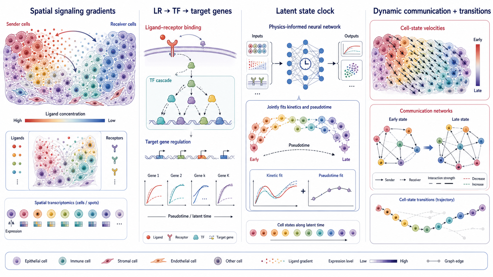
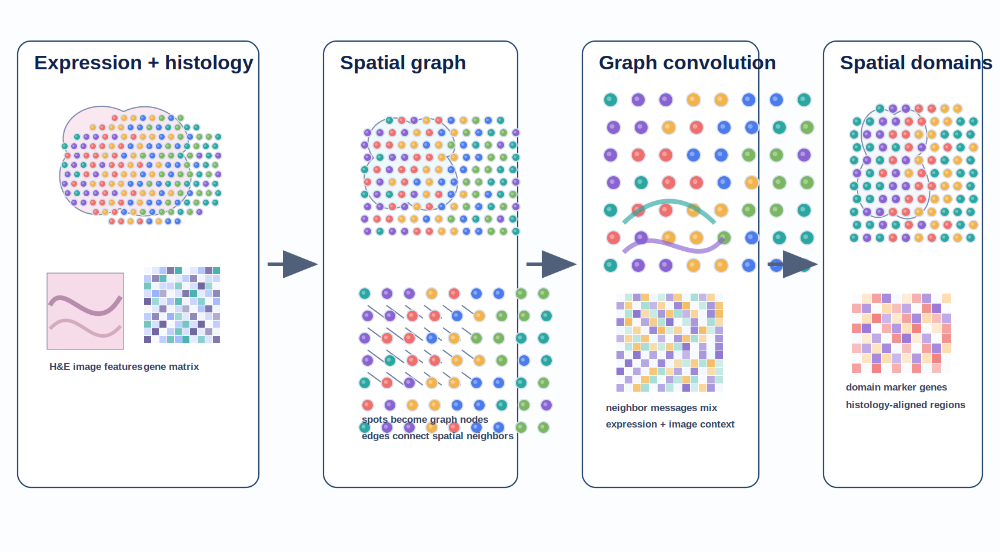
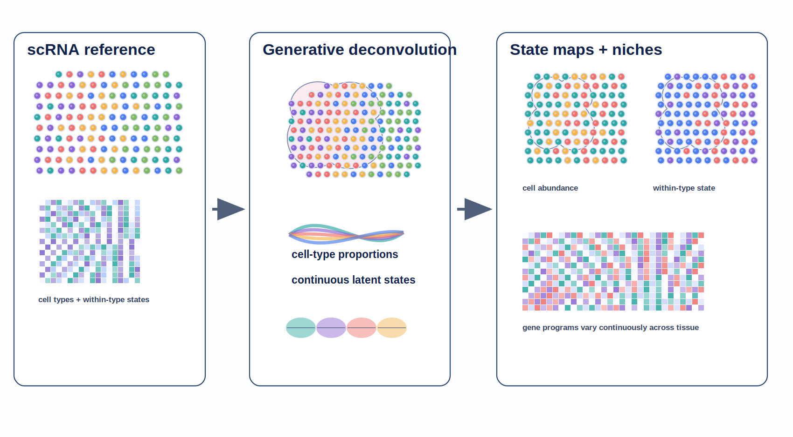
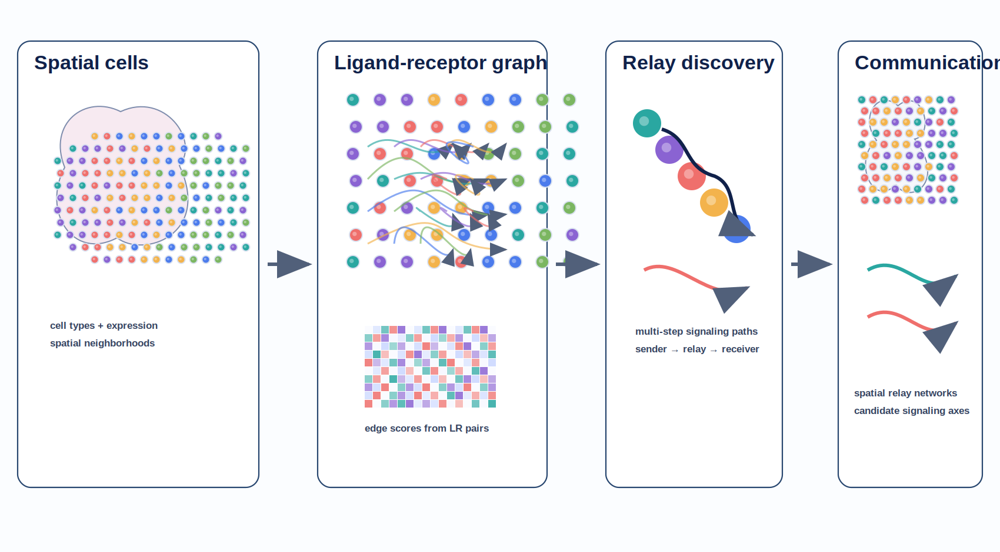

# Spatial Omics Modeling Brief

**June 8, 2026**

No qualifying paper appeared after yesterday’s cutoff. Today’s update therefore revisits four uncovered methods that define useful modeling directions: dynamic communication, multimodal domain detection, continuous-state deconvolution and relay signaling networks.

## Important to revisit

### 1. [Decoding cell state transitions driven by dynamic cell–cell communication in spatial transcriptomics](https://www.nature.com/articles/s43588-025-00934-2)

**Peer reviewed | Nature Computational Science | 2026-01-05**

*Ligand gradients, receptor signaling and transcription-factor cascades are coupled to a latent state clock to infer communication rewiring and directional cell-state transitions.*

CCCvelo reconstructs cell-state transitions driven by changing cell–cell communication from high-resolution spatial transcriptomics.

**Why included now:** Most communication tools infer a static network, while most trajectory tools model intracellular expression dynamics without an explicit spatial signaling mechanism. CCCvelo is worth checking because it attempts to join those two problems in one kinetic model.

**Technical contribution:** CCCvelo integrates intercellular ligand–receptor gradients with intracellular transcription-factor activation and target-gene dynamics. Its PINN-CELL algorithm jointly estimates kinetic parameters and pseudotemporal ordering through physics-informed neural-network optimization.

**Why it matters:** The model produces a mechanistic account of how communication networks rewire along a transition rather than merely correlating ligand–receptor expression with a precomputed trajectory.

**Verification:** The primary article states that CCCvelo jointly optimizes a dynamic communication network and latent cell-state clock using a multiscale nonlinear kinetic model and a physics-informed coevolution algorithm.

**Keywords:** `cell-state transition` `cell communication` `physics-informed neural network` `pseudotime`

### 2. [Integrating gene expression, spatial location and histology to identify spatial domains and spatially variable genes by graph convolutional network](https://www.nature.com/articles/s41592-021-01255-8)

**Peer reviewed | Nature Methods | 2021-10-28**

*Expression, tissue coordinates and histology define a spatial graph whose graph-convolution representation supports domain discovery and domain-guided marker-gene analysis.*

SpaGCN is an early graph-convolutional approach for jointly modeling expression, spatial proximity and histology in spatially resolved transcriptomics.

**Why included now:** Graph neural networks now appear throughout spatial-omics modeling. SpaGCN remains useful to revisit because it clearly exposes the basic design choice underneath many successors: what defines an edge, what information is aggregated, and how domain labels feed downstream differential analysis.

**Technical contribution:** Each spatial observation becomes a graph node, with neighborhood structure informed by coordinates and histology. Graph convolution aggregates neighboring expression profiles to identify coherent spatial domains, followed by domain-guided detection of spatially variable genes.

**Why it matters:** The paper established a compact multimodal graph formulation that remains a sensible baseline when evaluating newer graph attention, transformer and contrastive-learning methods.

**Verification:** The Nature Methods article explicitly describes integration of gene expression, spatial location and histology through graph convolution for domain identification and domain-guided differential expression.

**Keywords:** `graph convolution` `spatial domains` `histology integration` `spatially variable genes`

### 3. [DestVI identifies continuums of cell types in spatial transcriptomics data](https://www.nature.com/articles/s41587-022-01272-8)

**Peer reviewed | Nature Biotechnology | 2022-04-21**

*A single-cell reference and mixed spatial counts enter a variational generative model that estimates both cell-type proportions and continuous within-cell-type expression states across tissue.*

DestVI extends spatial deconvolution beyond discrete cell-type abundance by estimating continuous transcriptional variation within each cell type at every spatial location.

**Why included now:** Current atlases increasingly care about activation, differentiation, metabolism and disease-associated programs within a nominal cell type. DestVI is an important conceptual counterweight to methods that treat every reference cell type as a fixed expression signature.

**Technical contribution:** DestVI uses variational inference and coupled generative models for single-cell and spatial data. It estimates cell-type proportions and cell-type-specific latent states, enabling reconstruction of location-specific gene expression for each constituent cell type.

**Why it matters:** Continuous states can distinguish, for example, spatially localized macrophage programs that a discrete abundance map would merge together.

**Verification:** The Nature Biotechnology abstract states that DestVI was designed to identify continuous transcriptomic variation within cells of the same type and estimate gene expression for every cell type inside every spot.

**Keywords:** `deconvolution` `variational inference` `continuous cell states` `deep generative model`

### 4. [Inference of cell–cell communications in spatially resolved transcriptomics datasets](https://www.nature.com/articles/s41592-025-02721-3)

**Peer reviewed | Nature Methods | 2025-06-06**

*A spatial ligand–receptor graph is scored with attention to recover direct interactions and multistep sender–relay–receiver communication paths within tissue niches.*

CellNEST infers communication between individual spatially resolved cells and identifies relay networks in which signals propagate through intermediate cells.

**Why included now:** Pairwise ligand–receptor rankings miss a central property of tissue signaling: communication can be sequential and networked. CellNEST is worth checking alongside CCCvelo because one emphasizes spatial relay topology while the other emphasizes temporal dynamics.

**Technical contribution:** CellNEST constructs a spatial cell graph from expression and ligand–receptor information, then uses attention mechanisms to score communication edges and discover higher-order relay paths.

**Why it matters:** Relay-network inference can identify candidate signaling chains and communication niches that are invisible in aggregated cell-type interaction matrices.

**Verification:** The primary Nature Methods paper states that CellNEST detects cell-to-cell communication and relay networks in spatial transcriptomics using attention mechanisms.

**Keywords:** `cell communication` `graph attention` `ligand–receptor` `relay networks`

## What to watch

- Dynamic communication models are beginning to merge signaling mechanisms with trajectory inference.
- Continuous within-cell-type states should be evaluated alongside abundance in deconvolution benchmarks.
- Graph architecture choices remain biological assumptions: neighborhood construction, edge direction and relay depth all change interpretation.
- Static pairwise communication scores are giving way to spatial, multistep and state-dependent networks.

---

_Figures are original conceptual summaries based on verified primary-source descriptions. They are not reproduced publication figures and do not depict reported quantitative results._
