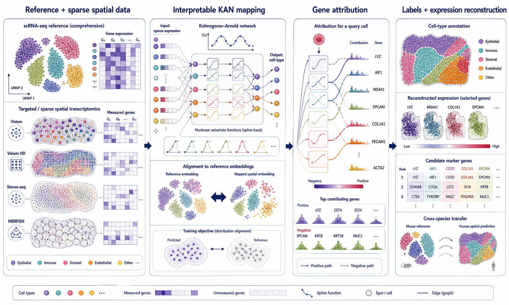
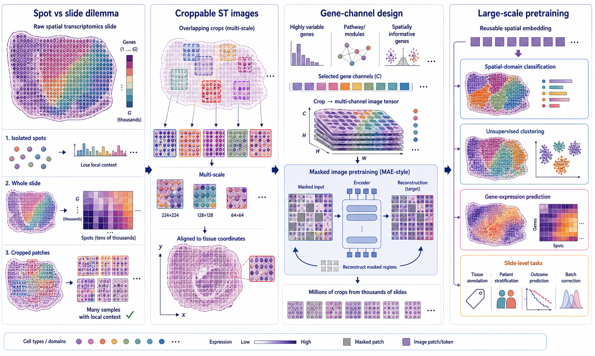
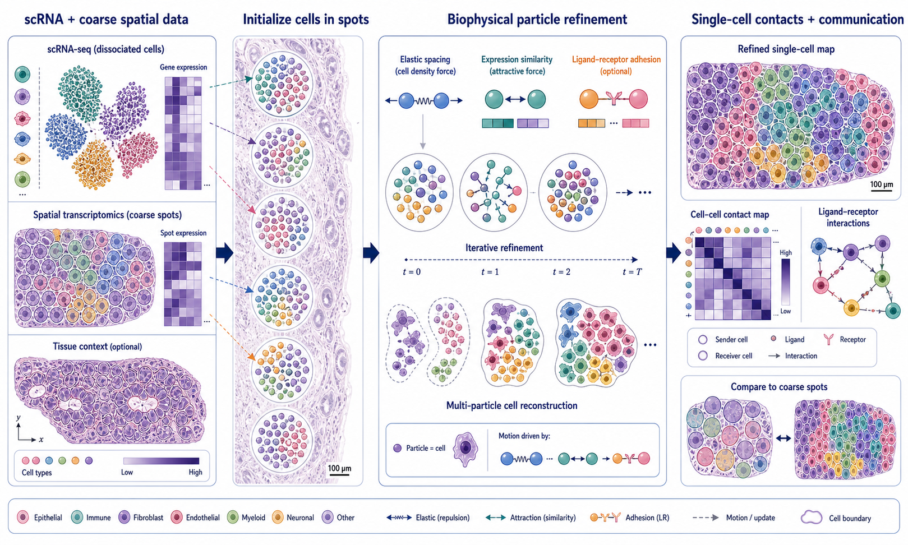
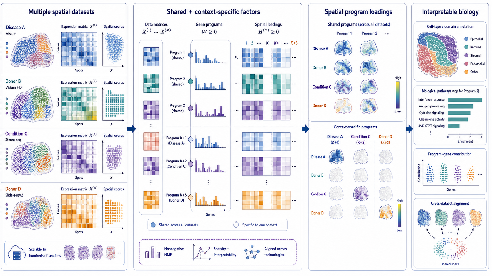

# Spatial Omics Modeling Brief

**June 9, 2026**

No qualifying paper appeared after yesterday’s cutoff. Today’s digest revisits four uncovered methods that point toward interpretable transfer, scalable pretraining, physically constrained reconstruction and multi-section integration.

## Important to revisit

### 1. [SpCAST: Decoding spatial transcriptomics at single-cell resolution with fast and interpretable analysis](https://arxiv.org/abs/2605.26904)

**Preprint | arXiv | 2026-05-26**

*A comprehensive single-cell reference is nonlinearly aligned to targeted or sparse spatial profiles, while gene-level attribution explains label transfer and supports expression reconstruction.*

SpCAST is a Kolmogorov–Arnold network-based framework for reference-guided analysis of single-cell-resolution spatial transcriptomics.

**Why included now:** Reference transfer is becoming a front end for spatial foundation and multimodal models, but interpretability often stops at a predicted label. SpCAST is worth checking because it pairs nonlinear transfer with gene-level feature attribution in one framework.

**Technical contribution:** SpCAST learns nonlinear mappings between reference and spatial expression profiles using KAN components. It supports cell-type annotation, reconstruction of unmeasured marker-gene patterns and prioritization of genes that support individual predictions.

**Why it matters:** Imaging-based assays frequently use targeted panels, while sequencing-based single-cell assays remain sparse. A transfer model that exposes contributing genes can make label assignment and panel design easier to audit.

**Verification:** The arXiv abstract states that SpCAST uses KANs and feature attribution for label transfer, spatial expression reconstruction and marker-gene prioritization across targeted and sparse datasets.

**Keywords:** `reference mapping` `Kolmogorov–Arnold network` `feature attribution` `expression reconstruction`

### 2. [Spatial Transcriptomics as Images for Large-Scale Pretraining](https://arxiv.org/abs/2603.13432)

**Preprint | arXiv | 2026-03-13**

*Spatial slides become overlapping, fixed-size multi-channel image crops that preserve local context and provide many reusable samples for large-scale pretraining.*

This work reframes spatial transcriptomics dataset construction: instead of treating each spot or entire slide as one sample, it represents local tissue crops as multi-channel images.

**Why included now:** Spatial foundation-model work has focused heavily on architectures, but the definition of a training sample may be just as consequential. This paper isolates that data-design question and offers a practical scaling strategy.

**Technical contribution:** Fixed-size crops preserve local spatial dependencies while multiplying the number of training examples. Gene-subset selection controls channel dimensionality, allowing standard image-style pretraining objectives to operate on spatial expression tensors.

**Why it matters:** Spot-level samples discard tissue context, while slide-level samples are enormous and scarce. Patch-based construction offers a middle scale that can support masked pretraining and transfer across downstream tasks.

**Verification:** The arXiv abstract explicitly describes croppable multi-channel image representations, fixed spatial size, gene-channel selection and improved large-scale ST pretraining.

**Keywords:** `foundation model` `dataset construction` `masked pretraining` `spatial representation`

### 3. [Reconstructing single-cell resolution from spatial transcriptomics with CellRefiner](https://www.nature.com/articles/s41467-026-70090-2)

**Peer reviewed | Nature Communications | 2026-02-27**

*Cells initialized within coarse spatial spots move under density, expression-similarity and optional ligand–receptor forces to recover plausible single-cell arrangements and contacts.*

CellRefiner reconstructs single-cell spatial organization from paired single-cell RNA-seq and lower-resolution spatial transcriptomics using a physical particle model.

**Why included now:** Many super-resolution methods optimize molecular agreement but leave cell packing and contact geometry implicit. CellRefiner is technically distinctive because it treats reconstruction as a constrained physical placement problem.

**Technical contribution:** Cells are initialized in coarse spots and represented by particles. Iterative forces encode local density, expression similarity and optional ligand–receptor adhesion; multi-particle representations can model cell shape.

**Why it matters:** Physical plausibility matters when downstream questions involve direct contacts or membrane-bound signaling. A molecularly accurate but geometrically implausible reconstruction can produce misleading communication networks.

**Verification:** The Nature Communications article describes elastic, transcriptional-similarity and ligand–receptor forces, particle-based refinement and reconstruction of realistic single-cell spatial distributions.

**Keywords:** `single-cell reconstruction` `physical model` `cell contact` `ligand–receptor adhesion`

### 4. [Interpretable, flexible and spatially aware integration of multiple spatial transcriptomics datasets from diverse sources](https://www.nature.com/articles/s41588-026-02579-x)

**Peer reviewed | Nature Genetics | 2026-04-27**

*Graph-aware integration aligns heterogeneous sections while nonnegative factorization exposes spatial programs and gene loadings that can be compared across technologies and conditions.*

INSPIRE integrates multiple heterogeneous spatial transcriptomics datasets while preserving interpretable spatial factors and gene programs.

**Why included now:** Multi-section atlases need to remove unwanted variation without erasing condition-specific biology. INSPIRE is worth checking because it explicitly combines alignment, spatial context and interpretable factorization rather than treating them as separate post-processing steps.

**Technical contribution:** A graph-neural-network encoder captures local spatial context, adversarial learning harmonizes datasets adaptively, and integrated nonnegative matrix factorization produces spatial factors with shared gene loadings.

**Why it matters:** The outputs support fine-grained spatial architecture, pathway interpretation, trajectory analysis, imputation and three-dimensional reconstruction while retaining links from factors back to genes.

**Verification:** The Nature Genetics article states that INSPIRE combines graph neural networks, adversarial alignment and NMF to integrate diverse sections and recover interpretable spatial factors and gene programs.

**Keywords:** `multi-section integration` `graph neural network` `adversarial learning` `nonnegative matrix factorization`

## What to watch

- Dataset construction is becoming a first-class design choice for spatial foundation models.
- Interpretability is moving from global marker lists toward prediction-specific gene attribution.
- Physical cell packing and contact constraints deserve explicit evaluation in super-resolution benchmarks.
- Multi-section integration methods must separate technical variation from genuinely context-specific spatial biology.

---

_Figures are original conceptual summaries based on verified primary-source descriptions. They are not reproduced publication figures and do not depict reported quantitative results._
