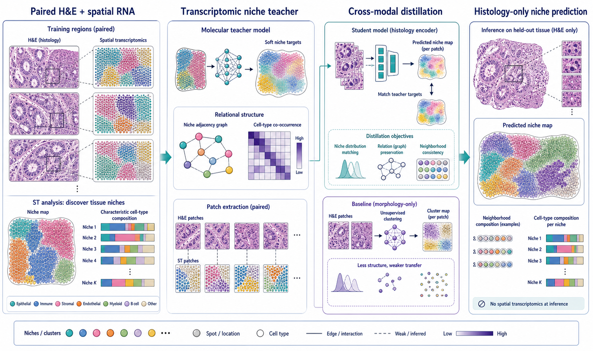
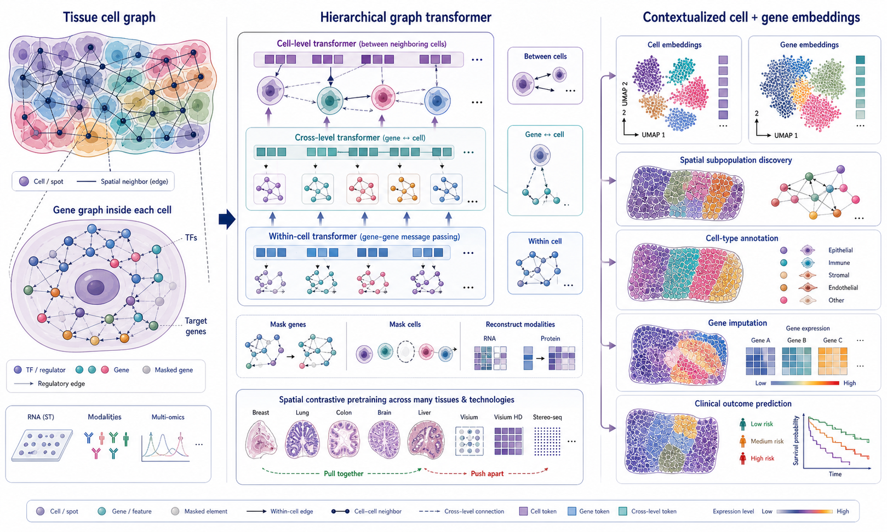
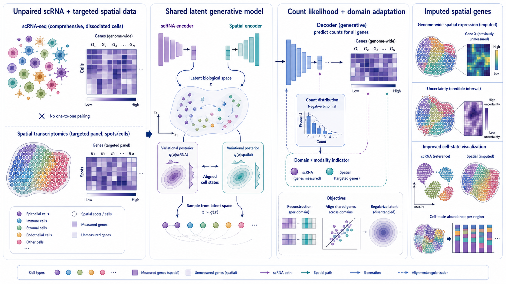
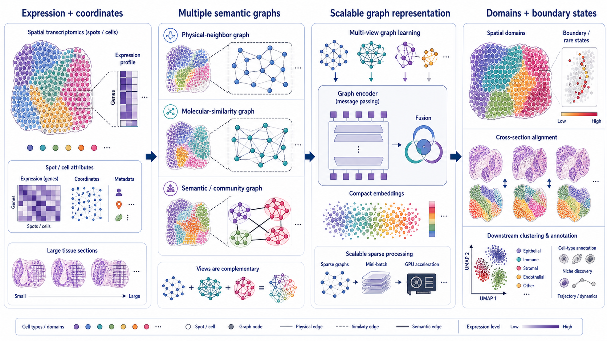

# Spatial Omics Modeling Brief

**June 10, 2026**

No qualifying paper appeared after yesterday’s cutoff. Today’s retrospective follows one question across several generations of methods: how should information move between modalities, graph levels and spatial scales?

## Important to revisit

### 1. [Cross-Modal Knowledge Distillation from Spatial Transcriptomics to Histology](https://arxiv.org/abs/2604.09076)

**Preprint | arXiv | 2026-04-10**

*Transcriptomics-derived tissue niches supervise a histology encoder during training, allowing niche structure to be predicted from H&E alone at inference.*

This work transfers spatially resolved molecular knowledge into a histology-only model through cross-modal knowledge distillation.

**Why included now:** Virtual spatial profiling often asks an image model to predict genes directly. Distilling higher-level niche structure is a distinct and potentially more robust target because it emphasizes tissue organization and cell composition rather than every noisy molecular measurement.

**Technical contribution:** A teacher trained from spatial transcriptomics provides molecularly defined niche targets and relational structure for paired histology patches. A student image encoder learns to reproduce those representations and can then infer niches in held-out H&E tissue without spatial transcriptomics.

**Why it matters:** The approach turns expensive spatial assays into supervision for scalable pathology-image analysis while retaining tissue-neighborhood information that morphology-only clustering may miss.

**Verification:** The arXiv abstract describes cross-modal distillation from spatial transcriptomics to histology and evaluation of histology-only prediction on unseen tissue.

**Keywords:** `knowledge distillation` `histology` `tissue niches` `virtual spatial profiling`

### 2. [HEIST: A Graph Foundation Model for Spatial Transcriptomics and Proteomics Data](https://arxiv.org/abs/2506.11152)

**Preprint | arXiv | 2025-06-11**

*Each tissue is a graph of neighboring cells, each cell contains a gene-regulatory graph, and hierarchical message passing yields contextualized cell and gene embeddings.*

HEIST is a hierarchical graph-transformer foundation model for spatial transcriptomics and proteomics.

**Why included now:** Many foundation models tokenize spots, cells or genes at one level. HEIST explicitly models two nested biological graphs—spatial cell neighborhoods and intracellular gene-regulatory networks—and its preprint received a substantive revision on June 4, 2026.

**Technical contribution:** The model performs message passing within gene graphs, between neighboring cells and across gene-to-cell levels. Spatial contrastive learning and masked autoencoding pretrain contextualized representations across tissues, organs and technologies.

**Why it matters:** A cell’s regulatory state depends on its microenvironment, while tissue behavior emerges from cell-level programs. Hierarchical modeling gives those two scales a direct computational interface.

**Verification:** The arXiv abstract states that HEIST represents tissue as a spatial cellular-neighborhood graph, each cell as a GRN graph and uses hierarchical graph transformers with cross-level message passing.

**Keywords:** `foundation model` `hierarchical graph transformer` `gene-regulatory network` `spatial proteomics`

### 3. [A joint model of unpaired data from scRNA-seq and spatial transcriptomics for imputing missing gene expression measurements](https://arxiv.org/abs/1905.02269)

**Preprint | arXiv | 2019-05-06**

*Unpaired genome-wide single-cell and targeted spatial profiles share a variational latent space whose generative decoder imputes unmeasured genes in tissue.*

gimVI is an early deep generative model for integrating unpaired scRNA-seq and targeted spatial transcriptomics.

**Why included now:** Current multimodal spatial models often present alignment and imputation as new foundation-model capabilities. gimVI is worth revisiting because it framed the same problem cleanly as probabilistic domain adaptation years earlier.

**Technical contribution:** Modality-specific observations are encoded into a shared latent biological space and decoded with a count-generative model. Shared genes align the domains, enabling posterior prediction of genes not measured in the spatial assay.

**Why it matters:** The probabilistic formulation naturally separates biological latent state, assay domain and observation noise while supporting uncertainty-aware imputation.

**Verification:** The arXiv abstract identifies gimVI as a deep generative domain-adaptation model for unpaired scRNA-seq and spatial transcriptomics that imputes missing spatial genes.

**Keywords:** `deep generative model` `domain adaptation` `gene imputation` `unpaired integration`

### 4. [SemanticST: A Scalable Framework for Spatial Transcriptomics Analysis via Multi-Semantic Representation Learning](https://arxiv.org/abs/2506.11491)

**Preprint | arXiv | 2025-06-13**

*Physical-neighbor, molecular-similarity and community-level graph views are fused into scalable embeddings for domains, boundaries and cross-section analysis.*

SemanticST learns spatial representations from multiple complementary semantic relationships rather than relying on a single neighborhood graph.

**Why included now:** Graph-based spatial methods often hide a consequential assumption inside one adjacency matrix. SemanticST is useful to revisit because it treats graph construction as a multi-view modeling problem.

**Technical contribution:** The framework constructs complementary graph views from physical proximity, molecular similarity and higher-level semantic relationships, then fuses them through scalable graph representation learning.

**Why it matters:** Local spatial neighbors and transcriptionally related but nonlocal cells provide different information. Explicitly preserving both can improve domain boundaries, rare-state discovery and integration of large sections.

**Verification:** The arXiv record presents SemanticST as a scalable multi-semantic representation-learning framework for spatial transcriptomics analysis.

**Keywords:** `multi-view graph` `representation learning` `spatial domains` `scalable analysis`

## What to watch

- Distillation may offer a more stable bridge from molecular assays to routine histology than direct gene-by-gene prediction.
- Hierarchical foundation models are beginning to connect intracellular regulation with intercellular context.
- Older probabilistic integration models remain valuable baselines for uncertainty and domain adaptation.
- Spatial graph construction should be treated as a model component, not merely preprocessing.

---

_Figures are original conceptual summaries based on verified primary-source descriptions. They are not reproduced publication figures and do not depict reported quantitative results._
