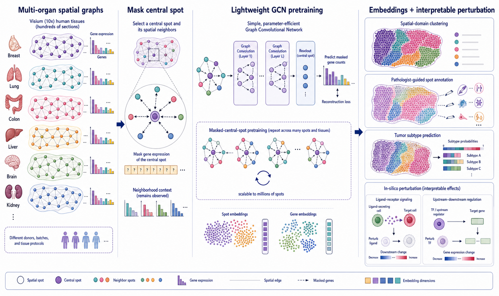
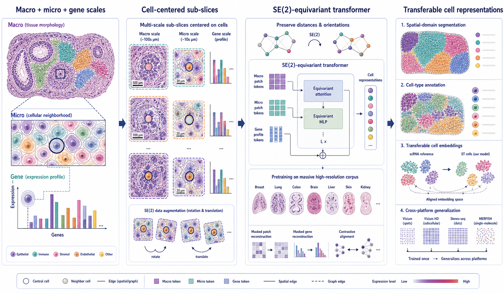
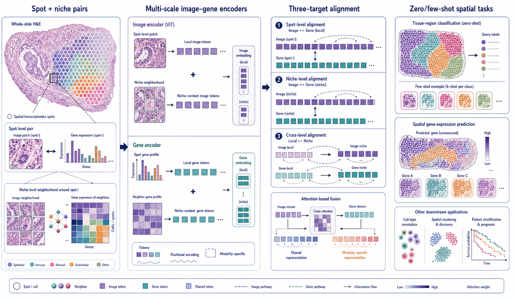

# Spatial Omics Modeling Brief

**June 11, 2026**

No qualifying paper appeared after yesterday’s cutoff. Today’s focused retrospective compares three definitions of spatial context in foundation models: local graph neighborhoods, geometric multiscale tissue structure and aligned image–gene niches.

## Important to revisit

### 1. [SAGE-FM: A lightweight and interpretable foundation model for spatial transcriptomics](https://arxiv.org/abs/2601.15652)

**Preprint, revised | arXiv | 2026-01-21; revised 2026-03-06**

*A lightweight graph network predicts a masked central spot from its observed neighborhood, producing reusable embeddings and interpretable in-silico perturbation responses.*

SAGE-FM is a parameter-efficient graph foundation model pretrained on hundreds of human Visium sections spanning multiple organs.

**Why included now:** Spatial foundation models are rapidly growing in architectural complexity. SAGE-FM is a useful counterexample: it asks how much transferable biology can be captured with a comparatively simple graph-convolution design and a transparent pretraining task.

**Technical contribution:** The central spot’s expression is masked while neighboring spots remain visible. A graph convolutional network reconstructs the central expression profile, learning spot and gene representations from repeated neighborhood prediction across tissues.

**Why it matters:** The compact model supports domain clustering, spot annotation and tumor-subtype prediction while enabling perturbation analyses that probe ligand–receptor and upstream–downstream regulatory effects.

**Verification:** The arXiv abstract describes a lightweight GCN trained on masked central spots, multi-organ Visium data, downstream spatial tasks and interpretable in-silico perturbation.

**Keywords:** `foundation model` `graph convolution` `masked modeling` `in-silico perturbation`

### 2. [SToFM: A Multi-scale Foundation Model for Spatial Transcriptomics](https://arxiv.org/abs/2507.10737)

**Preprint | arXiv | 2025-07-15**

*Cell-centered sub-slices combine tissue morphology, local cellular neighborhoods and gene profiles in an SE(2)-equivariant transformer that preserves spatial geometry.*

SToFM is a multiscale foundation model designed for high-resolution spatial transcriptomics at cellular scale.

**Why included now:** Many spatial models use coordinates as graph edges or positional encodings. SToFM is technically distinctive because it builds rotation and translation symmetry directly into the architecture while representing macro, micro and molecular scales.

**Technical contribution:** The model extracts cell-centered sub-slices containing tissue-scale morphology, neighborhood-scale cellular structure and gene-expression features. An SE(2)-equivariant transformer learns representations that respond consistently to rotations and translations.

**Why it matters:** Spatial biology should not change when a tissue section is rotated on the slide. Equivariance offers a principled route to geometry-aware transfer rather than relying entirely on augmentation.

**Verification:** The arXiv abstract describes multiscale cell-centered inputs, an SE(2)-equivariant transformer, large-scale high-resolution pretraining and transfer to segmentation and annotation tasks.

**Keywords:** `foundation model` `SE(2) equivariance` `multiscale modeling` `high-resolution ST`

### 3. [ST-Align: a multimodal foundation model for image-gene alignment in spatial transcriptomics](https://arxiv.org/abs/2411.16800)

**Preprint | arXiv | 2024-11-25**

*Spot-level and niche-level histology and expression are encoded separately, aligned through three complementary objectives and fused for zero- and few-shot spatial tasks.*

ST-Align is a multimodal foundation model that aligns histology images with spatial gene expression at both local and neighborhood scales.

**Why included now:** Image–gene foundation models can look similar at a distance, but their alignment targets differ substantially. ST-Align is worth revisiting because it makes spot, niche and cross-level alignment explicit rather than collapsing all context into one contrastive objective.

**Technical contribution:** Specialized image and gene encoders generate local and niche representations. Three alignment targets connect image and molecular information at spot scale, niche scale and across levels, followed by attention-based fusion.

**Why it matters:** The hierarchy supports zero- and few-shot tissue-region classification and spatial gene prediction while separating shared multimodal information from modality-specific signals.

**Verification:** The arXiv record describes multiscale image–gene encoding, three-target alignment, attention fusion and zero/few-shot spatial tasks.

**Keywords:** `multimodal foundation model` `histology` `contrastive alignment` `zero-shot learning`

## What to watch

- Parameter efficiency may matter as much as parameter count when spatial datasets remain modest and heterogeneous.
- Equivariance provides a testable inductive bias for tissue geometry, not merely a visual augmentation trick.
- Foundation-model comparisons should separate spot-level, niche-level and tissue-level alignment objectives.
- Interpretability claims are strongest when models expose perturbation responses or gene-level mechanisms rather than only attention maps.

---

_Figures are original conceptual summaries based on verified primary-source descriptions. They are not reproduced publication figures and do not depict reported quantitative results._
