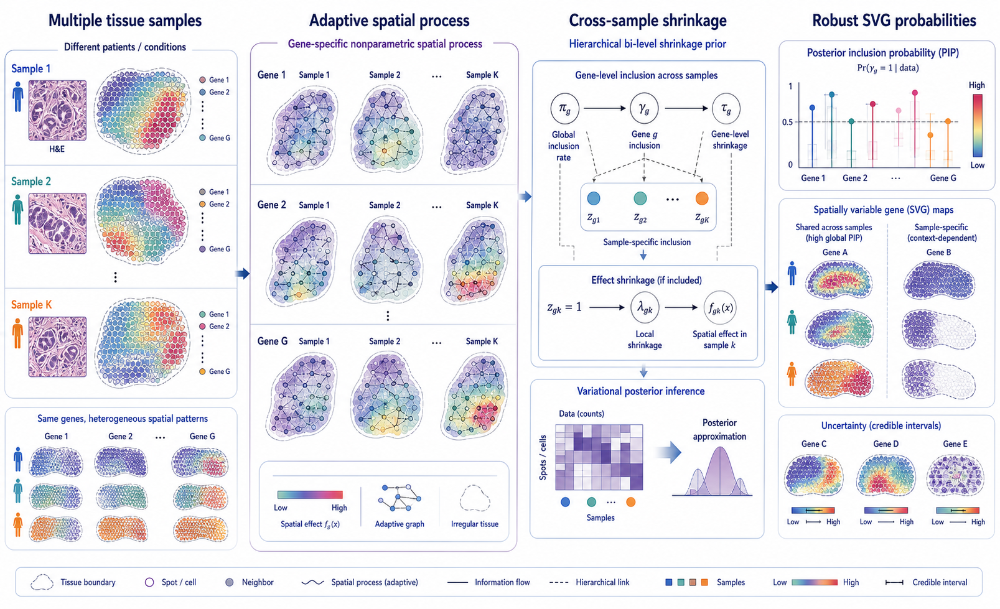
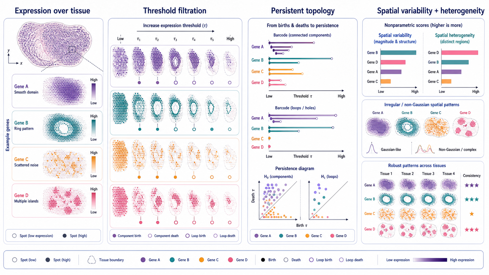
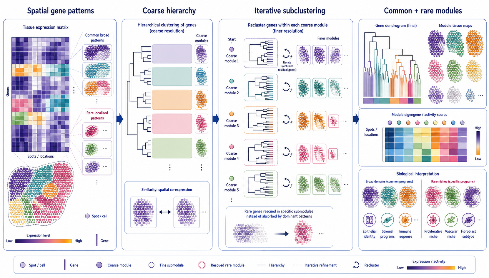

# Spatial Omics Modeling Brief

**June 12, 2026**

No qualifying paper appeared after yesterday's cutoff. Today's statistical retrospective follows spatial gene analysis from individual-gene selection, through topology-based scoring, to discovery of common and rare co-expression modules.

## Important to revisit

### 1. [Integrated Bayesian non-parametric spatial modeling for cross-sample identification of spatially variable genes](https://arxiv.org/abs/2504.09654)

**Preprint | arXiv | 2025-04-13**

*Gene-specific adaptive spatial processes model irregular patterns within each tissue, while hierarchical shrinkage separates shared from sample-specific spatial effects and quantifies uncertainty.*

This method performs integrated spatially variable gene detection across multiple tissue samples using Bayesian nonparametric spatial modeling.

**Why included now:** Multi-patient spatial studies need more than a pooled SVG list. A useful model must distinguish reproducible spatial programs from condition- or sample-specific effects while allowing patterns that do not resemble a small menu of predefined kernels.

**Technical contribution:** The framework uses an adaptive, gene-specific nonparametric spatial process to capture complex expression geometry. A hierarchical bi-level shrinkage prior links global gene inclusion with sample-specific inclusion and effect shrinkage, with scalable variational posterior inference.

**Why it matters:** The posterior separates genes with stable cross-sample spatial structure from genes whose spatial effect depends on a particular tissue context, while providing inclusion probabilities rather than only thresholded test results.

**Verification:** The arXiv abstract describes adaptive nonparametric spatial processes, cross-sample bi-level shrinkage and variational inference for robust multi-sample SVG detection.

**Keywords:** `spatially variable genes` `Bayesian nonparametrics` `multi-sample integration` `shrinkage prior`

### 2. [PersiST: Robust Identification of Spatially Variable Features in Spatial Omics Datasets via Topological Data Analysis](https://arxiv.org/abs/2505.04360)

**Preprint | arXiv | 2025-05-07**

*Expression thresholds generate a filtration in which connected regions and loops appear and disappear, yielding continuous topology-based scores for spatial structure.*

PersiST uses persistent homology to quantify the spatial structure of each feature in spatial transcriptomics and other spatial-omics datasets.

**Why included now:** Most SVG methods encode smoothness, covariance or neighborhood autocorrelation. PersiST offers a genuinely different representation that can recognize rings, multiple islands and irregular patterns without assuming a Gaussian spatial surface.

**Technical contribution:** As the expression threshold changes, the method records the birth and death of connected components and loops. Persistence summaries become continuous, nonparametric measures of spatial structure that can rank features and compare patterns between samples.

**Why it matters:** Topological summaries distinguish strong organized structure from scattered expression and can transfer across molecular modalities because they do not depend on a particular count distribution.

**Verification:** The arXiv abstract states that PersiST uses topology to compute a continuous measure of spatial structure for each feature and applies it to transcriptomic and metabolomic spatial data.

**Keywords:** `persistent homology` `topological data analysis` `spatial variability` `spatial metabolomics`

### 3. [Spatial Transcriptomics Iterative Hierarchical Clustering (stIHC): A Novel Method for Identifying Spatial Gene Co-Expression Modules](https://arxiv.org/abs/2502.09574)

**Preprint | arXiv | 2025-02-13**

*Genes first form broad spatial modules, then each branch is recursively reclustered so rare localized patterns are rescued from dominant tissue-wide programs.*

stIHC clusters spatially variable genes into modules with shared tissue-expression patterns using iterative hierarchical refinement.

**Why included now:** SVG detection is only the first step; biological interpretation often depends on modules. Standard one-pass clustering can absorb small, localized programs into broad dominant patterns, exactly where rare niches may disappear.

**Technical contribution:** The method performs coarse hierarchical clustering based on spatial co-expression, then iteratively reclusters genes inside each module at finer resolution. This creates nested modules and preserves rare or unique spatial patterns.

**Why it matters:** Module maps and activity scores provide a compact view of tissue programs while retaining specific vascular, proliferative or subtype-associated niches that broad clustering can miss.

**Verification:** The arXiv abstract describes iterative hierarchical clustering of SVGs, improved recovery of rare spatial patterns and evaluation across Visium, Xenium and original Spatial Transcriptomics datasets.

**Keywords:** `co-expression modules` `hierarchical clustering` `rare spatial patterns` `spatially variable genes`

## What to watch

- Multi-sample SVG analysis should report shared and sample-specific effects separately.
- Topological scores can complement covariance-based tests rather than merely compete with them.
- Module discovery needs explicit sensitivity to rare spatial programs, not just dominant variance.
- Uncertainty should propagate from SVG selection into downstream module and pathway interpretation.

---

_Figures are original conceptual summaries based on verified primary-source descriptions. They are not reproduced publication figures and do not depict reported quantitative results._
