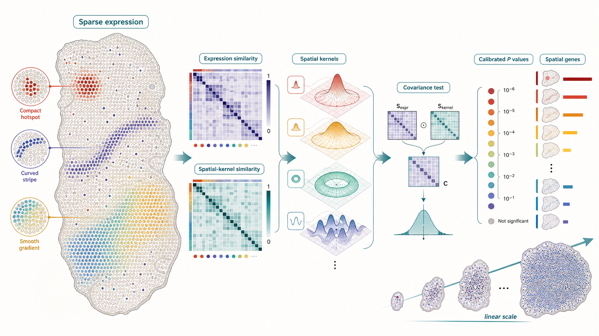
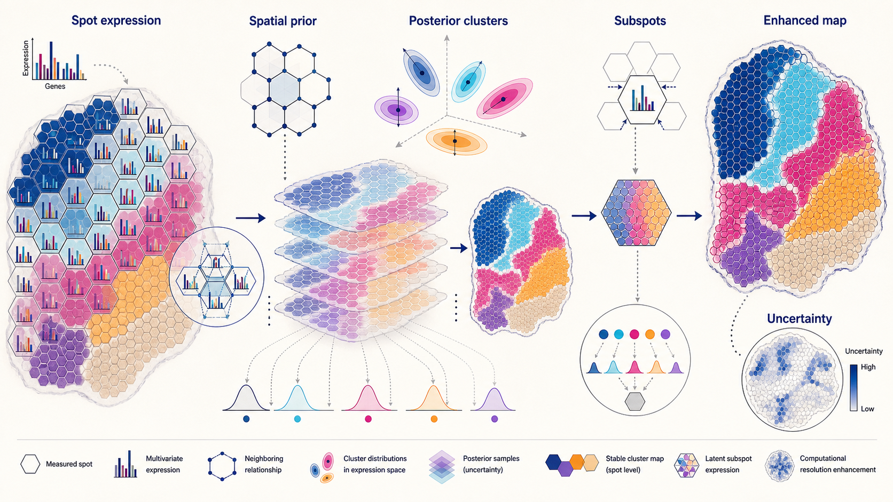
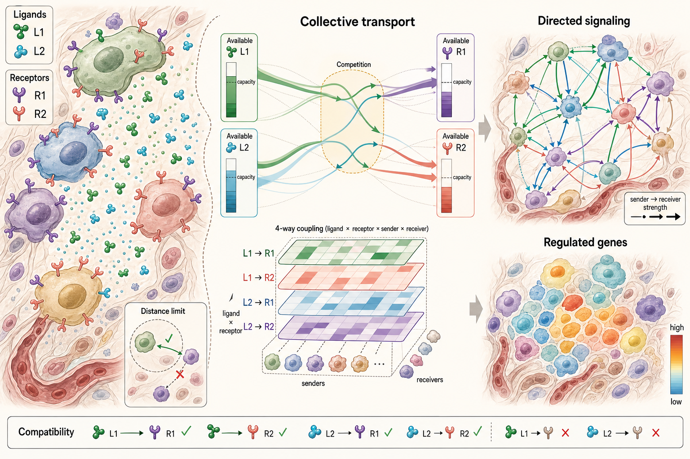

# Spatial Omics Modeling Brief

**June 13, 2026**

No qualifying new method appeared after the June 12 cutoff. Today's retrospective connects three enduring statistical ideas: scalable nonparametric spatial-feature detection, Bayesian tissue-domain refinement, and constrained transport models for directional cell-cell communication.

## Important to revisit

### 1. [SPARK-X: non-parametric modeling enables scalable and robust detection of spatial expression patterns for large spatial transcriptomic studies](https://genomebiology.biomedcentral.com/articles/10.1186/s13059-021-02404-0)

**Peer reviewed | Genome Biology | 2021-06-21**

*Sparse gene expression and spatial kernels are converted into similarity structures whose covariance yields calibrated tests and a scalable ranking of spatially expressed genes.*

SPARK-X detects spatially expressed genes in large, sparse spatial-transcriptomics datasets without specifying a parametric count model for each gene.

**Why included now:** Current high-resolution assays routinely contain hundreds of thousands of locations. That scale makes the distinction between a statistically flexible model and an algorithm with genuinely favorable time and memory complexity especially important.

**Technical contribution:** SPARK-X builds spatial and expression similarity matrices, then applies a robust covariance test across multiple spatial kernels. Algebraic reformulation reduces both computational and memory complexity from cubic to linear in the number of locations, while kernel aggregation covers hotspot, streak, gradient and periodic structures.

**Why it matters:** The method provides calibrated feature-level significance testing on sparse data at scales that exclude many likelihood-based spatial models. It also supports covariate adjustment, allowing spatial signal to be tested beyond variation attributable to cell-type composition.

**Authors' evidence:** The paper reports calibrated type I error in simulations and applications to Slide-seq, Slide-seqV2 and HDST datasets, including an HDST dataset with 177,455 locations.

**Interpretive note:** SPARK-X identifies association with spatial structure; significance alone does not establish a biological mechanism or guarantee stability across tissue sections.

**Keywords:** `spatially expressed genes` `nonparametric test` `spatial kernels` `large sparse data`

### 2. [Spatial transcriptomics at subspot resolution with BayesSpace](https://www.nature.com/articles/s41587-021-00935-2)

**Peer reviewed | Nature Biotechnology | 2021-06-03**

*A Bayesian spatial prior couples neighboring spots, posterior sampling estimates coherent tissue domains, and latent subspots produce a computationally enhanced map with uncertainty.*

BayesSpace is a fully Bayesian model for neighborhood-aware clustering and computational resolution enhancement of spot-based spatial transcriptomics.

**Why included now:** Modern representation-learning models increasingly optimize embeddings and domain labels jointly. BayesSpace remains a clear statistical reference point because it makes neighborhood dependence, robust cluster distributions, posterior sampling and enhancement assumptions explicit.

**Technical contribution:** The model clusters low-dimensional expression summaries using a spatial prior that favors agreement among neighboring spots and robust multivariate cluster components. Its enhancement stage partitions each measured spot into latent subspots and estimates their cluster identities and expression from the spot-level measurements and surrounding spatial context.

**Why it matters:** BayesSpace established a rigorous baseline for asking whether spatial smoothing sharpens real anatomical boundaries or merely imposes local coherence. Its posterior formulation also exposes uncertainty that deterministic domain pipelines often hide.

**Authors' evidence:** The paper benchmarks spatial and non-spatial clustering and reports recovery of tissue structure in brain and tumor datasets, with validation using immunohistochemistry and an in silico dataset derived from single-cell RNA sequencing.

**Interpretive note:** The enhanced map is model-based inference below the assay's measured spot resolution; it should not be described as directly observed subspot expression.

**Keywords:** `Bayesian clustering` `spatial domains` `resolution enhancement` `posterior uncertainty`

### 3. [Screening cell-cell communication in spatial transcriptomics via collective optimal transport](https://www.nature.com/articles/s41592-022-01728-4)

**Peer reviewed | Nature Methods | 2023-01-23**

*Joint transport couples spatial ligand and receptor distributions under compatibility, competition, capacity and distance constraints, producing directed signaling and downstream-response maps.*

COMMOT infers spatial cell-cell communication by formulating simultaneous ligand-receptor interactions as a collective optimal-transport problem.

**Why included now:** Many communication pipelines still score ligand-receptor pairs independently. COMMOT is worth revisiting as current models move toward global, multiscale tissue graphs because it encodes competition and molecular availability across many interacting species rather than treating each pair in isolation.

**Technical contribution:** Collective optimal transport jointly optimizes transported signal and ligand-receptor coupling while preserving comparability across distributions, limiting transported mass by available ligand and receptor, enforcing signaling-distance ranges and handling competing molecular species. The framework adds spatial signaling directionality and tree-based models that associate inferred signaling with downstream gene expression.

**Why it matters:** The output is more than a catalog of nearby ligand-receptor co-expression: it is a directed, spatially constrained allocation of signaling strength that can be summarized as vector fields and connected to putative response programs.

**Authors' evidence:** The paper evaluates COMMOT with simulations and eight spatial datasets across five technologies and reports a skin-morphogenesis case study.

**Interpretive note:** Transport plans are inferred communication hypotheses. They do not by themselves prove ligand secretion, receptor activation or causal regulation.

**Keywords:** `cell-cell communication` `optimal transport` `ligand-receptor competition` `signaling directionality`

## What to watch

- Scaling laws should be treated as part of a method's statistical design, not only as implementation detail.
- Spatial priors sharpen maps but can also erase boundaries, so posterior uncertainty and sensitivity analyses remain essential.
- Communication models are moving from independent pair scores toward globally constrained allocation over many molecular species.
- A coherent spatial workflow should propagate uncertainty from feature selection through domains and signaling rather than presenting each stage as fixed truth.

---

_Figures are original conceptual summaries generated for this digest from verified primary-source descriptions. They are not reproduced publication figures and do not depict reported quantitative results._
