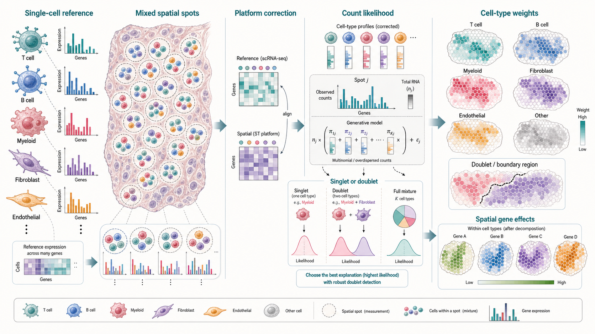
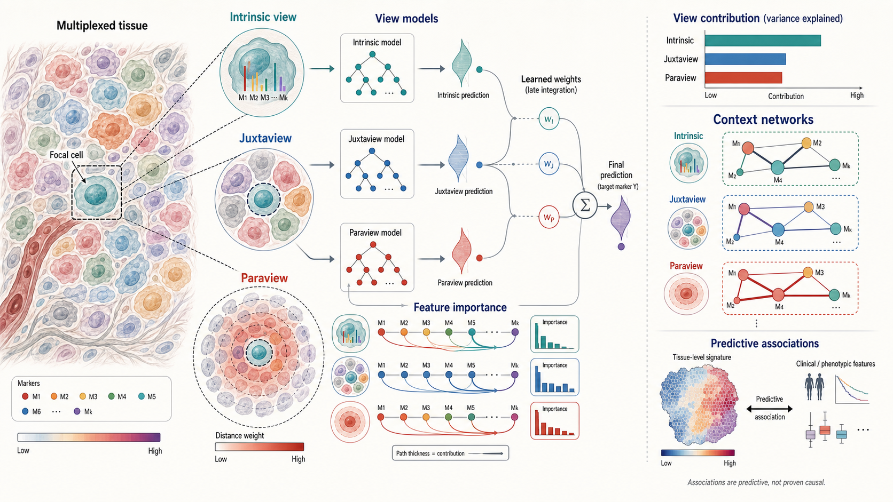
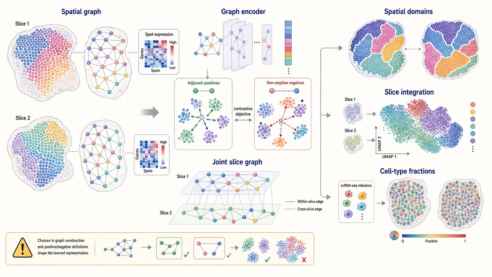

# Spatial Omics Modeling Brief

**June 14, 2026**

No qualifying new method appeared after the June 13 cutoff. Today's retrospective examines three complementary ways to use reference and spatial context: likelihood-based cell-mixture decomposition, interpretable multiview prediction, and graph contrastive representation learning.

## Important to revisit

### 1. [Robust decomposition of cell type mixtures in spatial transcriptomics](https://www.nature.com/articles/s41587-021-00830-w)

**Peer reviewed | Nature Biotechnology | 2021-02-18**

*Single-cell reference profiles are aligned to mixed spatial counts, then a robust count likelihood estimates singlets, doublets or full cell-type mixtures and enables cell-type-specific spatial analysis.*

RCTD uses a single-cell RNA-sequencing reference to estimate the cell types contributing RNA to each spatial measurement location.

**Why included now:** Deconvolution remains central even as spatial assays approach cellular resolution, because segmentation errors, partial cells and extracellular transcripts still create mixtures. RCTD is a useful statistical reference for separating platform correction from mixture estimation.

**Technical contribution:** The model estimates cell-type expression profiles from annotated single-cell data, adjusts for systematic differences between sequencing platforms, and fits spatial counts as mixtures of those profiles with location-specific RNA abundance. Its doublet mode chooses among singlet and two-cell-type explanations, while full mode estimates broader mixtures. The accompanying C-SIDE procedure tests cell-type-specific differential expression across spatial or experimental covariates.

**Why it matters:** RCTD distinguishes compositional change from expression change within a cell type. That distinction prevents an apparent spatial gene effect from being attributed to regulation when it may instead reflect a changing mixture of cell populations.

**Authors' evidence:** The paper evaluates decomposition and doublet detection with simulations, cell-type mixtures and mouse brain spatial data, then demonstrates cell-type-specific expression analysis.

**Interpretive note:** Estimated weights depend on reference quality, cell-type annotation and the assumption that reference profiles adequately represent the spatial tissue.

**Keywords:** `deconvolution` `platform effects` `doublet detection` `cell-type-specific expression`

### 2. [Explainable multiview framework for dissecting spatial relationships from highly multiplexed data](https://genomebiology.biomedcentral.com/articles/10.1186/s13059-022-02663-5)

**Peer reviewed | Genome Biology | 2022-04-14**

*Separate predictive models explain a focal marker from intrinsic, immediate-neighbor and broader tissue contexts, then learned view weights and feature importance expose scale-specific associations.*

MISTy is an explainable machine-learning framework that models marker relationships through multiple user-defined spatial views.

**Why included now:** Spatial models increasingly mix local graphs, tissue-scale context and morphology in one latent representation. MISTy offers a contrasting design in which each spatial scale remains an explicit, testable explanatory view.

**Technical contribution:** For each target marker, MISTy trains a predictive model within every view, such as intrinsic measurements, immediate neighbors or distance-weighted broader neighborhoods. A late-integration meta-model combines the view-specific predictions. Predictive gain, view coefficients and feature importance summarize which measurements and spatial scales explain the target.

**Why it matters:** The framework can separate intracellular associations from short- and longer-range tissue relationships without requiring one fixed neighborhood definition. Its view abstraction also allows domain knowledge to specify alternative spatial hypotheses.

**Authors' evidence:** The paper applies MISTy to imaging mass cytometry, multiplexed immunofluorescence and spatial transcriptomics, reporting reproducible marker relationships and associations with clinical features.

**Interpretive note:** MISTy reports predictive associations and context-specific importance; these outputs are not direct evidence of causal signaling.

**Keywords:** `multiview learning` `explainable machine learning` `spatial context` `multiplexed imaging`

### 3. [Spatially informed clustering, integration, and deconvolution of spatial transcriptomics with GraphST](https://www.nature.com/articles/s41467-023-36796-3)

**Peer reviewed | Nature Communications | 2023-03-01**

*A graph encoder and local-context contrastive objectives learn spatial spot representations that support domain discovery, cross-slice integration and reference-assisted cell-type mapping.*

GraphST combines graph neural networks with self-supervised contrastive learning for three spatial-transcriptomics tasks.

**Why included now:** Current spatial foundation models still rely on choices about graph construction, context windows and positive examples. GraphST makes those design choices especially visible and demonstrates how one spatial representation can be adapted across multiple downstream tasks.

**Technical contribution:** A graph convolutional encoder combines gene expression with a neighborhood graph. For clustering, spot embeddings are contrasted with real local summaries and corrupted-graph contexts while a decoder reconstructs expression. For multislice analysis, aligned sections form a shared graph with within- and cross-section edges. For deconvolution, a learned cell-to-spot mapping aligns single-cell and spatial representations while maximizing similarity among spatial neighbors and minimizing it among non-neighbors.

**Why it matters:** GraphST connects spatial-domain identification, batch-aware tissue integration and reference mapping within a common graph-learning framework rather than treating them as unrelated preprocessing steps.

**Authors' evidence:** The paper reports evaluations across Visium, Stereo-seq and Slide-seqV2 datasets from multiple tissues and benchmarks clustering, multislice integration and cell-type deconvolution.

**Interpretive note:** The representation is shaped by graph alignment, neighborhood radius, corruption strategy and contrastive definitions; smooth embeddings are not uniquely determined biological truth.

**Keywords:** `graph neural network` `contrastive learning` `multislice integration` `deconvolution`

## What to watch

- Reference mapping should model platform shifts explicitly rather than assuming single-cell and spatial counts are directly comparable.
- Multiscale context is easier to audit when local and tissue-wide effects remain separate model components.
- Contrastive learning objectives encode biological assumptions through their definitions of context, positives and negatives.
- Cell-type proportions and within-cell-type expression should be estimated and validated as distinct quantities.

---

_Figures are original conceptual summaries generated for this digest from verified primary-source descriptions. They are not reproduced publication figures and do not depict reported quantitative results._
