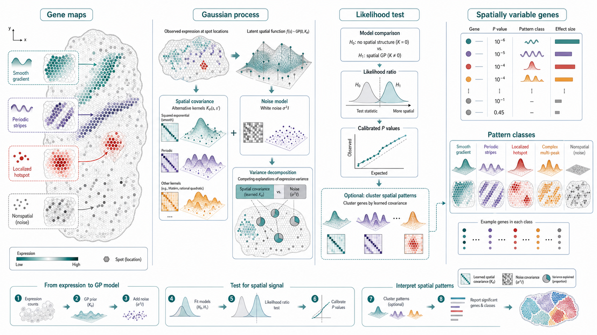
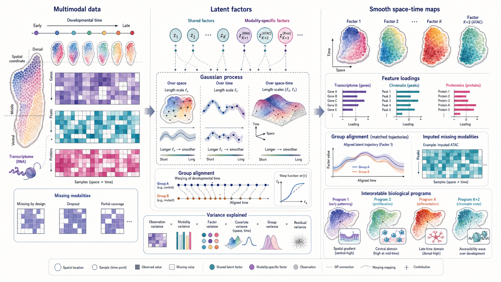
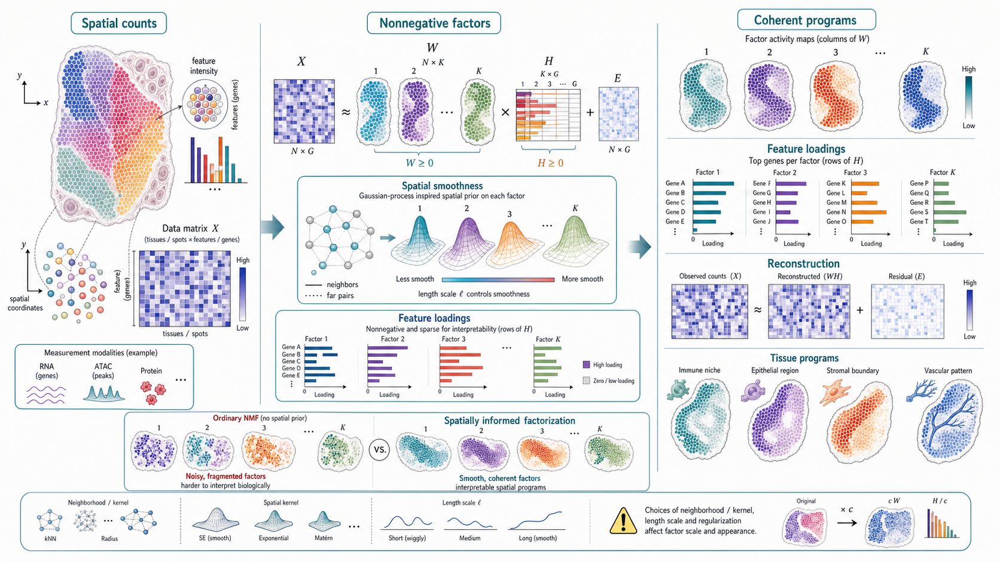

# Spatial Omics Modeling Brief

**June 15, 2026**

No qualifying new method appeared after the June 14 cutoff. Today's retrospective follows a statistical progression from gene-level spatial variability, to smooth multimodal latent factors, to interpretable spatial programs learned by constrained factorization.

## Important to revisit

### 1. [SpatialDE: identification of spatially variable genes](https://www.nature.com/articles/nmeth.4636)

**Peer reviewed | Nature Methods | 2018-03-19**

*Observed gene maps are modeled with Gaussian-process spatial covariance plus noise, then likelihood testing and optional pattern clustering identify spatially variable genes and shared spatial classes.*

SpatialDE detects genes whose expression varies systematically over tissue coordinates using Gaussian-process regression.

**Why included now:** Many newer spatial-feature methods still inherit SpatialDE's core question: how much expression variance is spatially structured rather than noise? Revisiting the original model clarifies what later scalable, graph-based and topology-based methods are modifying.

**Technical contribution:** For each gene, SpatialDE compares a spatial covariance model against a noise-only model. Alternative kernels represent smooth, periodic or more complex spatial structure, and a calibrated likelihood-ratio test ranks genes by evidence for spatial variability. The method can also cluster significant genes by their learned spatial covariance pattern.

**Why it matters:** SpatialDE made spatially variable gene detection a formal model-comparison problem rather than a visual inspection task, creating a reference point for later covariance tests, kernel mixtures and large-scale approximations.

**Authors' evidence:** The paper demonstrates recovery of spatial expression patterns in spatial transcriptomics and other spatially resolved gene-expression datasets, and introduces spatial pattern grouping for downstream interpretation.

**Interpretive note:** A significant spatial covariance indicates organized spatial association, not necessarily causal regulation or reproducibility across samples.

**Keywords:** `spatially variable genes` `Gaussian process` `kernel testing` `spatial pattern clustering`

### 2. [Identifying temporal and spatial patterns of variation from multimodal data using MEFISTO](https://www.nature.com/articles/s41592-021-01343-9)

**Peer reviewed | Nature Methods | 2022-01-13**

*Multimodal measurements are decomposed into shared and modality-specific latent factors whose Gaussian-process priors vary smoothly over space, time or other covariates.*

MEFISTO extends multi-omics factor analysis by modeling how latent factors change over continuous covariates such as spatial position, developmental time or pseudotime.

**Why included now:** Spatial omics is moving beyond static tissue maps toward developmental series, perturbation time courses and multimodal atlases. MEFISTO is a useful bridge between spatial factor analysis, missing-modality integration and smooth covariate-aware interpretation.

**Technical contribution:** The model represents each modality through a low-dimensional set of latent factors and feature loadings. Gaussian-process priors over covariates impose smooth factor variation, learn length scales, allow group-specific trajectories and support alignment or warping between groups. The factor model can handle missing modalities and quantify variance explained by factors, covariates, groups and residuals.

**Why it matters:** MEFISTO can identify biological programs that change smoothly across tissue coordinates or time while linking them to molecular features in different modalities. This makes it a statistical ancestor of many current spatial-temporal and multimodal representation-learning models.

**Authors' evidence:** The paper applies MEFISTO to multimodal single-cell and spatially structured datasets, showing recovery of temporal and spatial patterns, group alignment and modality-specific feature loadings.

**Interpretive note:** Smoothness is an assumption encoded through the GP prior and learned length scales; abrupt boundaries or rare discontinuous programs may be underrepresented.

**Keywords:** `multimodal integration` `factor analysis` `Gaussian process` `spatiotemporal modeling`

### 3. [Nonnegative spatial factorization applied to spatial genomics](https://www.nature.com/articles/s41592-022-01687-w)

**Peer reviewed | Nature Methods | 2022-12-31**

*A spatial count matrix is decomposed into nonnegative, spatially smooth factor activity maps and sparse nonnegative feature loadings that reconstruct coherent tissue programs.*

Nonnegative spatial factorization learns interpretable spatial programs from spatial genomics measurements by combining nonnegative matrix factorization with spatial structure.

**Why included now:** Foundation models and graph embeddings can be powerful but difficult to interpret. NSF is worth revisiting because it makes a different tradeoff: lower-dimensional spatial programs, nonnegative loadings and explicit spatial smoothness.

**Technical contribution:** The method factorizes spatial observations into nonnegative spatial factors and nonnegative feature loadings, with a spatial prior or covariance over tissue coordinates that encourages coherent factor activity. The nonnegativity constraint makes programs additive, while sparse loadings help identify the molecular features associated with each factor.

**Why it matters:** NSF turns high-dimensional spatial measurements into tissue programs that are visually inspectable, reconstructive and linked to ranked features. It is a strong conceptual baseline for asking whether more complex latent spaces are actually more interpretable.

**Authors' evidence:** The paper applies NSF to spatial genomics datasets and shows coherent spatial factors that correspond to interpretable tissue regions and molecular programs.

**Interpretive note:** Factor scale, number of factors and spatial kernel or neighborhood choices affect the learned programs; factors should be treated as model-based summaries rather than directly observed compartments.

**Keywords:** `nonnegative matrix factorization` `spatial factors` `interpretable programs` `spatial smoothness`

## What to watch

- Gaussian-process assumptions remain central, even when hidden inside newer kernels, latent factors or graph smoothers.
- Spatial feature tests, factor models and tissue-program decompositions answer different questions and should not be evaluated with one metric alone.
- Interpretability often comes from constraints such as nonnegativity, smoothness and sparsity, not only from post hoc explanations.
- Smooth spatial priors can reveal coherent biology but may blur discontinuities, boundaries and rare localized programs.

---

_Figures are original conceptual summaries generated for this digest from verified primary-source descriptions. They are not reproduced publication figures and do not depict reported quantitative results._
