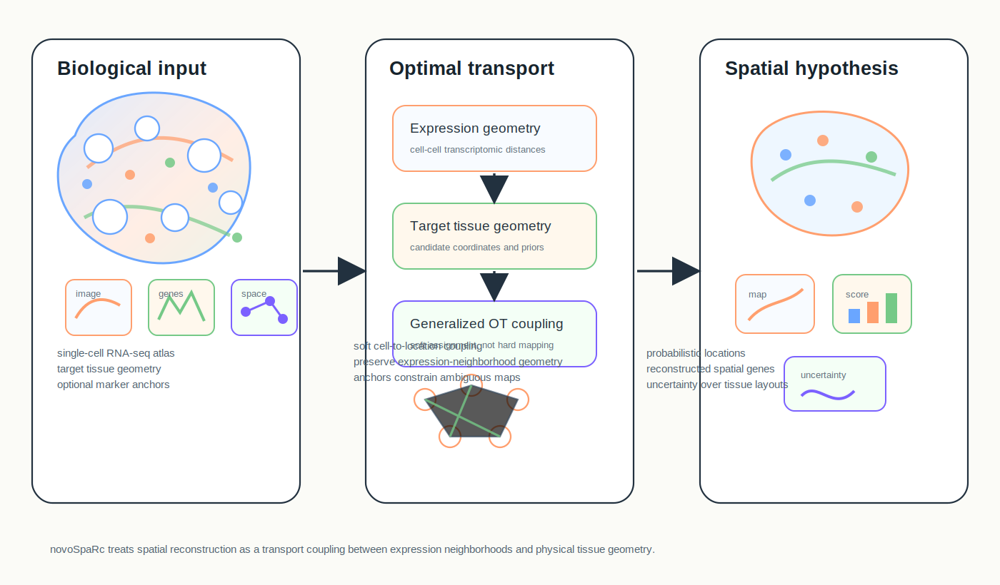
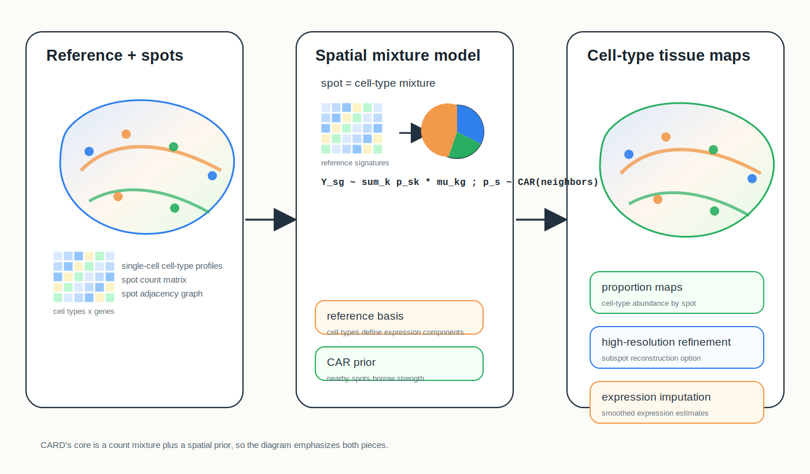
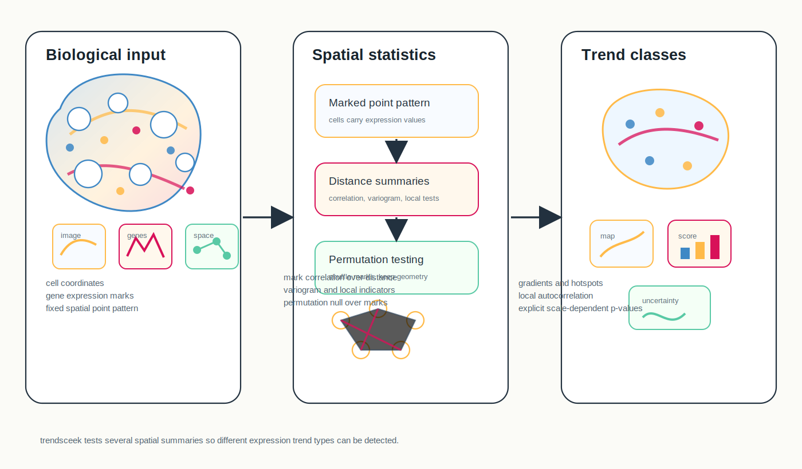

# Spatial Omics Modeling Brief

**June 16, 2026**

No qualifying new method appeared after the June 15 cutoff. Today's retrospective covers three older but still useful modeling ideas: spatial reconstruction from dissociated single-cell data, spatially regularized deconvolution, and marked-point-process testing for spatial expression trends.

## Important to revisit

### 1. [Gene expression cartography](https://www.nature.com/articles/s41586-019-1773-3)

**Peer reviewed | Nature | 2019-11-20**

*Dissociated single-cell expression profiles are probabilistically embedded into a target tissue space by matching transcriptomic and physical distance structures with generalized optimal transport.*

This paper introduced novoSpaRc, a method for reconstructing spatial gene-expression maps from single-cell RNA-seq data with little or no prior spatial information.

**Why included now:** As spatial assays grow, reconstruction from dissociated atlases remains relevant for tissues, stages or species where matched spatial data are missing. novoSpaRc is a clean reference for thinking about what can be inferred from expression geometry alone and what requires spatial anchors.

**Technical contribution:** The method defines a target tissue geometry and uses generalized optimal transport to assign each cell a probability distribution over tissue locations. It favors couplings in which transcriptionally similar cells occupy physically nearby positions, while allowing optional marker-gene or atlas information to anchor the reconstruction.

**Why it matters:** novoSpaRc frames spatial reconstruction as a soft transport problem rather than a hard nearest-neighbor assignment, making uncertainty and partial prior information natural parts of the model.

**Authors' evidence:** The paper demonstrates reconstruction of spatial expression patterns from single-cell RNA-seq in systems with known spatial organization and evaluates the role of marker-gene priors.

**Interpretive note:** Reconstructed locations are probabilistic hypotheses. Without sufficient spatial priors or distinctive expression geometry, multiple tissue arrangements can be compatible with the same single-cell data.

**Keywords:** `optimal transport` `spatial reconstruction` `single-cell RNA-seq` `probabilistic embedding`

### 2. [Spatially informed cell-type deconvolution for spatial transcriptomics](https://www.nature.com/articles/s41587-022-01273-7)

**Peer reviewed | Nature Biotechnology | 2022-05-02**

*Reference expression profiles and spatial counts are combined with a conditional autoregressive prior so neighboring spots borrow strength when estimating cell-type proportions, refined maps and imputed expression.*

CARD estimates cell-type composition in spatial transcriptomics by explicitly modeling spatial correlation among neighboring locations.

**Why included now:** Reference-based deconvolution has many competitors, but CARD remains valuable because it makes spatial borrowing a core model component rather than a post hoc smoothing step. That distinction is important when comparing deconvolution, imputation and resolution-enhancement claims.

**Technical contribution:** The method uses a reference expression matrix and observed spatial counts to infer latent cell-type proportions. A conditional autoregressive prior links neighboring spot proportions, encouraging spatial coherence while retaining spot-level mixture estimates. CARD also includes reference-free analysis, high-resolution map refinement and spatially informed expression imputation.

**Why it matters:** CARD provides a statistical bridge between deconvolution and spatial smoothing: it can improve noisy composition estimates by sharing information locally while preserving the uncertainty that comes from mixed measured spots.

**Authors' evidence:** The paper evaluates CARD on simulated and real spatial transcriptomics datasets and reports improved cell-type mapping, high-resolution reconstruction and expression imputation.

**Interpretive note:** Spatial correlation can stabilize estimates but can also oversmooth sharp boundaries; reference quality and cell-type definitions remain major sources of uncertainty.

**Keywords:** `deconvolution` `conditional autoregressive prior` `cell-type proportions` `expression imputation`

### 3. [Identification of spatial expression trends in single-cell gene expression data](https://www.nature.com/articles/nmeth.4634)

**Peer reviewed | Nature Methods | 2018-03-19**

*Cells are treated as spatial points with expression marks; distance-aware summary statistics and permutation nulls identify genes with gradients, hotspots or local spatial autocorrelation.*

trendsceek detects spatial expression trends by treating cell locations as a point pattern and expression values as marks attached to those points.

**Why included now:** Many newer spatial tests use kernels, graphs or topology, but trendsceek is a useful reminder that spatial statistics already offered a flexible language for gradients, local clustering and mark correlation before deep representation learning became dominant.

**Technical contribution:** The method computes multiple marked-point-process summary statistics over intercellular distances or neighborhoods, including mark correlation, variograms, conditional means and local indicators. Significance is assessed by randomizing expression marks while keeping the observed spatial coordinates fixed.

**Why it matters:** By testing several spatial summaries rather than one smoothness model, trendsceek can detect different spatial trend types and makes the null model explicit: expression labels are exchangeable over the fixed cell locations.

**Authors' evidence:** The paper applies trendsceek to spatial and single-cell gene-expression datasets and demonstrates detection of spatial expression trends across multiple summary statistics.

**Interpretive note:** Sensitivity depends on the selected summary statistics, distance scale and permutation strategy; a detected trend is an association pattern, not direct evidence of regulatory mechanism.

**Keywords:** `marked point process` `spatial trend testing` `permutation null` `single-cell spatial expression`

## What to watch

- Spatial reconstruction and deconvolution both infer unobserved tissue structure, but they solve different inverse problems and need different uncertainty checks.
- Spatial priors can be formulated as optimal transport, conditional autoregression, Gaussian processes, graph smoothing or point-process summaries; the chosen prior determines what patterns are easy to see.
- Reference-free options are useful, but they often trade interpretability for weaker biological anchoring.
- Older spatial statistics remain competitive as diagnostic tools for understanding what modern representation models are learning.

---

_Figures are original conceptual summaries generated for this digest from verified primary-source descriptions. They are not reproduced publication figures and do not depict reported quantitative results._
