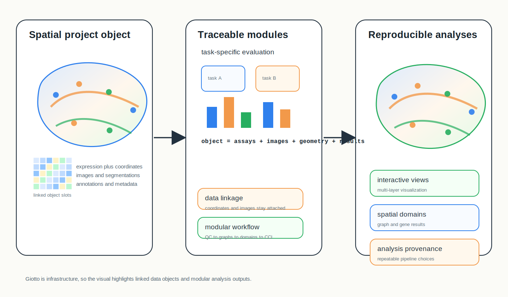
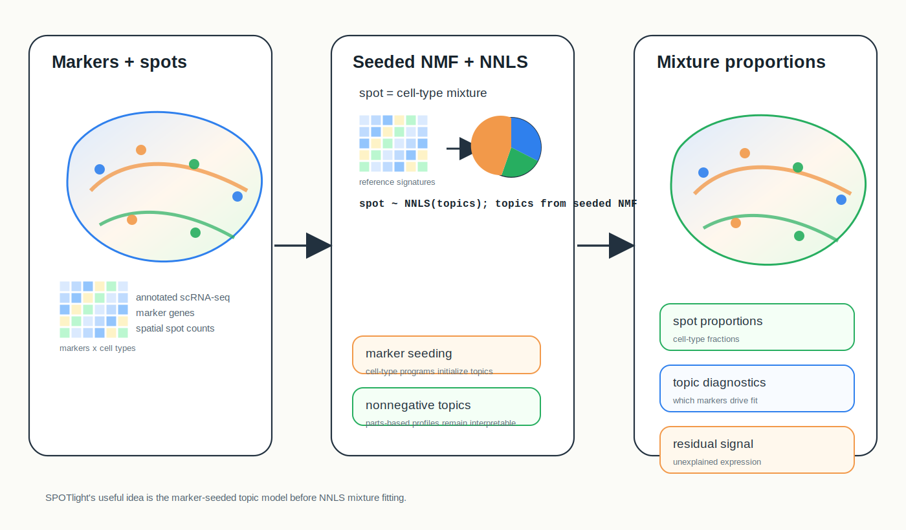
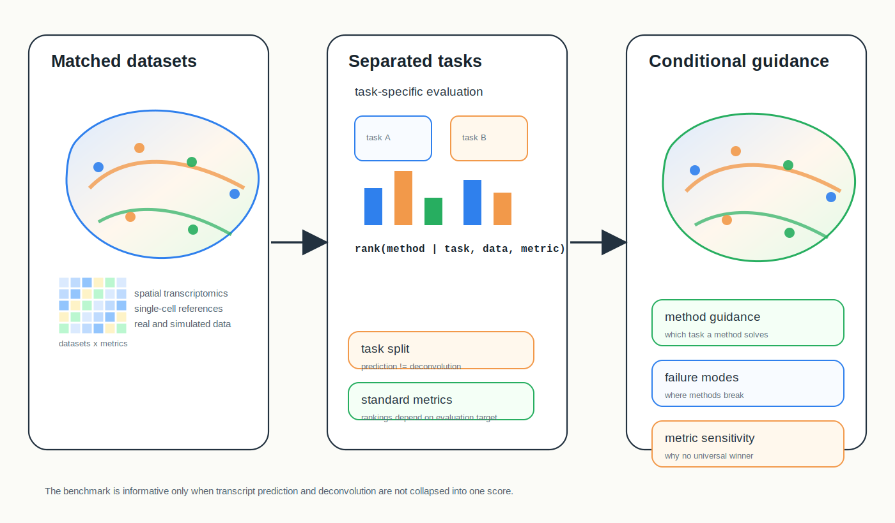

# Spatial Omics Modeling Brief

**June 17, 2026**

No qualifying new method appeared after the June 16 cutoff. Today's retrospective focuses on practical analysis infrastructure and evaluation: an end-to-end spatial analysis toolbox, a marker-seeded deconvolution model, and a benchmark that separates transcript prediction from cell-type deconvolution.

## Important to revisit

### 1. [Giotto: a toolbox for integrative analysis and visualization of spatial expression data](https://genomebiology.biomedcentral.com/articles/10.1186/s13059-021-02286-2)

**Peer reviewed | Genome Biology | 2021-03-08**

*Spatial expression, coordinates, images and segmentations are organized into a reproducible analysis object that supports graph construction, domains, spatial genes, interactions, enrichment and visualization.*

Giotto is an end-to-end framework for analyzing and visualizing spatial expression data across spatial transcriptomics technologies.

**Why included now:** Many recent methods solve one modeling subproblem, but spatial omics projects still need reproducible infrastructure that keeps expression, coordinates, image context and annotations connected. Giotto is worth revisiting as a practical substrate for comparing domain, interaction and enrichment analyses.

**Technical contribution:** The toolbox supports quality control, normalization, dimension reduction, spatial network construction, clustering, spatially variable gene detection, cell-cell interaction analysis, enrichment analysis and interactive visualization. Its data structure links molecular measurements to tissue coordinates and image-derived information.

**Why it matters:** Giotto helps turn spatial modeling from isolated scripts into a coherent workflow where neighborhood definitions, annotations and visual inspection remain traceable.

**Authors' evidence:** The paper demonstrates Giotto on multiple spatial technologies and biological examples, including spatial domain detection, interaction analysis and visualization.

**Interpretive note:** Giotto is an analysis ecosystem rather than one statistical model; conclusions still depend on the chosen submethods, parameters and preprocessing choices.

**Keywords:** `spatial analysis toolbox` `neighbor graph` `visualization` `cell-cell interaction`

### 2. [SPOTlight: seeded NMF regression to deconvolute spatial transcriptomics spots with single-cell transcriptomes](https://doi.org/10.1093/nar/gkab043)

**Peer reviewed | Nucleic Acids Research | 2021-02-05**

*Marker genes seed nonnegative topics from a single-cell reference, and NNLS regression fits each measured spatial spot as a mixture of topic-linked cell types plus residual signal.*

SPOTlight uses annotated single-cell RNA-seq data to deconvolve spot-based spatial transcriptomics measurements into cell-type proportions.

**Why included now:** Reference-based deconvolution is crowded, and recent methods often add spatial smoothing or deep latent spaces. SPOTlight remains a clear baseline for the marker-driven matrix-factorization view of deconvolution.

**Technical contribution:** The method selects marker genes from a single-cell reference, initializes a seeded nonnegative matrix factorization, learns nonnegative topic profiles, maps topics to cell types and estimates spot mixtures using nonnegative least-squares regression.

**Why it matters:** SPOTlight makes the link between marker genes, latent topics and spot-level mixtures explicit, which is useful for diagnosing whether deconvolution is driven by robust cell-type markers or by ambiguous shared expression.

**Authors' evidence:** The paper evaluates SPOTlight on simulated and real spatial transcriptomics data and compares deconvolution performance across tissue contexts.

**Interpretive note:** The approach depends on marker quality and reference annotation. It estimates mixtures at measured spots and should not be interpreted as direct single-cell localization within each spot.

**Keywords:** `deconvolution` `seeded NMF` `NNLS regression` `single-cell reference`

### 3. [Benchmarking spatial and single-cell transcriptomics integration methods for transcript distribution prediction and cell type deconvolution](https://www.nature.com/articles/s41592-022-01480-9)

**Peer reviewed | Nature Methods | 2022-05-16**

*Matched spatial and single-cell data are split into prediction and deconvolution tasks, then methods are compared with task-specific metrics, failure modes and practical guidance.*

This Analysis benchmark compares computational methods that integrate single-cell and spatial transcriptomics for transcript distribution prediction and cell-type deconvolution.

**Why included now:** New integration models often claim broad utility, but this benchmark is a useful reminder that transcript prediction, cell mapping and deconvolution are distinct tasks with different failure modes.

**Technical contribution:** The study organizes methods by task, evaluates them on standardized datasets and metrics, and distinguishes transcript distribution prediction from cell-type deconvolution. It emphasizes that performance depends on data type, reference quality, target task and evaluation metric.

**Why it matters:** Benchmarks like this help prevent one-size-fits-all method selection and make it easier to decide when a method should be used for imputation, cell-type mapping, compositional inference or exploratory visualization.

**Authors' evidence:** The paper reports systematic comparisons across integration methods using real and simulated spatial and single-cell transcriptomics scenarios.

**Interpretive note:** Benchmark rankings are conditional on the selected datasets, metrics and task definitions; they should guide method choice rather than define a universal winner.

**Keywords:** `benchmarking` `single-cell integration` `transcript prediction` `cell-type deconvolution`

## What to watch

- Infrastructure papers matter because reproducibility depends on how coordinates, images, graphs and annotations are carried through analysis.
- Deconvolution methods differ in whether they rely on markers, likelihoods, spatial priors or latent topics; those assumptions should be reported explicitly.
- Benchmarks should separate transcript prediction, cell mapping and compositional inference rather than collapsing them into one accuracy score.
- A method's best use case often depends more on data modality and reference quality than on headline performance.

---

_Figures are original conceptual SVG summaries generated for this digest from verified primary-source descriptions. They are not reproduced publication figures and do not depict reported quantitative results._
