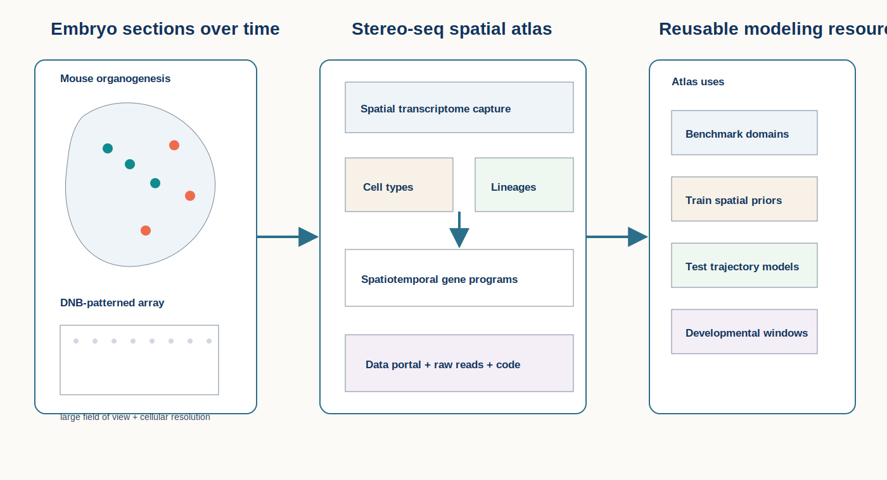
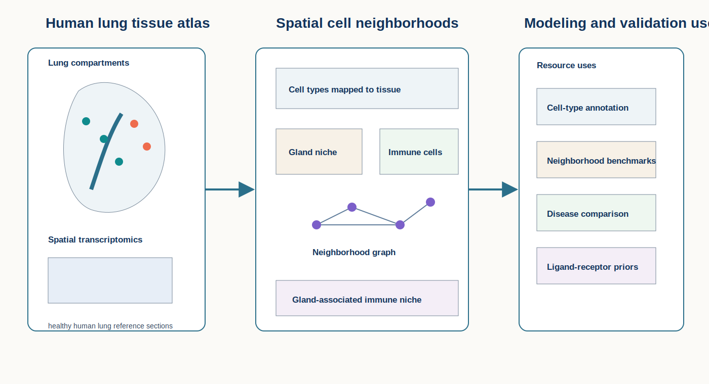
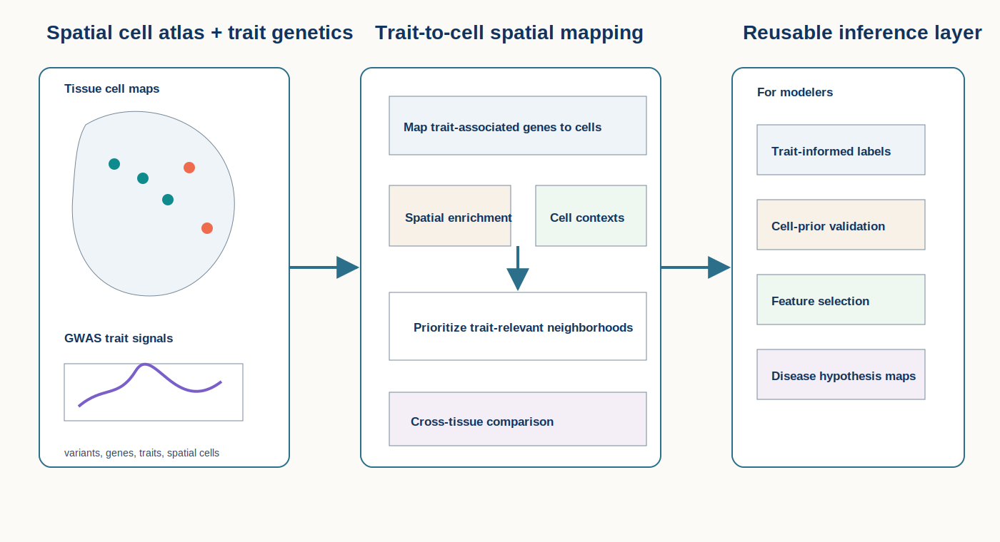

# Spatial Omics Resource Brief

**June 19, 2026 supplemental post**

This supplemental post expands the daily scope from method papers to important spatial-omics data resources. The focus is on atlases and reusable datasets that can support modeling, benchmarking, validation, pretraining or biological hypothesis generation.

## Important to revisit

### 1. [Spatiotemporal transcriptomic atlas of mouse organogenesis using DNA nanoball-patterned arrays](https://doi.org/10.1016/j.cell.2022.04.003)

**Data resource / atlas | Peer reviewed | Cell | 2022-05**

*Serial embryo sections profiled with high-resolution Stereo-seq create a spatiotemporal atlas for organogenesis, tissue domains and developmental gene programs.*

This resource, often referred to as MOSTA, provides high-resolution spatial transcriptomic maps across mouse organogenesis using DNA nanoball-patterned array technology.

**Why included now:** Developmental spatial atlases are useful testbeds for models that claim to recover domains, trajectories, tissue boundaries or cross-stage alignment. MOSTA is especially useful because it combines spatial resolution, broad anatomical coverage and developmental time.

**Resource contribution:** The atlas links spatial coordinates, transcriptome-wide measurements, developmental stages and organ/tissue annotations across embryo sections. It supports queries over spatial gene programs, organogenesis trajectories and anatomical structures.

**Why it matters for modeling:** It can benchmark spatial domain detection, spatiotemporal alignment, trajectory inference, spatially variable gene methods and generative models that need realistic tissue-scale structure.

**Interpretive note:** The resource is powerful but not plug-and-play; models should account for sectioning, registration, developmental-stage effects and platform-specific capture biases.

**Keywords:** `data resource / atlas` `Stereo-seq` `mouse organogenesis` `spatiotemporal modeling`

### 2. [A spatially resolved atlas of the human lung characterizes a gland-associated immune niche](https://www.nature.com/articles/s41588-022-01243-4)

**Data resource / atlas | Peer reviewed | Nature Genetics | 2022-12-21**

*Spatial transcriptomics maps human lung cell types and tissue neighborhoods, identifying a gland-associated immune niche that can serve as a reference context for disease modeling.*

This atlas maps human lung cell states and tissue neighborhoods with spatial resolution, emphasizing gland-associated immune organization.

**Why included now:** Lung spatial references are increasingly important for interpreting inflammatory, fibrotic and infectious disease datasets. A curated healthy or reference atlas gives modelers something concrete to compare against when evaluating disease-associated neighborhoods.

**Resource contribution:** The study provides spatially resolved cell-type and niche information for human lung tissue, connecting molecular cell states to anatomical compartments and neighborhood organization.

**Why it matters for modeling:** It is useful for cell-type annotation, neighborhood benchmarking, ligand-receptor prior construction, reference mapping and evaluating whether disease datasets preserve or perturb normal lung tissue organization.

**Interpretive note:** Lung atlases are sensitive to donor, sampling and anatomical-region effects; reference transfer should check whether target tissues match the profiled compartments.

**Keywords:** `data resource / atlas` `human lung` `spatial neighborhoods` `immune niche`

### 3. [Spatially resolved mapping of cells associated with human complex traits](https://www.nature.com/articles/s41586-025-08757-x)

**Data resource / atlas | Peer reviewed | Nature | 2025-03-19**

*Spatial cell maps are connected to human complex-trait genetics, creating trait-informed tissue contexts for prioritizing cell states and neighborhoods.*

This resource connects spatially resolved cellular maps with human complex-trait associations.

**Why included now:** Spatial models increasingly need biologically meaningful supervision beyond cell type labels. Trait-linked spatial cell maps can help evaluate whether learned representations preserve disease- or trait-relevant tissue contexts.

**Resource contribution:** The study maps cells associated with complex traits in spatial tissue contexts, linking genetic association information to cell states and locations.

**Why it matters for modeling:** It can provide trait-informed labels or priors for feature selection, representation evaluation, spatial neighborhood prioritization and cross-tissue disease hypothesis generation.

**Interpretive note:** Trait association does not establish causality at a specific location; genetic mapping, cell annotation and spatial context each add uncertainty.

**Keywords:** `data resource / atlas` `complex traits` `spatial cell mapping` `disease genetics`

## What to watch

- Resource papers should be evaluated by reusability: data access, metadata quality, coordinate systems, annotations and raw-data availability.
- Atlas-scale spatial data can benchmark model robustness better than small demonstration datasets.
- Trait-linked and disease-linked spatial references may become important supervision for foundation models.
- Transfer from atlas to new tissue should explicitly check platform, donor, region and disease-state mismatch.

---

_Figures are original conceptual SVG summaries generated for this supplemental digest from verified primary-source descriptions. They are not reproduced publication figures and do not depict reported quantitative results._
