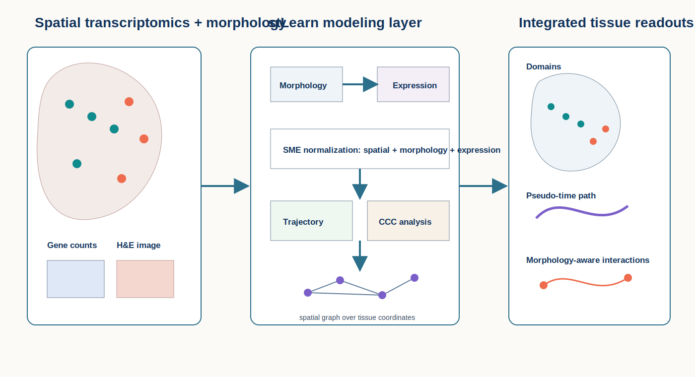
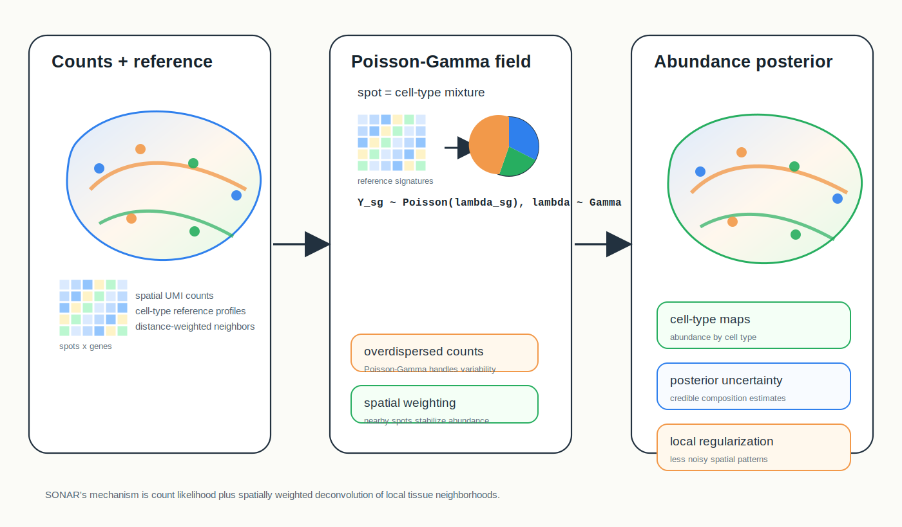
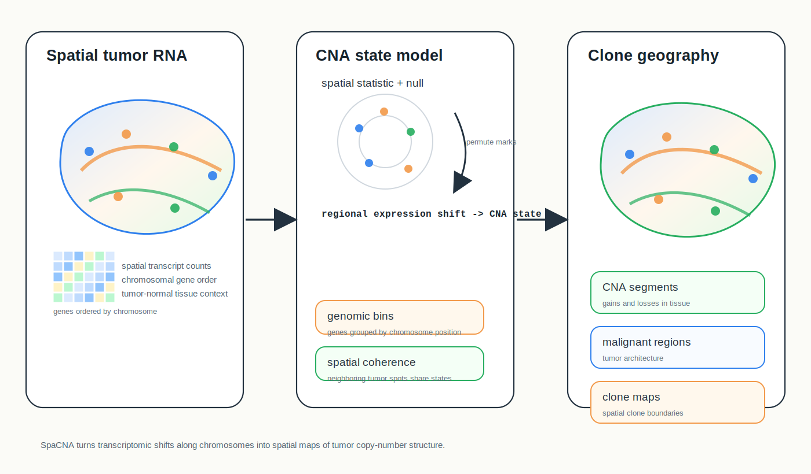

# Spatial Omics Modeling Brief

**June 19, 2026**

No qualifying new method appeared in the June 18-19 primary-source scan. Today's retrospective revisits three non-duplicate modeling directions: morphology-aware spatial transcriptomics, spatially weighted deconvolution, and copy-number inference from spatial expression.

## Important to revisit

### 1. [Combining spatial transcriptomics with tissue morphology](https://www.nature.com/articles/s41467-025-58989-8)

**Peer reviewed | Nature Communications | 2025-05-13**

*Gene counts, spatial coordinates and tissue morphology are fused so domain, trajectory and interaction analyses can use both molecular and image context.*

This work presents stLearn-style analysis for jointly modeling spatial transcriptomics and histology-derived tissue morphology.

**Why included now:** Spatial foundation and multimodal models increasingly fuse images with gene expression. This paper is a useful bridge between classical spatial workflows and modern morphology-aware representation learning.

**Technical contribution:** The framework combines gene-expression profiles, spatial coordinates and local image features to improve spatial smoothing, domain detection, pseudo-time analysis and cell-cell interaction analysis. Its morphology-aware normalization uses neighboring spots weighted by both spatial proximity and tissue-image similarity.

**Why it matters:** Histology is not only a visualization layer; it can alter neighborhood structure and downstream biological interpretation when morphology and expression agree or conflict.

**Authors' evidence:** The paper evaluates morphology-aware spatial analysis across tissue examples and reports improved recovery of spatial structure and interpretable tissue programs.

**Interpretive note:** Image features can help when morphology is biologically aligned with expression, but they can also amplify staining, sectioning or segmentation artifacts.

**Keywords:** `histology integration` `morphology-aware smoothing` `spatial domains` `cell-cell interaction`

### 2. [SONAR enables cell type deconvolution with spatially weighted Poisson-Gamma model for spatial transcriptomics](https://www.nature.com/articles/s41467-023-40458-9)

**Peer reviewed | Nature Communications | 2023-08-07**

*Observed spatial counts are modeled with Poisson likelihoods and Gamma latent abundances, while spatial weights borrow information from nearby spots to estimate cell-type proportions.*

SONAR is a spatially weighted probabilistic deconvolution model for estimating cell-type composition in spatial transcriptomics.

**Why included now:** Recent deconvolution methods often add graph smoothing or deep embeddings. SONAR is a compact probabilistic alternative that makes count noise, latent abundance and spatial weighting explicit.

**Technical contribution:** The method uses reference-derived cell-type expression information and a Poisson-Gamma formulation to model observed spatial counts. Spatial weights incorporate neighboring spot information so the posterior cell-type proportions are stabilized by local tissue context.

**Why it matters:** SONAR helps separate two sources of signal: molecular evidence from measured counts and spatial evidence from nearby locations. That separation is useful when evaluating rare cell types or noisy spots.

**Authors' evidence:** The paper benchmarks SONAR on simulated and real spatial transcriptomics datasets and reports improved cell-type deconvolution across several settings.

**Interpretive note:** Spatial borrowing can stabilize estimates but may blur abrupt boundaries or rare isolated populations if neighborhood weights are misspecified.

**Keywords:** `deconvolution` `Poisson-Gamma model` `spatial weighting` `cell-type proportions`

### 3. [Spatial-aware detection of copy number alterations from spatial transcriptomics using SpaCNA](https://www.nature.com/articles/s41467-026-72284-0)

**Peer reviewed | Nature Communications | 2026-04-29**

*Spatial expression profiles are aggregated across genomic bins and smoothed over tissue neighborhoods to infer copy-number states, tumor clones and subclonal architecture.*

SpaCNA detects copy number alterations from spatial transcriptomics while preserving spatial organization.

**Why included now:** Spatial omics modeling is expanding beyond expression domains into genomic-state inference. SpaCNA is a current example of using spatial transcriptomics to infer tumor copy-number architecture rather than only cell type or pathway activity.

**Technical contribution:** The method aggregates expression signals by chromosomal region, normalizes technical effects, infers copy-number states across spots and uses spatial information to stabilize CNA detection and clone segmentation.

**Why it matters:** Spatially resolved CNA maps can connect tumor genomic subclones to tissue architecture, microenvironmental context and regional expression programs.

**Authors' evidence:** The paper applies SpaCNA to spatial transcriptomics tumor datasets and reports spatial CNA patterns and clone structures.

**Interpretive note:** RNA-derived CNA inference is indirect; validation with DNA-based copy-number measurements remains important, especially for subtle events.

**Keywords:** `copy number alteration` `tumor subclones` `spatial genomics` `RNA-derived CNA`

## What to watch

- Morphology-aware models should report when image features change biological conclusions, not just improve clustering visuals.
- Spatial deconvolution methods need sensitivity checks for neighborhood size and smoothing strength.
- Spatial transcriptomics is becoming a substrate for genomic-state inference, including copy-number and clonal architecture.
- Image, expression and genomic-state models are converging, but each modality carries different artifacts and uncertainty.

---

_Figures are original conceptual SVG summaries generated for this digest from verified primary-source descriptions. They are not reproduced publication figures and do not depict reported quantitative results._
