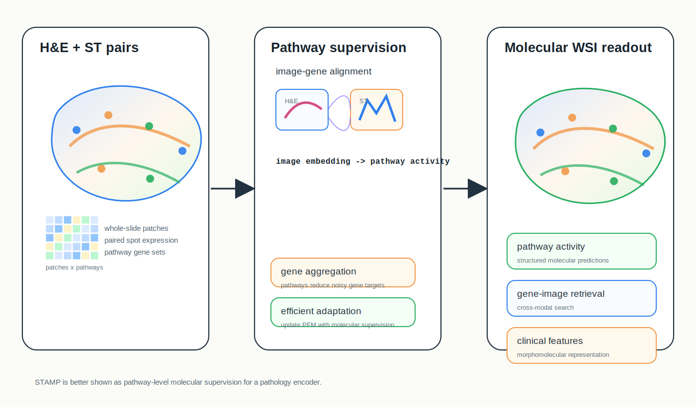
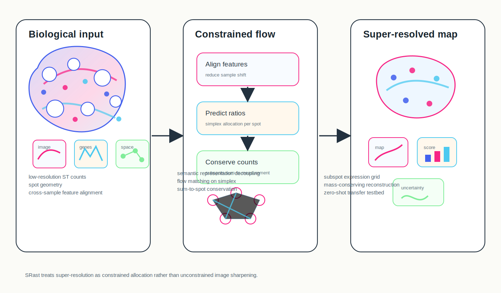
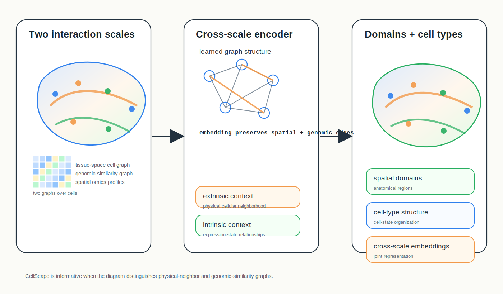

# Spatial Omics Research Digest

**June 20, 2026**

Today mixes one recent preprint with three important items to check now: two modeling papers that sharpen current debates about spatial foundation models and super-resolution, plus a data-portal resource that matters for benchmarking and atlas-scale training.

## New or updated

### 1. [Spatial Transcriptomics-Guided Alignment Enhances Molecular Profiling in Pathology Foundation Model](https://arxiv.org/abs/2606.03644)

**Method paper with data corpus | Preprint | arXiv | 2026-05-29**

*H&E image patches paired with spatial transcriptomics are aggregated into pathway-level molecular targets, then used for parameter-efficient alignment of pathology foundation models.*

STAMP uses spatial transcriptomics as molecular supervision for pathology foundation models, targeting molecular profiling from routine H&E whole-slide images.

**Why included now:** It directly addresses a current bottleneck in pathology foundation models: vision-only pretraining may miss molecular states that are subtle or invisible in morphology. The paper also introduces HumanST-1k, described as a human spatial transcriptomics dataset spanning diverse organs and platforms.

**Methodological contribution:** The framework pairs H&E patches with transcriptomic profiles, aggregates noisy gene-level readouts into pathway-informed targets and integrates that supervision into pathology foundation models using parameter-efficient fine-tuning. The authors describe 1.8 million image-transcriptome pairs in HumanST-1k.

**Significance:** This is a useful comparison point for STORM, SEAL and other morphomolecular foundation-model efforts because it emphasizes pathway-level alignment rather than direct raw-gene prediction alone.

**Interpretive note:** The authors claim improved molecular awareness and clinical utility, but digest readers should separate the modeling idea from deployment readiness; performance will depend on cohort composition, tissue coverage, platform mix and leakage controls.

**Keywords:** `pathology foundation model` `spatial transcriptomics` `pathway alignment` `HumanST-1k`

## Important to revisit

### 2. [Towards Universal Spatial Transcriptomics Super-Resolution: A Generalist Physically Consistent Flow Matching Framework](https://arxiv.org/abs/2602.10644)

**Method paper | Preprint | arXiv | 2026-02-11**

*Low-resolution spatial counts are decomposed into high-resolution allocation ratios on a simplex, with flow matching constrained so each region conserves observed molecular mass.*

SRast reframes spatial transcriptomics super-resolution as physically constrained allocation rather than unconstrained expression regression.

**Why revisit now:** Super-resolution methods are proliferating, but many can generate visually plausible high-resolution maps without conserving the observed low-resolution counts. SRast is worth checking because it turns that concern into an explicit modeling constraint.

**Methodological contribution:** The method decouples gene semantic representation from spatial geometry deconvolution, uses self-supervised alignment to reduce cross-sample shifts and applies flow matching to predict allocation ratios on a simplex. The final reconstructed subspots are constrained to sum back to the observed low-resolution spot expression.

**Significance:** The paper gives the field a concrete way to ask whether super-resolution outputs are physically compatible with the measured data, not merely smoother or sharper.

**Interpretive note:** The key claim is strong zero-shot generalization across tissues, species and platforms; independent benchmarks should test whether the mass-conservation constraint improves biological validity in unseen cohorts.

**Keywords:** `super-resolution` `flow matching` `mass conservation` `OOD generalization`

### 3. [Uncovering spatial tissue domains and cell types in spatial omics through cross-scale profiling of cellular and genomic interactions](https://arxiv.org/abs/2602.12651)

**Method paper | Preprint | arXiv | 2026-02-13**

*CellScape links tissue-space cellular neighborhoods with genomic relationships among cells, producing representations for spatial domains and cell-type structure.*

CellScape is a deep learning framework for jointly modeling extrinsic spatial context and intrinsic genomic relationships in spatial transcriptomics.

**Why revisit now:** Many current graph methods emphasize local physical neighborhoods. CellScape is interesting because it explicitly frames spatial analysis as a cross-scale problem: tissue-space interactions plus genomic relationships among cells.

**Methodological contribution:** The authors describe a model that integrates cellular interactions in physical tissue space with genomic relationships, yielding representations used for spatial domain segmentation and cell-type analysis across transcriptomics datasets.

**Significance:** It is a useful prompt for benchmarking: models should be evaluated on whether they preserve both anatomical neighborhoods and expression-defined cell-state relationships, rather than optimizing one graph definition.

**Interpretive note:** The arXiv abstract is high level; before relying on it operationally, readers should inspect the full architecture, ablation design and dataset split strategy.

**Keywords:** `cross-scale graph modeling` `spatial domains` `cell type analysis` `representation learning`

### 4. [HuBMAP Data Portal: A Resource for Multi-Modal Spatial and Single-Cell Data of Healthy Human Tissues](https://arxiv.org/abs/2511.05708)

**Data resource / portal | Preprint | arXiv | 2025-11-07**

The HuBMAP Data Portal is a multi-modal repository for healthy human tissue data, including spatial and single-cell datasets, portal search, visualization and download infrastructure.

**Why revisit now:** As spatial foundation models and atlas transfer benchmarks grow, the limiting factor is no longer only model design. It is access to harmonized, searchable, quality-controlled datasets spanning tissues, donors and assay types.

**Resource table**

| Field | Details |
| --- | --- |
| Biological scope | Healthy human tissues across many organ classes and donors, as described by the portal paper. |
| Modalities | Multi-modal spatial and single-cell data, including non-spatial, 2D spatial and 3D spatial datasets. |
| Scale reported | The abstract reports 5,032 datasets, 22 data types, 27 organ classes and 310 donors as of October 2025. |
| Access and tooling | Portal search, bulk download, integrated data collections, collaborative Jupyter workspaces and Vitessce visualizations. |
| Modeling uses | Foundation-model pretraining, atlas transfer, cross-organ benchmarking, metadata-aware retrieval and healthy-reference construction. |
| Reuse checks | Harmonization helps, but modelers still need to account for assay, donor, organ, processing-pipeline and metadata-completeness differences. |

**Resource contribution:** The portal paper emphasizes standardized processing, quality control, web visualization and data-driven search for large-scale spatial and single-cell human tissue resources.

**Significance:** HuBMAP is not a single benchmark; it is infrastructure for building better benchmarks. It can support tissue- and modality-stratified evaluation rather than single-dataset demonstrations.

**Interpretive note:** Portal-scale resources can tempt indiscriminate pooling. For modeling, the critical unit is the provenance-rich dataset with compatible metadata, not the total dataset count.

**Keywords:** `data portal` `healthy human atlas` `multimodal spatial data` `benchmark infrastructure`

## What to watch

- Pathology foundation models are moving from gene prediction toward biologically structured alignment targets such as pathways and molecular programs.
- Super-resolution papers should report conservation checks and uncertainty, not only visual sharpness.
- Cross-scale graph definitions are becoming a core design choice: physical adjacency, expression similarity and regulatory structure encode different hypotheses.
- Data resources are becoming model infrastructure. Metadata completeness, donor balance, organ coverage and raw-data availability should be treated as first-class benchmark criteria.

---

_Method figures are original conceptual SVG summaries generated from verified primary-source descriptions. The data-resource table is an original compact summary from the cited portal paper and is not a reproduced publication table._
