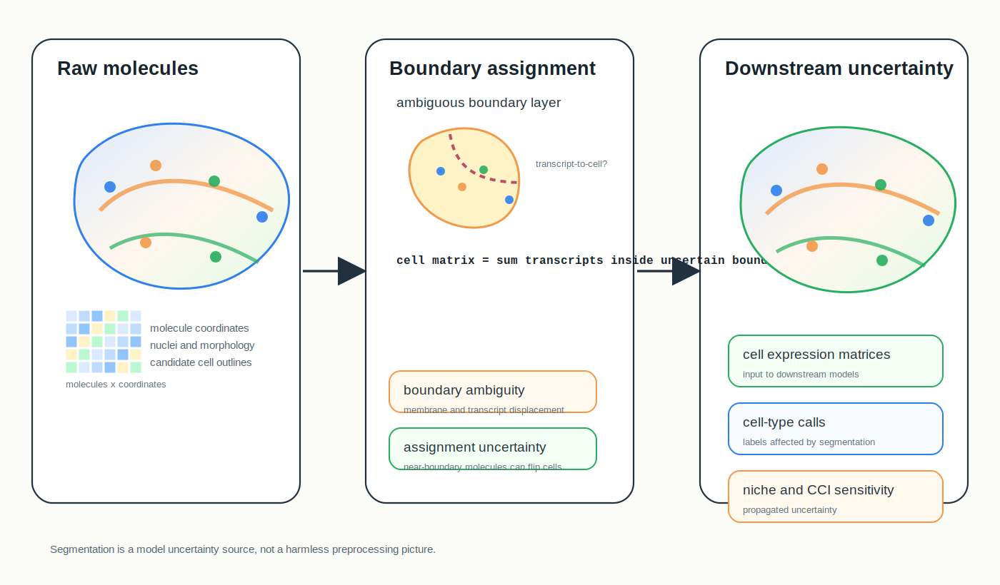
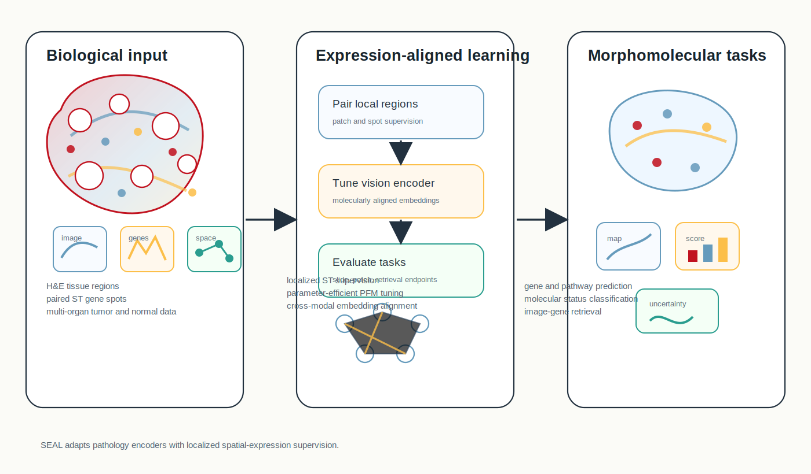
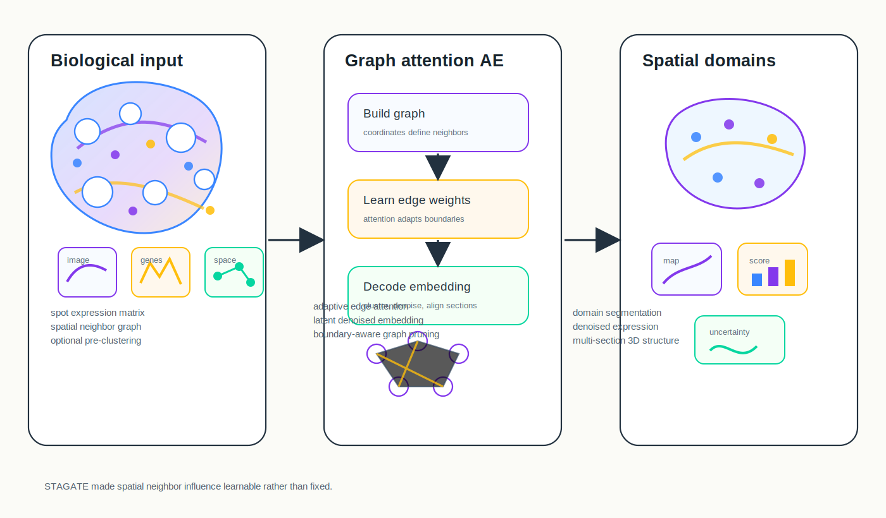
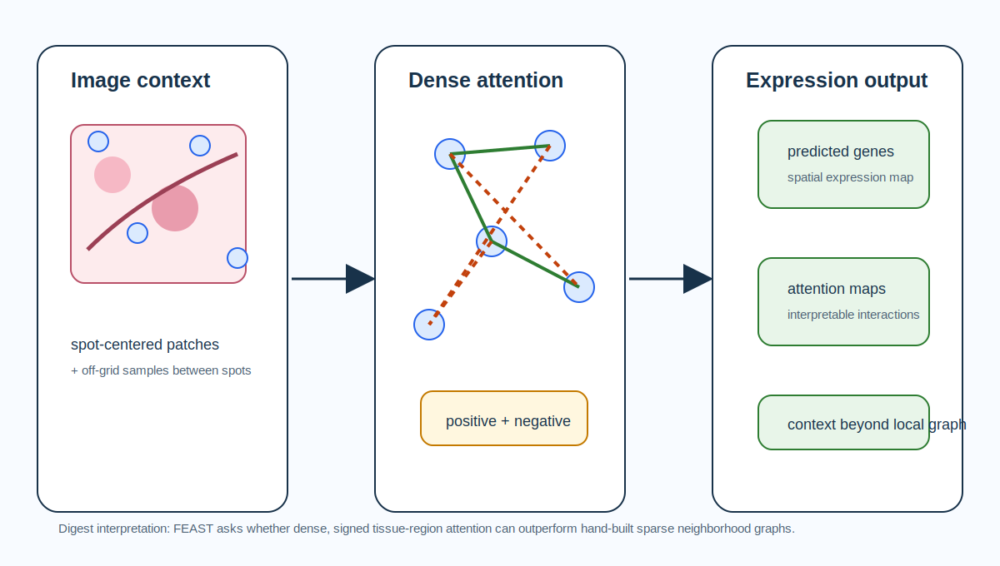

# Spatial Omics Research Digest

**June 22, 2026**

Today emphasizes infrastructure under the modeling surface: segmentation uncertainty, spatially supervised pathology encoders, graph-attention domain detection, dense attention for image-to-gene prediction and data standards for multimodal spatial objects.

## New or updated

### 1. [The Challenge of Cell Segmentation in Spatially Resolved Transcriptomics](https://arxiv.org/abs/2606.09675)

**Perspective / benchmarking agenda | Preprint | arXiv | 2026-06-08**

*Transcript coordinates and tissue morphology pass through uncertain cell-boundary assignment, making downstream cell types, niches and interactions sensitive to segmentation choices.*

This preprint argues that cell segmentation and transcript assignment should be treated as a central unresolved modeling problem in spatially resolved transcriptomics rather than a routine preprocessing step.

**Why included now:** The paper is recent and timely because high-resolution platforms increasingly make the "cell" the unit of analysis. If boundaries and transcript assignment are wrong, downstream domain detection, deconvolution, ligand-receptor inference and foundation-model training can inherit systematic artifacts.

**Methodological contribution:** The authors review segmentation approaches and failure modes, including sparse molecular signal, displaced transcripts, complex morphology and projection of 3D tissue into 2D images. They call for shared evaluation frameworks, scalable benchmark datasets and transparent reporting standards.

**Significance:** This is a useful guardrail for interpreting many spatial modeling papers: a method may look accurate because segmentation-induced uncertainty is invisible, not because the biological signal is clean.

**Interpretive note:** This is not a new algorithm, but it is modeling-relevant because it reframes segmentation as an uncertainty source that should be benchmarked and propagated.

**Keywords:** `cell segmentation` `benchmarking` `transcript assignment` `uncertainty propagation`

## Important to revisit

### 2. [Towards Spatial Transcriptomics-driven Pathology Foundation Models](https://arxiv.org/abs/2602.14177)

**Method paper | Preprint | arXiv | 2026-02-15**

*SEAL fine-tunes existing pathology vision encoders with localized spatial-expression supervision, then tests whether the resulting embeddings improve molecular and clinical prediction tasks.*

SEAL introduces Spatial Expression-Aligned Learning, a vision-omics self-supervised framework that injects localized ST information into existing pathology foundation models.

**Why revisit now:** The June 20 digest covered STAMP/HumanST-1k. SEAL is a useful companion rather than a repeat: it focuses on parameter-efficient fine-tuning of widely used pathology foundation models and reports broad task evaluation across slide-level and patch-level endpoints.

**Methodological contribution:** SEAL trains on over 700,000 paired gene-expression spot and tissue-region examples from tumor and normal samples across 14 organs. It uses localized molecular supervision to make pathology encoders more morphomolecular, supporting molecular-status prediction, pathway-activity prediction, treatment-response prediction, patch-level gene prediction and gene-to-image retrieval.

**Significance:** The paper sharpens a current design question: should pathology foundation models learn molecular structure by predicting genes, pathways, contrastive image-gene alignment or some mixture of these objectives?

**Interpretive note:** The authors report robust downstream gains, but comparisons to STAMP/STORM should control for training corpus, target construction, base encoder and task leakage.

**Keywords:** `pathology foundation model` `spatial transcriptomics` `vision-omics alignment` `self-supervised learning`

### 3. [Deciphering spatial domains from spatially resolved transcriptomics with an adaptive graph attention auto-encoder](https://www.nature.com/articles/s41467-022-29439-6)

**Method paper | Peer reviewed | Nature Communications | 2022-04-01**

*STAGATE builds a spatial neighbor graph, adaptively weights neighbor edges with attention and learns latent embeddings for domain detection, denoising and multi-section 3D domain reconstruction.*

STAGATE is a foundational graph-attention autoencoder for spatial domain identification in spatial transcriptomics.

**Why revisit now:** Many current models still inherit the same core problem: how much should neighboring spots influence each other, especially at domain boundaries? STAGATE remains important because it made neighbor weighting learnable rather than fixed.

**Methodological contribution:** The method integrates gene expression and spatial coordinates through a spatial neighbor network and graph attention autoencoder. It optionally prunes the neighbor graph using pre-clustering to better handle boundaries, then uses learned latent embeddings for clustering, visualization, denoising and 3D analysis across consecutive sections.

**Significance:** STAGATE is a practical baseline for newer graph representation methods, especially those claiming better spatial-domain recovery or adaptive neighborhood learning.

**Interpretive note:** Its attention mechanism is locally graph-based; newer fully connected or multiscale methods should show when broader context improves over adaptive local edges.

**Keywords:** `spatial domains` `graph attention` `autoencoder` `3D reconstruction`

### 4. [FEAST: Fully Connected Expressive Attention for Spatial Transcriptomics](https://arxiv.org/abs/2603.25247)

**Method paper | Preprint | arXiv | 2026-03-26**

*FEAST predicts spatial gene expression from whole-slide image context by replacing predefined sparse spot graphs with fully connected attention and negative-aware interactions.*

FEAST targets spatial gene-expression prediction from histology images using a fully connected attention model over tissue regions.

**Why revisit now:** It is technically distinctive because it questions the sparse predefined graphs used by many spatial and pathology-ST models. Instead of deciding neighborhood structure up front, FEAST lets all spot pairs interact through attention.

**Methodological contribution:** The model represents tissue regions with a fully connected graph, introduces negative-aware attention for excitatory and inhibitory relationships and uses off-grid sampling to gather additional image context between standard spot-centered patches.

**Significance:** FEAST gives a concrete test of whether dense tissue-context modeling improves image-to-expression prediction beyond local graphs and patch-only encoders.

**Interpretive note:** Fully connected attention can be expressive, but its biological plausibility depends on whether learned long-range and negative interactions remain stable across tissues and platforms.

**Keywords:** `image-to-gene prediction` `fully connected attention` `histology` `negative-aware attention`

### 5. [SpatialData: an open and universal data framework for spatial omics](https://www.nature.com/articles/s41592-024-02212-x)

**Data infrastructure / framework | Peer reviewed | Nature Methods | 2024-03-20**

SpatialData defines a unified, extensible data framework for multimodal spatial omics objects.

**Why revisit now:** As the digest now includes atlas and resource papers, SpatialData is worth foregrounding because modeling quality increasingly depends on whether images, labels, molecular points, shapes, tables and coordinate transforms remain synchronized.

**Resource table**

| Field | Details |
| --- | --- |
| Biological scope | General-purpose framework for spatial omics datasets across platforms and tissues, illustrated with multimodal breast cancer spatial data. |
| Modalities | Images, labels, molecular points, geometric shapes and tables, with support for uni- and multimodal spatial omics. |
| Data model | Zarr / OME-NGFF-based storage, lazy larger-than-memory representation and tracked coordinate transformations into common coordinate systems. |
| Access and tooling | Python library, napari-spatialdata annotation, spatialdata-plot, spatialdata-io, documentation, tutorials and sample datasets. |
| Modeling uses | Multimodal alignment, cross-modal aggregation, reproducible benchmark construction, PyTorch dataset access and coordinate-aware model training. |
| Reuse checks | Verify coordinate transforms, technology-specific readers, segmentation labels, spatial units and metadata completeness before pooling datasets. |

**Resource contribution:** The framework represents spatial data with interoperable primitives and supports queries, aggregation and annotation across aligned modalities.

**Significance:** SpatialData is infrastructure, but it changes modeling practice: it makes coordinate transforms and cross-modal aggregation explicit rather than hidden in one-off scripts.

**Interpretive note:** Standardizing representation does not standardize biology; users still need platform-aware normalization, QC and provenance checks.

**Keywords:** `data framework` `multimodal spatial omics` `coordinate transforms` `benchmark infrastructure`

## What to watch

- Segmentation uncertainty is becoming a first-class modeling issue; downstream methods should report sensitivity to cell-boundary and transcript-assignment choices.
- ST-guided pathology foundation models are converging on parameter-efficient adaptation, but the field still needs fair comparisons of gene, pathway and contrastive objectives.
- Graph design remains unsettled: local adaptive attention, fully connected attention and multiscale geometry each encode different assumptions about tissue organization.
- Data standards are now part of modeling. Coordinate systems, spatial primitives and modality alignment can determine whether a benchmark is reproducible.

---

_Method figures are original conceptual SVG summaries generated from verified primary-source descriptions. The SpatialData resource table is an original compact summary from the cited paper and is not a reproduced publication table._
