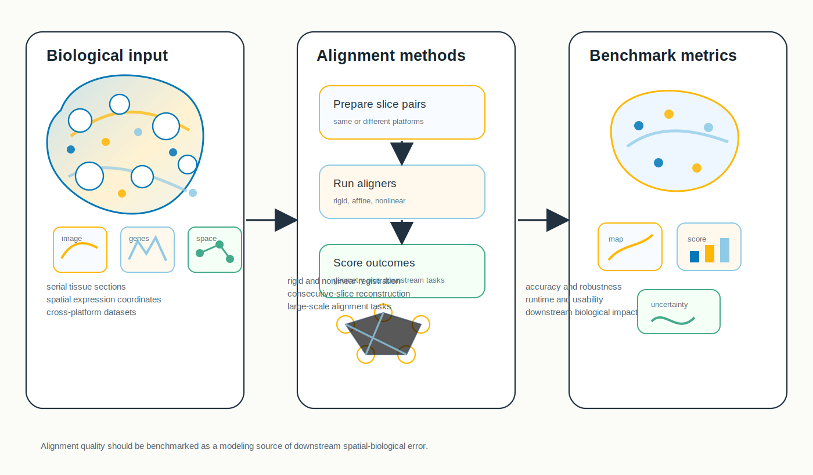
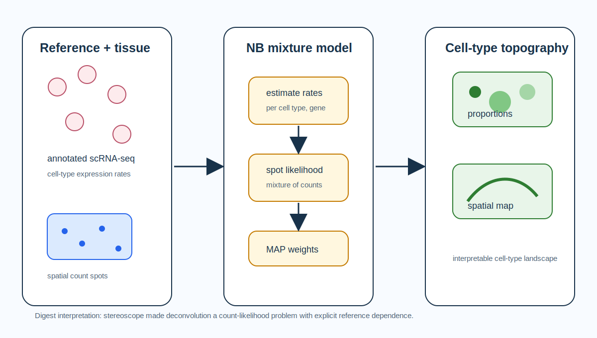
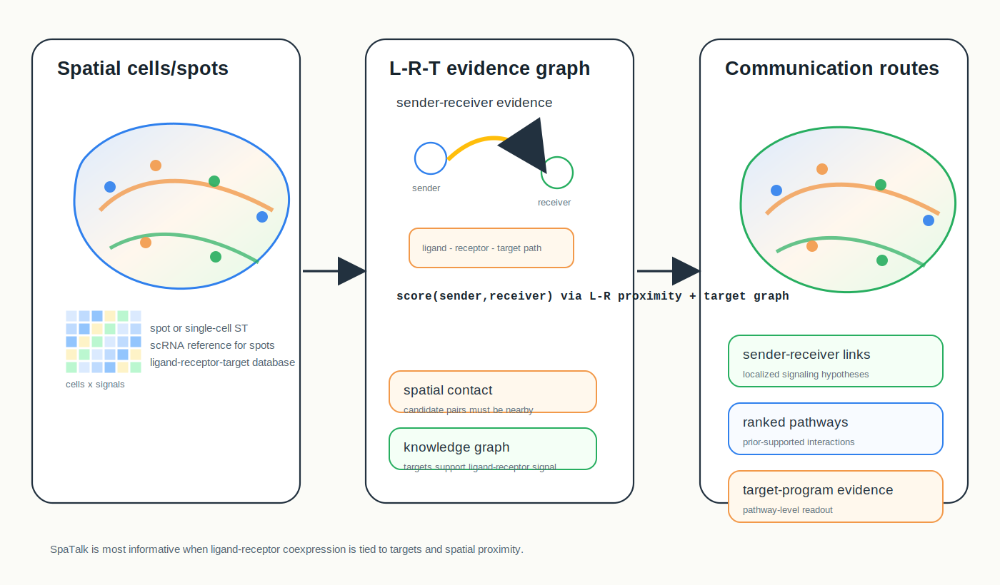

# Spatial Omics Research Digest

**June 23, 2026**

No strong brand-new spatial omics modeling paper surfaced after yesterday's cutoff. Today's digest is therefore a focused "important to revisit" issue: alignment benchmarking, probabilistic deconvolution, spatial communication inference and standardized histology-to-gene benchmarking.

## Important to revisit

### 1. [Benchmarking alignment methods for spatial transcriptomics data](https://www.nature.com/articles/s43588-026-00977-z)

**Benchmarking / analysis paper | Peer reviewed | Nature Computational Science | 2026-04-03**

*Multiple spatial slices and platforms are passed through alignment methods, then scored for accuracy, efficiency, usability, robustness and downstream effects.*

This paper systematically benchmarks spatial transcriptomics alignment methods for reconstructing multi-slice tissue architecture from 2D sections.

**Why revisit now:** Alignment is becoming a hidden dependency for 3D atlases, serial-section integration and atlas-to-query transfer. The June 22 digest emphasized graph and data infrastructure; this benchmark fills the adjacent question of how well slice registration actually works.

**Methodological contribution:** The authors execute 295 alignment tasks across diverse datasets and technologies, evaluating accuracy, efficiency, usability, robustness and downstream impact. They also probe challenging scenarios such as cross-platform alignment, consecutive-slice reconstruction and large-scale data.

**Significance:** It provides a practical counterweight to method demos: alignment quality should be treated as a measurable source of error before downstream domain detection, trajectory inference or 3D atlas construction.

**Interpretive note:** The benchmark is method-selection guidance, not a universal winner list; task geometry, platform, tissue deformation and downstream objective still decide the right tool.

**Keywords:** `alignment benchmarking` `3D reconstruction` `multi-slice integration` `robustness`

### 2. [Single-cell and spatial transcriptomics enables probabilistic inference of cell type topography](https://www.nature.com/articles/s42003-020-01247-y)

**Method paper | Peer reviewed | Communications Biology | 2020-10-09**

*Single-cell reference profiles parameterize a negative-binomial mixture model, which estimates interpretable cell-type proportions at each spatial capture location.*

This paper introduced stereoscope, an early model-based framework for mapping single-cell cell types onto spatial transcriptomics spots.

**Why revisit now:** The archive has covered RCTD, cell2location, CARD, SPOTlight and SONAR, but stereoscope is still worth keeping in the mental map because it cleanly formulates deconvolution as count-model likelihood rather than marker scoring or latent-factor interpretation.

**Methodological contribution:** The method estimates cell-type expression parameters from annotated single-cell RNA-seq and models each spatial spot as a mixture of cell-type contributions under a negative-binomial count model. It accounts for platform bias and returns cell-type proportion estimates over tissue coordinates.

**Significance:** Stereoscope helped establish the now-standard reference-mapping problem: use dissociated single-cell atlases to infer spatial cell-type topography in lower-resolution spatial assays.

**Interpretive note:** Its outputs are only as complete as the reference; cell types absent from the single-cell data cannot be confidently assigned in the spatial map.

**Keywords:** `probabilistic deconvolution` `negative binomial` `cell-type topography` `single-cell reference`

### 3. [Knowledge-graph-based cell-cell communication inference for spatially resolved transcriptomic data with SpaTalk](https://www.nature.com/articles/s41467-022-32111-8)

**Method paper | Peer reviewed | Nature Communications | 2022-07-30**

*SpaTalk decomposes spot-level or single-cell spatial data, constructs spatial neighbor relationships and scores ligand-receptor-target signaling through graph and knowledge-graph evidence.*

SpaTalk infers spatially resolved cell-cell communication using ligand-receptor proximity and downstream target evidence.

**Why revisit now:** Recent cell-cell communication methods are adding dynamics, optimal transport and learned representations. SpaTalk remains distinctive because it explicitly combines spatial proximity, cell-type decomposition and ligand-receptor-target knowledge graphs.

**Methodological contribution:** For spot-based data, SpaTalk uses a non-negative linear model with scRNA-seq references to reconstruct cell-type composition. It then builds a cell graph in space, tests proximal ligand-receptor co-expression and uses a ligand-receptor-target knowledge graph with random-walk scoring to rank signaling between senders and receivers.

**Significance:** The paper helps clarify an important modeling standard: spatial communication should not be inferred from ligand-receptor co-expression alone when downstream target programs and spatial proximity can be checked.

**Interpretive note:** Knowledge-graph priors are useful but can encode database incompleteness and literature bias; inferred signaling should be validated against perturbation, imaging or pathway evidence when possible.

**Keywords:** `cell-cell communication` `knowledge graph` `ligand-receptor-target` `spatial proximity`

### 4. [Completing spatial transcriptomics data for gene expression prediction benchmarking](https://arxiv.org/abs/2505.02980)

**Benchmarking resource with method | Peer-reviewed journal reference: Medical Image Analysis | 2025-12**

SpaRED/SpaCKLE addresses standardized benchmarking for predicting spatial gene expression from histology images.

**Why revisit now:** The June 20 and June 22 digests covered ST-guided pathology foundation models. SpaRED/SpaCKLE matters because fair evaluation of those models depends on standardized datasets, preprocessing and missing-expression handling.

**Resource table**

| Field | Details |
| --- | --- |
| Biological scope | Public Visium-style spatial transcriptomics datasets paired with histology images. |
| Modalities | H&E tissue images and spatial gene-expression profiles. |
| Scale reported | SpaRED curates 26 public datasets for gene-expression prediction benchmarking. |
| Access/tooling | ArXiv paper, journal DOI, standardized benchmark framing and SpaCKLE transformer-based completion model. |
| Modeling uses | Histology-to-gene prediction benchmarking, dropout-aware evaluation, foundation-model comparison and preprocessing reproducibility. |
| Reuse checks | Confirm train/test split definitions, tissue overlap, gene panels, dropout handling and whether completed expression is used as target or auxiliary signal. |

**Resource contribution:** The paper introduces SpaRED as a curated benchmark database and SpaCKLE as a transformer-based gene-expression completion model; it evaluates multiple prediction models on raw and completed data.

**Significance:** It moves image-to-expression evaluation away from one-off datasets and toward a reusable benchmark where preprocessing decisions are visible.

**Interpretive note:** Completed expression can stabilize benchmarking, but it may also smooth away biologically meaningful dropout or uncertainty if treated as ground truth.

**Keywords:** `benchmark resource` `histology-to-gene prediction` `SpaRED` `SpaCKLE`

## What to watch

- Spatial alignment benchmarks should report downstream biological impact, not only coordinate error.
- Deconvolution papers should make their likelihood assumptions and reference-coverage limitations explicit.
- Cell-cell communication inference is converging on multi-evidence scoring: proximity, ligand-receptor co-expression, downstream targets and pathway priors.
- Histology-to-gene foundation models need benchmark resources that separate raw measurements, imputed targets and evaluation labels.

---

_Method figures are original conceptual SVG summaries generated from verified primary-source descriptions. The SpaRED/SpaCKLE resource table is an original compact summary from the cited paper and is not a reproduced publication table._
