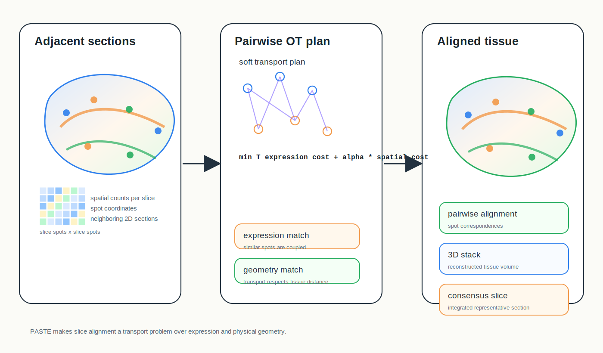
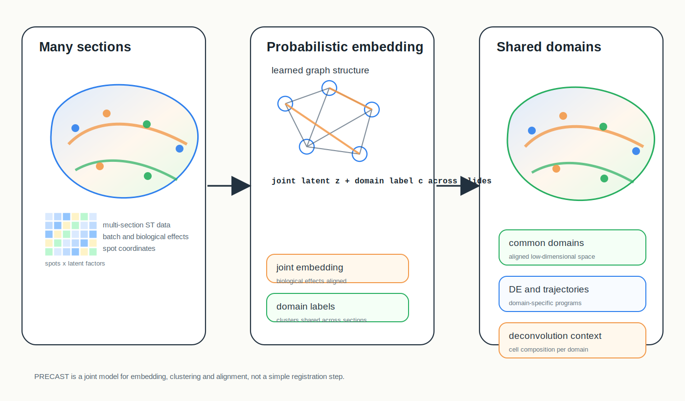
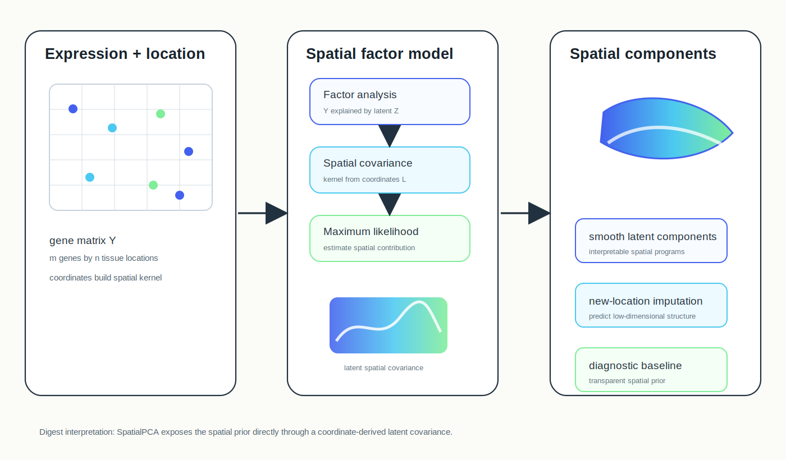
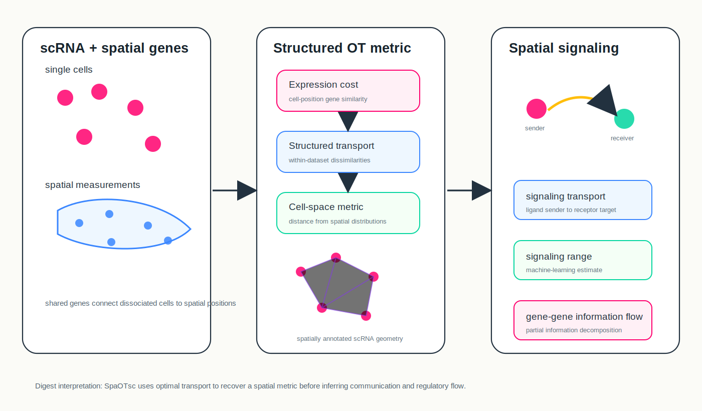

# Spatial Omics Research Digest

**June 24, 2026**

No strong newly released spatial-omics modeling paper surfaced after the June 23 cutoff. Today's digest is a focused "important to revisit" issue on geometric and probabilistic models for multi-section alignment, joint embedding, spatial dimension reduction and spatially constrained signaling.

## Important to revisit

### 1. [Alignment and integration of spatial transcriptomics data](https://www.nature.com/articles/s41592-022-01459-6)

**Method paper | Peer reviewed | Nature Methods | 2022-05-16**

*PASTE aligns adjacent spatial transcriptomics slices by optimal transport, jointly considering transcriptional similarity and physical spot distances to build pairwise, stacked 3D or consensus-slice representations.*

PASTE introduced a probabilistic optimal-transport formulation for aligning and integrating multiple spatial transcriptomics slices.

**Why revisit now:** Yesterday's digest covered a 2026 alignment benchmark; PASTE is the conceptual ancestor worth pairing with that benchmark. It makes explicit that slice registration is a modeling problem over both expression similarity and tissue geometry, not just an image-registration step.

**Methodological contribution:** PASTE computes pairwise alignments between slices using an optimal-transport objective that combines transcriptional similarity with spatial distances between spots. It can stack aligned 2D slices into a 3D representation or integrate multiple slices into a single consensus slice.

**Significance:** The method is a clean baseline for multi-section spatial atlases because it links registration, integration and downstream cell-type or differential-expression analysis in one mathematical frame.

**Interpretive note:** PASTE assumes adjacent slices share enough structure for expression-space and physical-space matching to be informative; severe tissue deformation or missing anatomy can still break the alignment.

**Keywords:** `optimal transport` `slice alignment` `3D reconstruction` `consensus slice`

### 2. [Probabilistic embedding, clustering, and alignment for integrating spatial transcriptomics data with PRECAST](https://www.nature.com/articles/s41467-023-35947-w)

**Method paper | Peer reviewed | Nature Communications | 2023-01-18**

*PRECAST jointly learns aligned embeddings and spatial-domain labels across multiple tissue sections, allowing domain-aware integration, differential expression and trajectory analysis.*

PRECAST is a probabilistic framework for embedding, clustering and alignment of multiple spatial transcriptomics sections.

**Why revisit now:** Current atlas construction often needs more than pairwise registration: it needs shared embeddings, joint domain labels and section-specific biological effects. PRECAST is useful because it puts those tasks into one probabilistic model rather than a chain of independent post-processing steps.

**Methodological contribution:** PRECAST estimates aligned latent embeddings for biological effects across slides and joint labels for spatial domains. The paper evaluates it on DLPFC, mouse liver, mouse olfactory bulb and hepatocellular carcinoma sections, connecting detected domains to deconvolution, differential expression, trajectory and RNA-velocity analyses.

**Significance:** PRECAST is a strong reference for asking whether a multi-section method preserves domain biology while correcting unwanted slice-to-slice variation.

**Interpretive note:** Joint domain labels are powerful, but they can blur sample-specific pathology if the model is asked to over-align genuinely different tissue states.

**Keywords:** `probabilistic embedding` `multi-section integration` `spatial domains` `alignment`

### 3. [Spatially aware dimension reduction for spatial transcriptomics](https://www.nature.com/articles/s41467-022-34879-1)

**Method paper | Peer reviewed | Nature Communications | 2022-11-23**

*SpatialPCA models expression through latent factors whose covariance is built from tissue coordinates, producing spatially smooth components and imputed low-dimensional structure at unmeasured locations.*

SpatialPCA extends dimension reduction for spatial transcriptomics by explicitly modeling spatial correlation in latent factors.

**Why revisit now:** Recent graph and foundation models often claim better spatial representations, but SpatialPCA remains a clean statistical baseline: it asks how far a generative factor model with an explicit spatial kernel can go before deep architectures are needed.

**Methodological contribution:** The method represents the expression matrix through latent factors and builds a spatial covariance kernel from location information, estimating the contribution of spatial correlation to low-dimensional components. The paper also highlights imputation of low-dimensional components at new spatial locations.

**Significance:** SpatialPCA makes the spatial prior inspectable. It provides a useful comparison for graph neural networks, contrastive embeddings and spatial foundation models whose inductive biases may be harder to diagnose.

**Interpretive note:** Kernel choice matters. Smooth spatial covariance is a useful assumption for broad programs, but it may under-represent sharp boundaries, rare niches or discontinuous tissue structures.

**Keywords:** `dimension reduction` `spatial kernel` `factor analysis` `latent components`

### 4. [Inferring spatial and signaling relationships between cells from single-cell transcriptomic data](https://www.nature.com/articles/s41467-020-15968-5)

**Method paper | Peer reviewed | Nature Communications | 2020-04-29**

*SpaOTsc maps single cells into spatial measurements with structured optimal transport, then uses the inferred cell-space metric to model signaling transport and intercellular gene-gene information flow.*

SpaOTsc connects dissociated single-cell RNA-seq with spatial measurements and then uses the inferred spatial metric for communication and regulatory analysis.

**Why revisit now:** The archive has covered COMMOT, SpaTalk and other spatial communication methods. SpaOTsc is a useful earlier bridge: it first reconstructs a spatial metric for scRNA-seq cells and then uses that metric to constrain signaling and gene-regulatory information flow.

**Methodological contribution:** SpaOTsc builds a transport map between scRNA-seq cells and spatial measurements using shared genes, within-dataset dissimilarities and spatial distances. It then infers cell-cell distances, signaling sender-to-receiver transport, signaling range with machine-learning models and intercellular gene-gene regulatory information flow using partial information decomposition.

**Significance:** It shows how optimal transport can turn non-spatial single-cell data into a geometry where communication is distance-aware rather than purely cell-type-averaged.

**Interpretive note:** The inferred spatial metric depends on the quality and coverage of the paired spatial measurements; downstream signaling should be interpreted as model-based spatial plausibility, not direct observation of molecular exchange.

**Keywords:** `structured optimal transport` `single-cell to spatial mapping` `cell-cell communication` `regulatory information flow`

## What to watch

- Multi-section atlas methods need to separate three tasks that are often entangled: geometric alignment, batch correction and biological domain sharing.
- Optimal transport remains a recurring mathematical language across alignment, reconstruction, communication and super-resolution, but each use encodes different conservation and cost assumptions.
- Spatial kernel factor models are still valuable baselines for newer graph and foundation models because their assumptions are visible.
- Communication inference benefits from explicit spatial metrics, but inferred signaling should be checked against perturbation, pathway activity or imaging evidence.

---

_Figures are original conceptual SVG summaries generated from verified primary-source descriptions. They are not reproduced publication figures and do not depict reported quantitative results._
