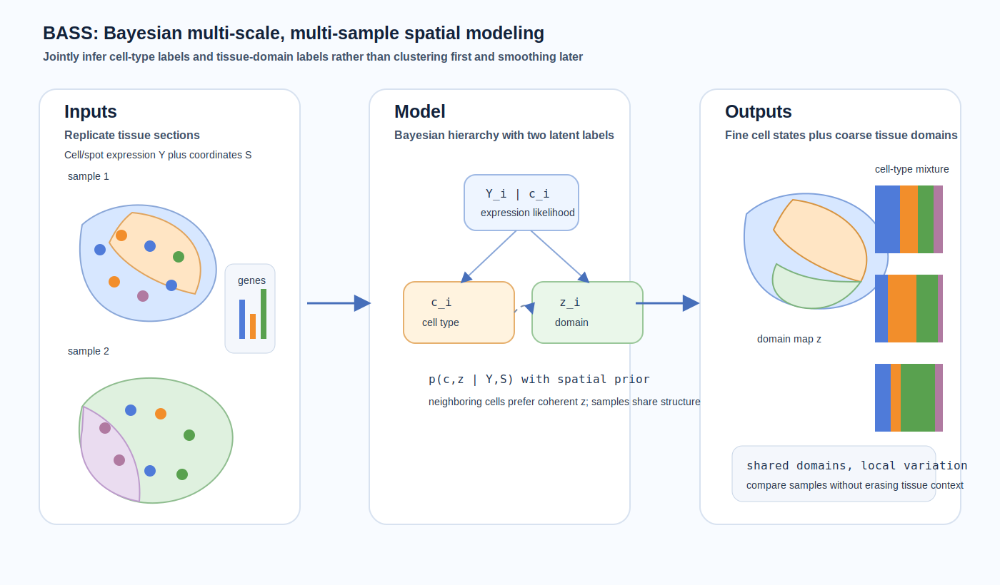
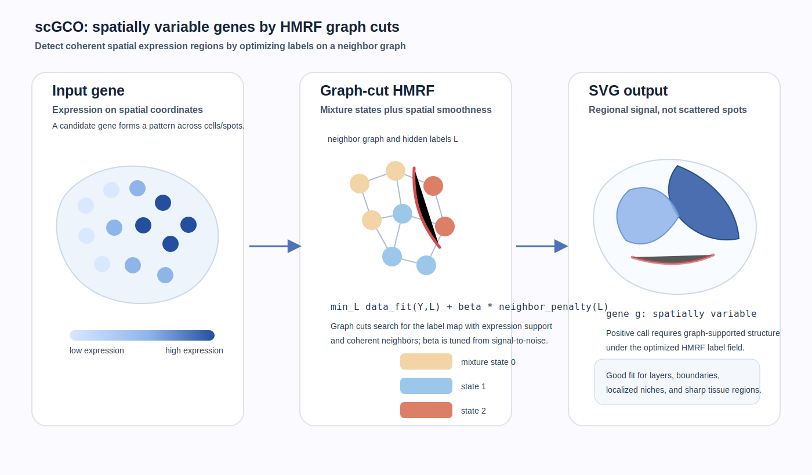
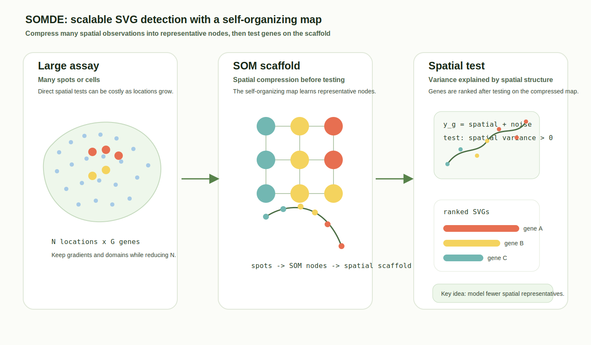

# Spatial omics methods digest - 2026-06-25

Today I did not find a strong newly released spatial-omics modeling paper that was clearly worth adding after the June 24 digest. Rather than pad the update, this digest revisits three technically important statistical modeling papers that are useful for interpreting the current wave of graph, Bayesian, and scalable spatial-domain methods.

## 1. BASS: multi-scale and multi-sample analysis enables accurate cell type clustering and spatial domain detection in spatial transcriptomic studies

**Lane:** Important to revisit.  
**Date:** Published August 4, 2022.  
**Status:** Peer-reviewed method article in *Genome Biology*.  
**Primary link:** [Genome Biology article](https://genomebiology.biomedcentral.com/articles/10.1186/s13059-022-02734-7)

**Why now:** Many current spatial foundation-model and graph-neural-network papers still need statistically grounded baselines for multi-sample domain discovery. BASS is worth keeping visible because it explicitly couples cell-scale clustering and tissue-scale domains in one Bayesian hierarchical model, rather than treating cluster labels and domains as independent post-processing steps.

**Methodological contribution:** BASS models both the cell-type label and the spatial-domain label as latent variables, using gene expression, spatial coordinates, and spatial correlation to jointly infer fine-scale cell states and coarser tissue regions. The paper emphasizes multi-scale and multi-sample inference, making it relevant when spatial sections must be aligned conceptually without forcing a single deterministic clustering first.

**Significance:** BASS is a clean example of a statistical model that encodes the biological hierarchy directly: cells live inside tissue regions, regions impose spatial smoothness, and multiple samples share information while retaining sample-specific tissue organization.

*Caption: BASS jointly infers cell-level types and tissue-level domains across spatial samples using a Bayesian hierarchy with spatial smoothing and shared multi-sample structure.*

## 2. Identification of spatially variable genes with graph cuts

**Lane:** Important to revisit.  
**Date:** Published September 19, 2022.  
**Status:** Peer-reviewed method article in *Nature Communications*.  
**Primary link:** [Nature Communications article](https://www.nature.com/articles/s41467-022-33182-3)

**Why now:** Spatially variable gene detection remains a core first step before domain modeling, interaction modeling, or downstream regulatory analysis. scGCO is still technically distinctive because it formulates SVG detection as an efficient hidden-Markov-random-field optimization problem and uses graph cuts, rather than relying only on Gaussian-process or regression-style tests.

**Methodological contribution:** scGCO builds a spatial-neighbor graph, discretizes expression patterns through mixture components, and optimizes a hidden Markov random field objective with graph cuts. The authors describe automatic smoothness tuning and scalability to large spatial data, while the model explicitly balances expression fit against neighbor-label consistency.

**Significance:** The paper is a useful counterpoint to purely continuous spatial-covariance models: it detects spatial expression programs as coherent graph-supported regions, which can be easier to interpret in tissues with sharp boundaries, layers, or localized niches.

*Caption: scGCO converts spatial expression into graph labels and uses graph-cut optimization of an HMRF objective to identify coherent spatially variable genes.*

## 3. SOMDE: a scalable method for identifying spatially variable genes with self-organizing map

**Lane:** Important to revisit.  
**Date:** Published June 24, 2021.  
**Status:** Peer-reviewed method article in *Bioinformatics*.  
**Primary link:** [Bioinformatics article](https://doi.org/10.1093/bioinformatics/btab471)

**Why now:** As spatial assays move toward very large fields of view and many samples, SVG methods need to avoid scaling poorly with spot or cell count. SOMDE is worth revisiting because it separates spatial compression from spatial testing: first summarize locations with a self-organizing map, then test genes on the lower-dimensional spatial scaffold.

**Methodological contribution:** SOMDE uses a self-organizing map to aggregate spatial transcriptomic locations into representative nodes, then applies a spatial variance test to identify genes with structured spatial patterns. This reduces computational cost while preserving broad tissue-level gradients and regions.

**Significance:** SOMDE is an early example of an idea that has become newly relevant: compress the tissue into a learned spatial scaffold before modeling genes. That design connects naturally to modern tokenization, pooling, and graph coarsening strategies in spatial foundation models.

*Caption: SOMDE compresses many spatial observations into self-organizing-map nodes and performs scalable spatial-variance testing on the learned scaffold.*

## Emerging themes to watch

- **Statistical hierarchy is becoming valuable again.** BASS shows a principled route for linking cell labels, domains, and multi-sample structure, which can inform how newer neural models encode tissue organization.
- **SVG detection is not one problem.** scGCO favors graph-supported discrete regions, while SOMDE favors scalable spatial compression; the right baseline depends on whether the biology is boundary-like, gradient-like, sparse, or multi-scale.
- **Compression is becoming a modeling primitive.** SOMDE's self-organizing-map scaffold anticipates current interest in tissue tokens, graph pooling, and region-level latent representations.
- **Better diagrams should expose the model's statistical object.** For method digests, the most useful visual is not a workflow box chain; it is the paper-specific object being inferred: latent labels, graph cuts, spatial covariance, transport plans, attention neighborhoods, or resource tables when the item is a data portal.
