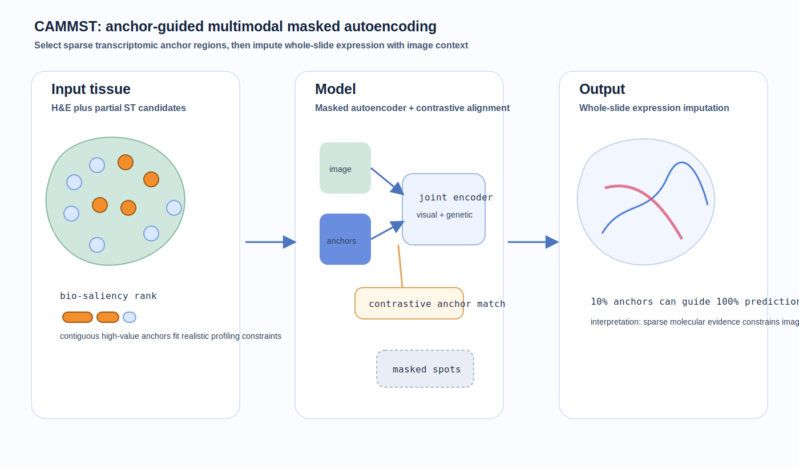
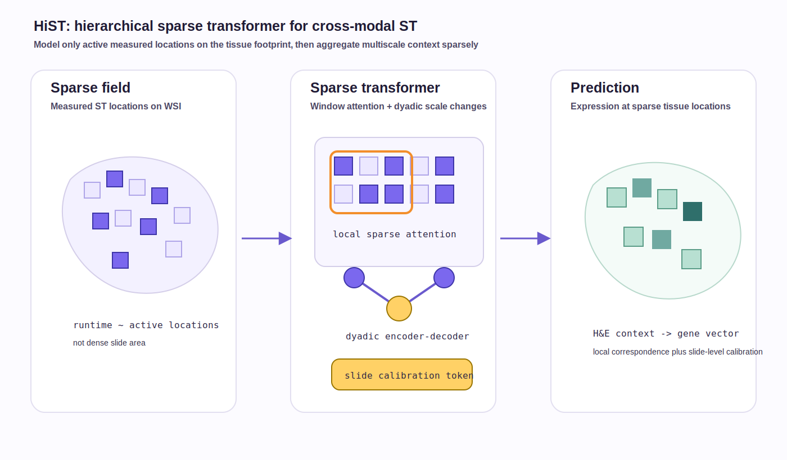
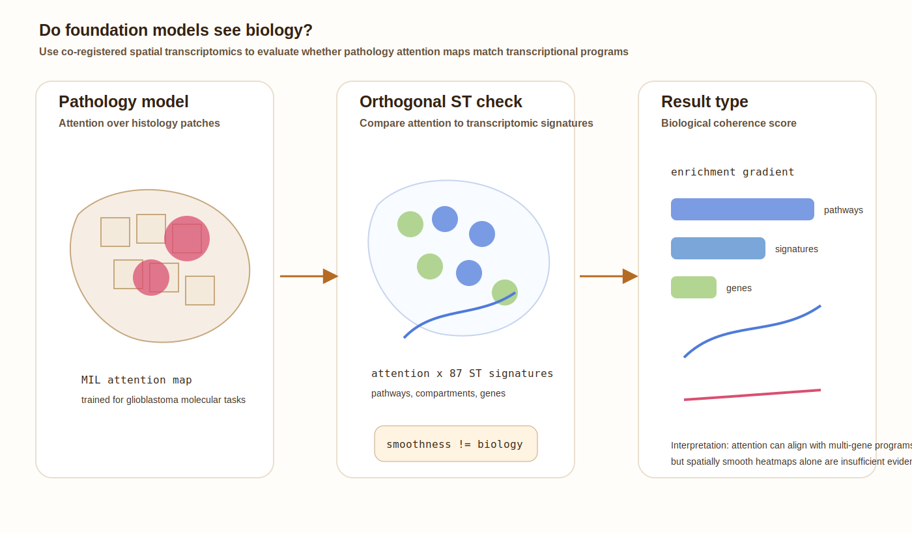
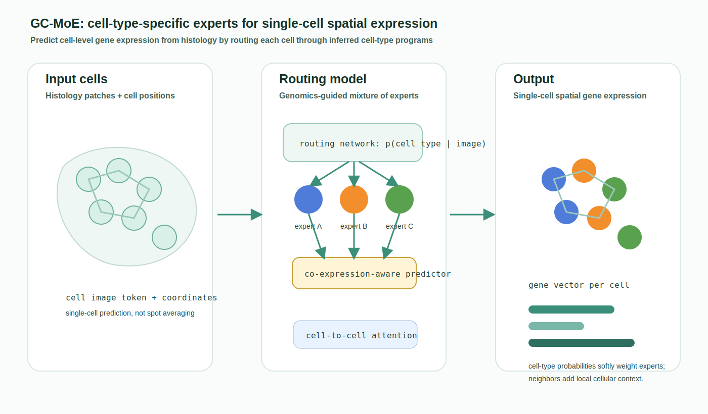

# Spatial omics methods digest - 2026-06-27

I did not find a strong primary-source spatial-omics modeling paper released after the June 25 digest. Today's update therefore uses the second lane: recent June preprints that were not yet covered and are important to check because they sharpen current directions in histology-to-spatial transcriptomics, multimodal transformers, cell-level expression prediction, and biological validation of pathology foundation models.

## 1. Contrastive and Adaptive Multi-modal Masked Autoencoder for Spatial Transcriptomics

**Lane:** Important to revisit.  
**Date:** Preprint posted June 19, 2026.  
**Status:** Preprint on arXiv.  
**Primary link:** [arXiv:2606.21156](https://arxiv.org/abs/2606.21156)

**Why now:** This paper is relevant to the practical question of how much transcriptomic coverage is needed when histology alone is insufficient. It treats expression prediction as spatial imputation with selected transcriptomic anchor regions rather than a pure image-to-expression problem.

**Methodological contribution:** CAMMST uses a masked-autoencoder setup with a bio-saliency score and learning-to-rank procedure to choose informative anchor spots. Contiguous anchor regions are selected to match realistic profiling hardware constraints. A cross-modal joint encoder combines histology features and partial gene-expression anchors, with contrastive alignment between anchor expression and visual features.

**Significance:** The key modeling idea is active use of partial molecular measurements: instead of asking a foundation model to hallucinate all expression from morphology, the method injects sparse transcriptomic evidence and propagates it over the tissue.

*Caption: CAMMST ranks informative spatial regions as transcriptomic anchors, masks the remaining tissue, and uses cross-modal MAE/contrastive learning to impute whole-slide expression.*

## 2. HiST: A Hierarchical Sparse Transformer for Cross-Modal Spatial Transcriptomics Modeling

**Lane:** Important to revisit.  
**Date:** Preprint posted June 12, 2026.  
**Status:** Preprint on arXiv.  
**Primary link:** [arXiv:2606.14251](https://arxiv.org/abs/2606.14251)

**Why now:** Histology-to-ST models increasingly need to process whole-slide scale data without dense-grid tokenization. HiST is useful because it explicitly models measured ST locations as a sparse field and makes the scaling claim depend on active tissue locations rather than slide area.

**Methodological contribution:** HiST uses a hierarchical sparse transformer with sparse window attention for local correspondence, dyadic encoder-decoder resolution changes for multiscale context, and a slide calibration token to condition local representations on slide-level acquisition context.

**Significance:** The paper pushes a technically important direction: representing ST observations as irregular sparse spatial fields, rather than forcing every whole-slide problem into a dense patch grid with quadratic token mixing.

*Caption: HiST keeps only active spatial locations, applies local sparse attention and multiscale sparse aggregation, and calibrates predictions with a slide-level token.*

## 3. Do Foundation Models See Biology? Evaluating Attention Coherence with Spatial Transcriptomics in Glioblastoma

**Lane:** Important to revisit.  
**Date:** Preprint posted June 3, 2026; updated June 23, 2026.  
**Status:** Preprint on arXiv.  
**Primary link:** [arXiv:2606.04764](https://arxiv.org/abs/2606.04764)

**Why now:** The field is using pathology foundation models aggressively, but saliency and attention maps are often interpreted visually rather than biologically. This preprint is important because it uses co-registered spatial transcriptomics as an orthogonal evaluation target for attention coherence.

**Methodological contribution:** The authors evaluate attention maps from five pathology foundation models and a ResNet50 baseline in glioblastoma. Attention-based multiple-instance-learning models predict molecular alterations, and attention maps are compared against spatial transcriptomic signatures from co-registered Visium samples. The reported result is that attention coherence is stronger for pathway-level transcriptional programs than for individual genes, and spatial smoothness alone is not sufficient evidence of biological coherence.

**Significance:** This is a benchmarking and validation paper rather than a new ST model, but it is highly relevant: it asks whether image encoders attend to biologically meaningful compartments and provides a quantitative way to test that claim with spatial omics.

*Caption: The evaluation aligns pathology-model attention maps with co-registered spatial transcriptomic signatures to test whether attention corresponds to biological programs rather than visual smoothness alone.*

## 4. GC-MoE: Genomics-Guided Cell-Type-Specific Mixture of Experts for Histology-Based Single-Cell Spatial Transcriptomics

**Lane:** Important to revisit.  
**Date:** Preprint posted June 1, 2026.  
**Status:** Preprint on arXiv.  
**Primary link:** [arXiv:2606.02424](https://arxiv.org/abs/2606.02424)

**Why now:** Many histology-to-ST approaches predict spot-level profiles. GC-MoE is relevant because it targets single-cell spatial transcriptomics from histology and explicitly routes prediction through inferred cell-type structure.

**Methodological contribution:** GC-MoE estimates cell-type probabilities with a routing network and softly combines cell-type-specific expression experts. It adds a cell-type-specific co-expression-aware predictor and a lightweight cell-to-cell interaction attention module to incorporate neighborhood context.

**Significance:** The paper makes a useful modeling distinction: single-cell spatial expression prediction should not be treated as only higher-resolution spot prediction. It needs cell-type-aware routing, cell-specific gene programs, and local cellular context.

*Caption: GC-MoE routes each histology-detected cell through cell-type-specific expression experts and uses neighborhood attention to predict single-cell spatial expression.*

## Emerging themes to watch

- **Histology-to-ST is moving from hallucination to constrained inference.** CAMMST uses sparse molecular anchors, HiST uses sparse measured locations, and GC-MoE uses cell-type routing; all three constrain prediction with explicit biological or assay structure.
- **Sparse geometry is becoming central.** Whole-slide models need representations that scale with measured cells/spots and active tissue regions, not with every possible image patch.
- **Validation is becoming more biological.** The glioblastoma foundation-model evaluation shows that attention maps need transcriptomic checks; smooth heatmaps are not enough.
- **Cell-level prediction needs cell-level assumptions.** Routing by cell type and using cell-neighborhood context are likely to matter as single-cell spatial assays become more common.
