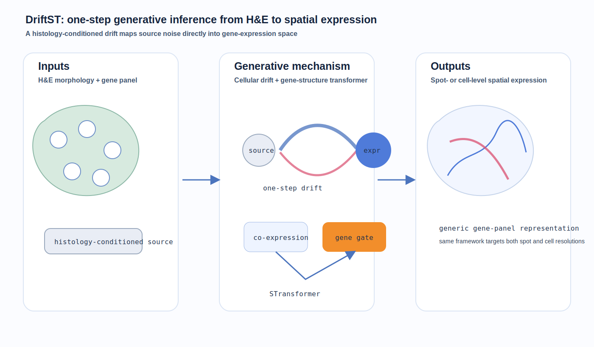
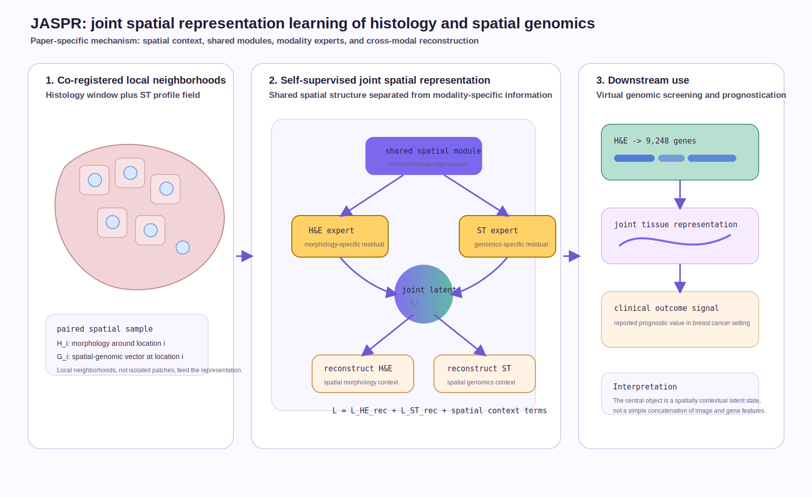
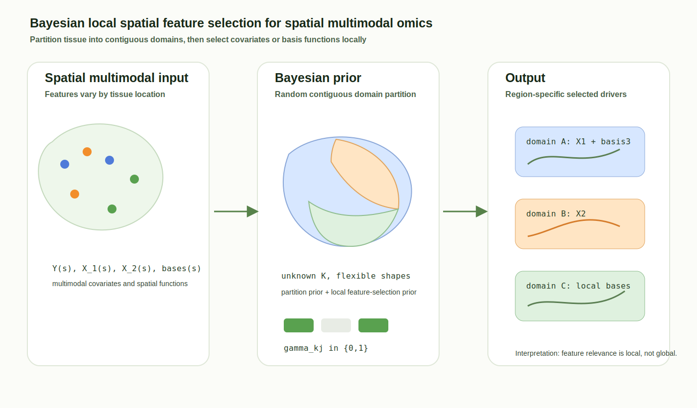
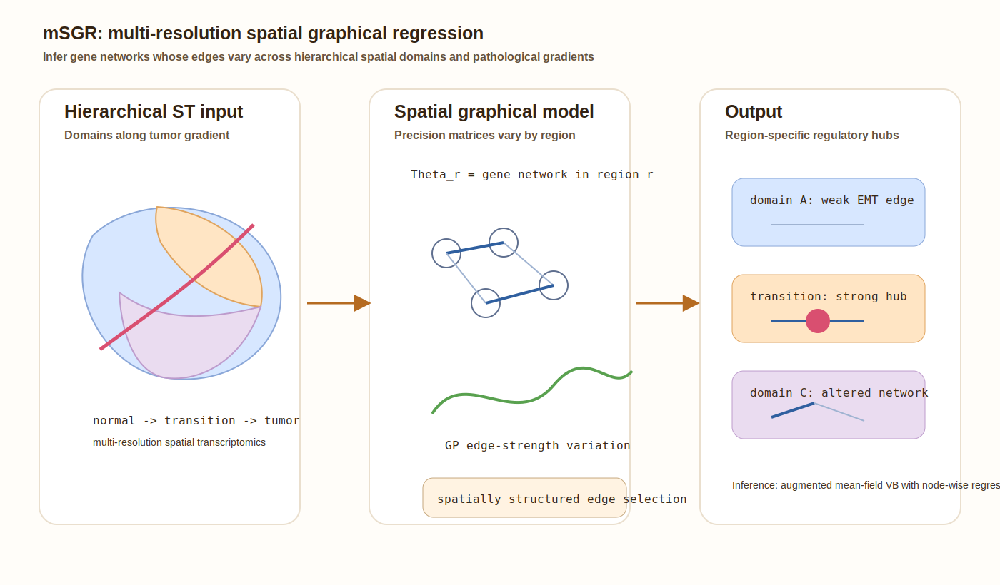

# Spatial omics methods digest - 2026-07-07

This update covers primary-source items found through July 7, 2026. I selected one newly posted July method, one new reproducible-workflow resource, and three recent missed modeling papers that are technically relevant for spatial transcriptomics, spatial multimodal omics, and spatial regulatory-network inference.

## 1. DriftST: One-Step Generative Inference of Spatial Transcriptomics from H&E Histology

**Lane:** New or updated.  
**Date:** Preprint posted July 6, 2026.  
**Status:** Preprint on arXiv.  
**Primary link:** [arXiv:2607.04740](https://arxiv.org/abs/2607.04740)

**Methodological contribution:** DriftST infers spatially resolved gene expression from H&E images with a one-step generative model. The core mechanism is a Cellular Drifting model that learns a direct drift from a histology-conditioned source distribution to the expression distribution. The model also introduces an STransformer with co-expression attention for inter-gene dependency and a gene residual gate for differential gene importance. The authors state that the same framework applies to both spot-level and cell-level data through a generic gene-panel representation.

**Significance:** DriftST addresses a recurring limitation in histology-to-ST models: regression can over-smooth expression, while diffusion-style generative models can be slow. The one-step drift formulation is important if it preserves generative expressiveness while reducing inference cost.

*Caption: DriftST conditions on H&E morphology, learns a one-step drift into gene-expression space, and uses gene-structure attention plus residual gates to predict spot- or cell-level expression.*

## 2. DiSTILL: A Hybrid Cloud-HPC Workflow System for Reproducible Spatial Transcriptomics Analysis

**Lane:** New or updated.  
**Date:** Preprint posted June 28, 2026.  
**Status:** Preprint on arXiv.  
**Primary link:** [arXiv:2606.30693](https://arxiv.org/abs/2606.30693)

**Why included:** This is not a new statistical model, but it is relevant infrastructure for reproducible spatial transcriptomics analysis. It targets a practical failure mode in ST workflows: large annotated data objects, notebooks, HPC jobs, configuration, and artifacts are often handled through ad hoc scripts that are hard to audit or rerun.

| Resource aspect | Summary |
|---|---|
| Biological scope | Demonstrated through an inflammatory bowel disease spatial transcriptomics workflow; intended for user-supplied datasets matching the wrapped pipeline schema. |
| Modalities | Spatial transcriptomics analysis objects plus workflow metadata, presets, notebooks, generated scripts, and outputs. |
| Scale | Designed for resource-intensive analyses that need HPC execution through SLURM or remote execution modes. |
| Access/tooling | FastAPI backend, web frontend, dataset/preset registry, Python pipeline generator, SLURM bundle generation, local/SSH/poller execution modes. |
| Modeling uses | Makes spatial analysis pipelines reproducible and auditable; useful when evaluating model runs, parameter presets, and artifact provenance. |
| Reuse caveats | The contribution is workflow orchestration, not a general biological model; reuse depends on whether datasets satisfy the schema assumptions of the wrapped analytical pipeline. |

## 3. JASPR: Joint Spatial Representation learning of histology and spatial genomics for improved virtual genomic screening and clinical prognostication

**Lane:** Important to revisit.  
**Date:** Preprint posted June 24, 2026.  
**Status:** Preprint on arXiv.  
**Primary link:** [arXiv:2606.28395](https://arxiv.org/abs/2606.28395)

**Why now:** This was missed in the previous digest window and is directly relevant to multimodal spatial representation learning. It addresses a specific gap: learning a joint H&E/ST representation while preserving spatial context across both morphology and genomics.

**Methodological contribution:** JASPR is a self-supervised framework that integrates H&E images and spatial transcriptomics using a cross-modal reconstruction objective. It uses shared modules to capture common spatial properties across modalities and modality-specific experts to encode morphology-specific and genomics-specific features. The authors validate on breast cancer datasets and report improved H&E-based prediction of 9,248 genes and prognostic value.

**Significance:** JASPR is notable because it treats spatial context as part of the representation-learning objective rather than only concatenating image and expression features. This is a useful contrast to purely image-to-gene prediction models.

*Caption: JASPR learns shared and modality-specific spatial representations by reconstructing histology and spatial genomics across local tissue context.*

## 4. Consistent Bayesian Local Spatial Feature Selection with Application to Spatial Multimodal Omics

**Lane:** Important to revisit.  
**Date:** Preprint posted May 28, 2026.  
**Status:** Preprint on arXiv.  
**Primary link:** [arXiv:2605.30658](https://arxiv.org/abs/2605.30658)

**Why now:** Recent digests have emphasized foundation models and histology-to-ST prediction; this paper is a useful statistical counterweight. It focuses on local feature selection in spatial multimodal omics, where relevant covariates or basis functions may differ across contiguous tissue regions.

**Methodological contribution:** The model uses a random domain partition prior to divide tissue into contiguous spatial clusters with flexible shapes and unknown number. Conditional on each cluster, it imposes a local feature-selection prior that can select covariates or functional bases. The authors derive consistency and posterior contraction conditions and implement an informed reversible-jump MCMC sampler.

**Significance:** The paper is important because it asks a distinct question from representation learning: which features matter locally, and where? That is central for interpretable spatial multi-omics when mechanisms vary across tissue compartments.

*Caption: The Bayesian model partitions tissue into contiguous domains and performs local feature or basis selection within each region to identify spatially varying multimodal drivers.*

## 5. Multi-resolution Spatial Graphical Regression Models for Hierarchical Spatial Transcriptomics Data

**Lane:** Important to revisit.  
**Date:** Preprint posted May 16, 2026.  
**Status:** Preprint on arXiv.  
**Primary link:** [arXiv:2605.16804](https://arxiv.org/abs/2605.16804)

**Why now:** Spatial omics modeling is moving beyond domains and expression prediction toward spatially varying regulatory networks. This paper is relevant because it explicitly models gene-network structure across hierarchical tissue regions and pathological gradients.

**Methodological contribution:** mSGR is a Bayesian multi-resolution spatial graphical regression framework. Precision matrices vary across hierarchically structured spatial domains, spatially structured edge selection borrows strength across nearby regions and pathological gradients, and Gaussian-process priors model spatial variation in edge strengths. Inference uses an augmented mean-field variational Bayes algorithm with node-wise parallel regressions.

**Significance:** The key contribution is spatially varying network inference rather than spatially varying expression alone. For tumor microenvironment studies, this can identify region-specific regulatory hubs and changing edge strengths along disease gradients.

*Caption: mSGR models gene-regulatory networks as precision matrices that vary across hierarchical spatial domains and pathological gradients.*

## Emerging themes to watch

- **Generative histology-to-ST is being optimized for speed.** DriftST's one-step drift model targets the gap between over-smoothed regression and slow multi-step generation.
- **Spatial context is becoming part of the objective, not just metadata.** JASPR and mSGR both encode spatial structure directly in the learning or inference objective.
- **Statistical local interpretability remains important.** Bayesian local feature selection and spatial graphical regression expose region-specific covariates and gene-network edges that black-box embeddings may hide.
- **Reproducibility infrastructure is becoming a modeling concern.** DiSTILL is a reminder that spatial workflows need auditable configuration, HPC execution, and artifact tracking if model comparisons are to be credible.
