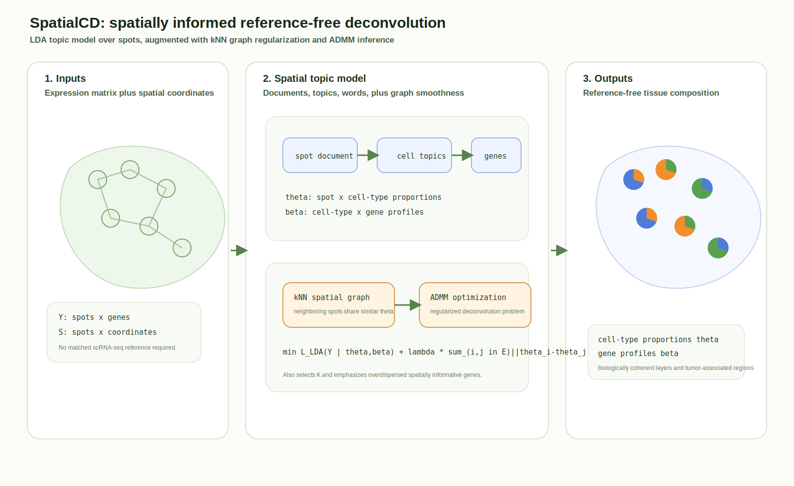
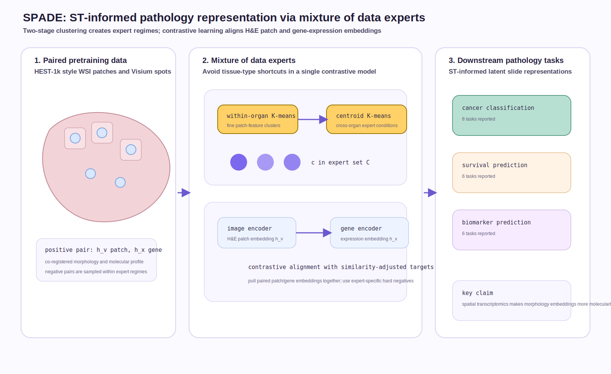
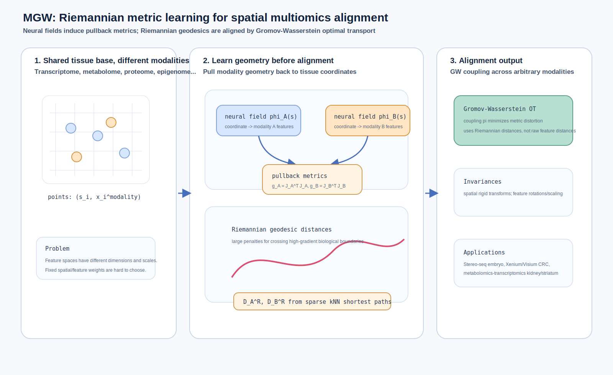
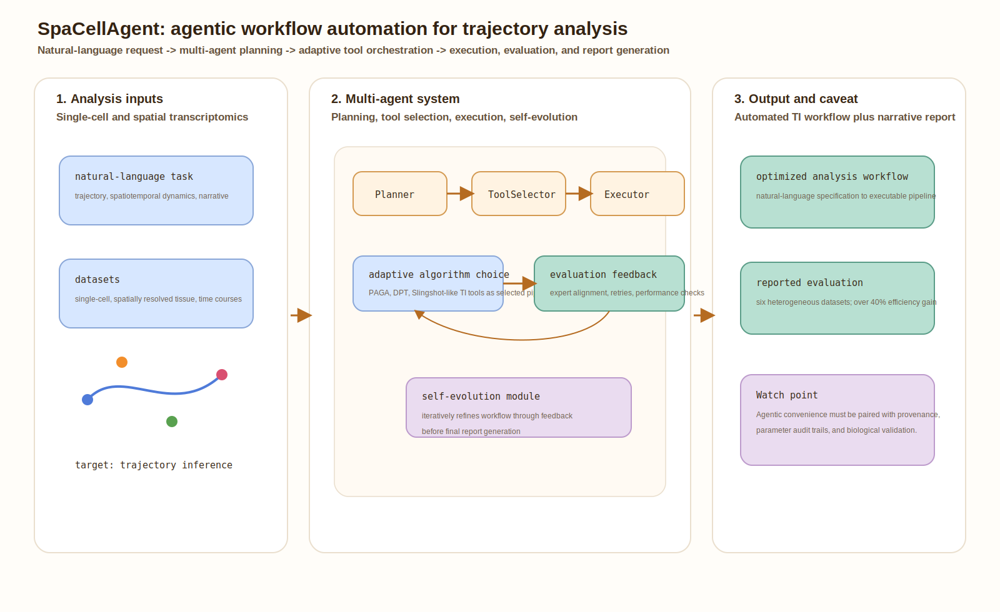

# Spatial omics methods digest - 2026-07-16

This update covers primary-source items identified through July 16, 2026. I selected four strong items rather than padding: two newly published peer-reviewed methods, one newly posted agentic preprint, and one recent peer-reviewed reference-free deconvolution method that was missed but is technically important.

## 1. Spatially informed reference-free cell-type deconvolution for spatial transcriptomics with SpatialCD

**Lane:** Important to revisit.  
**Date:** Published June 22, 2026.  
**Status:** Peer-reviewed method article in *Genome Research*.  
**Primary link:** [Genome Research article](https://genome.cshlp.org/content/36/7/1455)

**Why now:** Recent digests covered reference-based deconvolution and spatially informed deconvolution, but SpatialCD fills a distinct gap: reference-free deconvolution that explicitly uses spatial adjacency. This is valuable when matched scRNA-seq references are unavailable, incomplete, or mismatched to the tissue state.

**Methodological contribution:** SpatialCD extends latent Dirichlet allocation for spatial transcriptomics. Spots are treated as documents, latent cell types as topics, and genes as words, while a k-nearest-neighbor spatial graph adds regularization so neighboring spots have similar cell-type compositions. The optimization uses ADMM, includes data-driven selection of the number of latent cell types, and prioritizes overdispersed spatially informative genes.

**Significance:** The paper adds a statistically interpretable reference-free baseline for deconvolution. It is especially useful as a consistency check against reference-based methods when atlas quality is uncertain.

*Caption: SpatialCD combines an LDA-style topic model with spatial graph regularization to infer cell-type proportions and gene profiles without requiring a single-cell reference.*

## 2. SPADE: Spatial transcriptomics and pathology alignment using a mixture of data experts for an expressive latent space

**Lane:** New or updated.  
**Date:** Available online July 9, 2026.  
**Status:** Peer-reviewed / journal-preproof article in *Medical Image Analysis*.  
**Primary link:** [ScienceDirect article](https://www.sciencedirect.com/science/article/abs/pii/S1361841526002665)

**Methodological contribution:** SPADE is a pathology foundation-model framework that uses paired whole-slide histopathology and spatial transcriptomics to create an ST-informed latent space. It builds a mixture-of-data-experts architecture: experts are formed through two-stage image-feature-space clustering, then trained with contrastive learning to align co-registered H&E patch embeddings and gene-expression embeddings. The article reports pretraining on HEST-1k and evaluation across cancer classification, survival prediction, and biomarker prediction tasks.

**Significance:** SPADE is important because it directly tackles a failure mode in multimodal pathology pretraining: a single contrastive model trained across diverse tissues may learn tissue-type separation rather than molecular-morphological correspondence. The expert mixture and hard-negative setup are designed to make the latent space more expressive.

*Caption: SPADE clusters paired H&E/ST samples into expert regimes, aligns image and gene embeddings with contrastive learning, and aggregates ST-informed features for downstream pathology tasks.*

## 3. Riemannian metric learning for alignment of spatial multiomics

**Lane:** New or updated.  
**Date:** Published July 7, 2026.  
**Status:** Peer-reviewed conference/supplement article in *Bioinformatics*.  
**Primary link:** [Bioinformatics article](https://academic.oup.com/bioinformatics/article/42/Supplement_1/btag220/8726335)

**Methodological contribution:** The paper introduces Manifold Gromov-Wasserstein (MGW), a metric-learning framework for aligning spatial multiomics across arbitrary modalities. Each spatial omics dataset is represented as a neural field mapping common tissue coordinates into a modality-specific feature space. The Jacobian of each field induces a Riemannian pullback metric on physical space; geodesic distances under these metrics are then aligned with Gromov-Wasserstein optimal transport. This avoids hand-tuning a fused spatial/feature trade-off parameter and supports heterogeneous modalities with different feature spaces.

**Significance:** MGW is technically notable because it learns the alignment cost from modality-specific differential geometry rather than using Euclidean feature distances or a fixed spatial-feature mixing weight. This is directly relevant to aligning transcriptomics, metabolomics, proteomics, epigenomics, and histology-derived features across tissue slices.

*Caption: MGW learns neural fields for each modality, pulls modality geometry back onto tissue coordinates, computes Riemannian geodesic distances, and aligns datasets with Gromov-Wasserstein optimal transport.*

## 4. SpaCellAgent: A Self-Evolving LLM-Based Multi-Agent Framework for Trajectory Analysis

**Lane:** New or updated.  
**Date:** Preprint posted July 8, 2026.  
**Status:** Preprint on arXiv.  
**Primary link:** [arXiv:2607.07467](https://arxiv.org/abs/2607.07467)

**Methodological contribution:** SpaCellAgent is an LLM-based multi-agent framework for automating trajectory inference and spatiotemporal analysis in single-cell and spatial transcriptomics. The authors describe a multi-agent architecture for workflow planning, a dynamic tool-orchestration engine for adaptive algorithm selection, and a self-evolution module that iteratively refines analysis through feedback. The paper evaluates the framework on six heterogeneous datasets spanning temporal trajectories, sequencing platforms, and spatial tissue architectures.

**Significance:** This is not a new statistical trajectory model, but it is a timely systems paper for spatial omics modeling: it moves part of the modeling burden from manually selecting pipelines to agentic workflow planning, tool choice, execution, evaluation, and report generation. The key risk to watch is whether automation remains scientifically reliable under difficult datasets and ambiguous biological questions.

*Caption: SpaCellAgent turns a natural-language trajectory-analysis request into a planned, tool-selected, executed, evaluated, and iteratively refined spatial/single-cell analysis workflow.*

## Emerging themes to watch

- **Reference-free methods are becoming more spatial.** SpatialCD shows that topic-model deconvolution can be improved by spatial graph regularization rather than treating spots as independent mixtures.
- **Spatial transcriptomics is becoming supervision for pathology foundation models.** SPADE uses paired ST/H&E not just for gene prediction, but to shape a reusable pathology latent space.
- **Geometry is returning to multimodal alignment.** MGW reframes spatial multiomics alignment as learned Riemannian geometry plus optimal transport, which is more principled than fixed feature/spatial weighting.
- **Agentic analysis is entering spatial omics.** SpaCellAgent is a signal that future modeling workflows may include automated planning and tool orchestration, but reliability, provenance, and biological validation will matter more than convenience.
