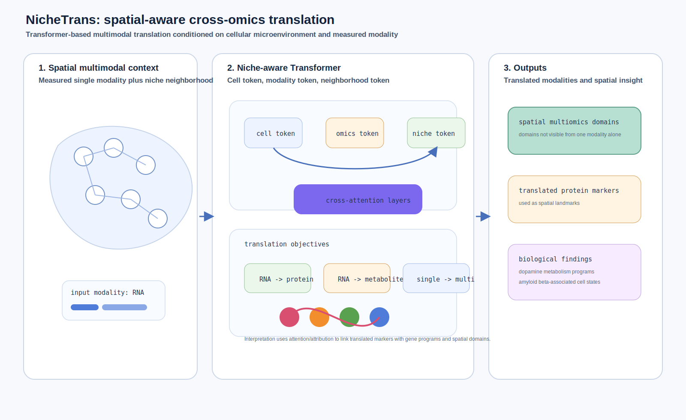
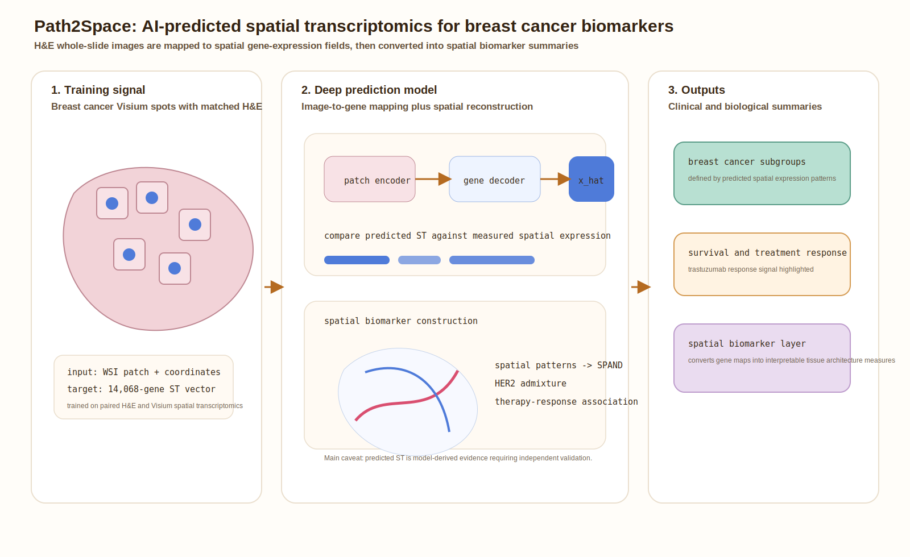

# Spatial omics methods and resources digest - 2026-07-20

Today I did not find a strong new post-July-17 primary-source method release. I found three recent, important items that were not yet covered: two method papers for spatial cross-omics and pathology-to-ST modeling, plus one spatial transcriptomic resource/biology paper that is useful for benchmarking niche and cross-species analyses.

## 1. NicheTrans: spatial-aware cross-omics translation

**Lane:** Important to revisit.  
**Date:** Published July 9, 2026.  
**Status:** Peer-reviewed method article in *Nature Methods*.  
**Primary link:** [Nature Methods article](https://www.nature.com/articles/s41592-026-03153-3)

**Why now:** NicheTrans was not included in the July 16 digest, but it is directly relevant to spatial multiomics modeling. It addresses a practical limitation: many tissues have only one accessible omics modality, while biological interpretation often requires translated protein, metabolite, or other molecular profiles in spatial context.

**Methodological contribution:** NicheTrans is a spatially aware cross-omics translation method built as a flexible Transformer-based multimodal framework. Unlike generic single-cell modality translation, it incorporates cellular microenvironment information together with multimodal measurements. The authors report validation across multiple biological cases, including spatial multiomics domain discovery, gene program-metabolite associations, translated protein markers as spatial landmarks, and Alzheimer disease brain analyses.

**Significance:** The important modeling move is to make the cellular neighborhood part of the translation problem. That matters because cross-omics prediction in tissue is not only a per-cell mapping; neighboring cells and spatial niches can determine which molecular programs are plausible.

*Caption: NicheTrans translates between spatial omics modalities by conditioning Transformer representations on both multimodal measurements and the local cellular microenvironment.*

## 2. AI-predicted spatial transcriptomics unlocks breast cancer biomarkers from pathology

**Lane:** Important to revisit.  
**Date:** Published July 9, 2026.  
**Status:** Peer-reviewed article in *Cell*.  
**Primary link:** [Cell article](https://www.sciencedirect.com/science/article/abs/pii/S0092867426004587)

**Why now:** This paper was missed in the July 16 digest despite being a major histology-to-spatial transcriptomics application. It is important because it pushes predicted spatial gene expression beyond reconstruction accuracy into biomarker discovery, breast cancer subgrouping, survival analysis, and therapy-response modeling.

**Methodological contribution:** The authors present Path2Space, a deep-learning model trained on Visium spatial transcriptomics with matched H&E whole-slide images to predict spatial expression for thousands of genes. They use the predicted spatial expression to compute spatial pattern features, define breast cancer subgroups, and derive spatial biomarkers including HER2 spatial admixture and treatment-response signals.

**Significance:** Path2Space is a useful counterpoint to general-purpose foundation models: its value is not only pixel-to-gene prediction, but the downstream construction of clinically interpretable spatial biomarkers from predicted gene-expression maps. The main caveat is that predicted ST should be treated as model-derived evidence requiring independent biological and clinical validation.

*Caption: Path2Space maps H&E whole-slide image patches to predicted spatial gene-expression maps, then derives spatial biomarkers and treatment-response associations from the predicted molecular tissue architecture.*

## 3. Spatial transcriptomic analyses highlight distinct erythroid niches in mice and humans

**Lane:** Important to revisit.  
**Date:** Published July 2, 2026.  
**Status:** Peer-reviewed article in *Nature Genetics*.  
**Primary link:** [Nature Genetics article](https://www.nature.com/articles/s41588-026-02671-2)

**Why now:** This is primarily a biology/resource paper rather than a modeling method, but it is useful for spatial-model benchmarking. It provides a cross-species spatial transcriptomic setting where the biology is explicitly about niche architecture: macrophage-centered erythroblastic islands in mice versus largely macrophage-independent erythroid clusters in humans.

| Resource aspect | Summary |
|---|---|
| Biological scope | Mouse and human hematopoietic tissues across development, stress, healthy bone marrow, and myeloid disease contexts. |
| Modalities | Spatial transcriptomics, Xenium subcellular spatial transcriptomics, scRNA-seq integration, and validation imaging. |
| Scale | Multiple mouse and human tissue contexts; datasets deposited in GEO, with source data and code availability described by the authors. |
| Access/tooling | Visium and Xenium datasets are deposited in GEO; R code and parameter settings are available on Zenodo. |
| Modeling uses | Benchmarking spatial niche detection, cross-species domain comparison, ligand-receptor or adjacency analyses, and models that must distinguish conserved versus species-specific tissue organization. |
| Reuse caveats | The central finding is biological, not a standardized benchmark. Cross-species comparisons require careful harmonization of cell labels, tissue context, developmental stage, and assay resolution. |

## Emerging themes to watch

- **Spatial translation is becoming niche-aware.** NicheTrans makes the neighborhood part of cross-omics prediction, not merely metadata after prediction.
- **Predicted ST is moving toward clinical biomarker construction.** Path2Space shows how image-predicted spatial gene maps can be converted into spatial biomarkers, but validation remains essential.
- **Cross-species spatial biology can stress-test models.** The erythroid-niche paper gives a clear case where naive transfer from mouse to human would miss architecture differences.
- **Model outputs need biological interpretation layers.** Gene maps alone are not enough; the next step is spatial programs, landmarks, niches, and clinically or mechanistically interpretable summaries.
